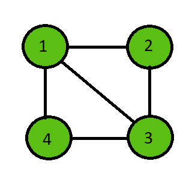
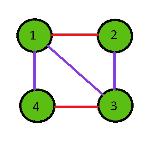

# 实现维辛定理的 Java 程序

> 原文:[https://www . geesforgeks . org/Java-实现-vizings-定理的程序/](https://www.geeksforgeeks.org/java-program-to-implement-the-vizings-theorem/)

[图论中的 Vizing 定理](https://www.geeksforgeeks.org/vizings-theorem/)指出，每个简单无向图都有一个比图的最大度数‘d’大一的[色指数](https://en.wikipedia.org/wiki/Edge_coloring)。简单地说，这个定理指出色指数可以是‘d’或‘d’+1。

图的颜色指数是给图的边着色所需的最小颜色数，这样共享同一个顶点的任何两条边都有不同的颜色。

**示例:**

> **输入:**
> 
> 
> 
> **输出:**
> 
> 色度指数= 3
> 
> 从 1 到 2 的边缘:颜色 1
> 
> 从 2 到 3 的边缘:颜色 2
> 
> 从 3 到 4 的边缘:颜色 1
> 
> 边缘从 4 到 1:颜色 2
> 
> 从 1 到 3 的边缘:颜色 3
> 
> 

**算法:**

以下是该算法的分步方法

*   初始化边的数量和边列表。
*   根据维京定理给图表上色。
*   为边指定一种颜色，并检查是否有任何相邻的边具有相同的颜色。
*   如果任何相邻的边具有相同的颜色，则增加颜色以尝试该边的下一种颜色。
*   根据定理，重复直到所有的边都变成它的颜色。
*   完成后，打印所有边的最大颜色值和每个边的颜色。

**实施上述方法:**

## Java 语言(一种计算机语言，尤用于创建网站)

```
// Java program to Implement
// Vizing's Theorem

import java.util.*;

public class chromaticIndex {

    // Function to find the chromatic index
    public void edgeColoring(int[][] edges, int e)
    {
        // Initialize edge to first
        // edge and color to color 1
        int i = 0, color = 1;

        // Repeat until all edges are done coloring
        while (i < e) {

            // Give the selected edge a color
            edges[i][2] = color;

            boolean flag = false;

            // Iterate through all others edges to check
            for (int j = 0; j < e; j++) {

                // Ignore if same edge
                if (j == i)
                    continue;

                // Check if one vertex is similar
                if ((edges[i][0] == edges[j][0])
                    || (edges[i][1] == edges[j][0])
                    || (edges[i][0] == edges[j][1])
                    || (edges[i][1] == edges[j][1])) {

                    // Check if color is similar
                    if (edges[i][2] == edges[j][2]) {

                        // Increment the color by 1
                        color++;
                        flag = true;
                        break;
                    }
                }
            }

            // If same color faced then repeat again
            if (flag == true) {
                continue;
            }

            // Or else proceed to a new vertex with color 1
            color = 1;
            i++;
        }

        // Check the maximum color from all the edge colors
        int maxColor = -1;
        for (i = 0; i < e; i++) {
            maxColor = Math.max(maxColor, edges[i][2]);
        }

        // Print the chromatic index
        System.out.println("Chromatic Index = " + maxColor);

        for (i = 0; i < e; i++)
        {
            System.out.println("Edge from " + edges[i][0]
                               + " to " + edges[i][1]
                               + " : Color " + edges[i][2]);
        }
    }

    // Driver code
    public static void main(String[] args)
    {

        // Number of edges
        int e = 5;

        // Edge list
        int[][] edges = new int[e][3];

        // Initialize all edge colors to 0
        for (int i = 0; i < e; i++) {
            edges[i][2] = -1;
        }

        // Edges
        edges[0][0] = 1;
        edges[0][1] = 2;

        edges[1][0] = 2;
        edges[1][1] = 3;

        edges[2][0] = 3;
        edges[2][1] = 4;

        edges[3][0] = 4;
        edges[3][1] = 1;

        edges[4][0] = 1;
        edges[4][1] = 3;

        // Run the function
        chromaticIndex c = new chromaticIndex();
        c.edgeColoring(edges, e);
    }
}
```

**Output**

```
Chromatic Index = 3
Edge from 1 to 2 : Color 1
Edge from 2 to 3 : Color 2
Edge from 3 to 4 : Color 1
Edge from 4 to 1 : Color 2
Edge from 1 to 3 : Color 3

```