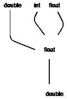

# 实现类型铸造和类型转换的 Java 程序

> 原文:[https://www . geesforgeks . org/Java-程序到实现-类型转换-类型转换/](https://www.geeksforgeeks.org/java-program-to-implement-type-casting-and-type-conversion/)

当我们必须根据需求的需要改变输出的功能以及输出的类型时，会出现许多情况。例如，以十进制格式输入的 PI 值应转换为十进制格式，以便可以有效地使用该值，而不会出现任何类型的错误和错误输出。

有两种方法可以将类型从一种更改为另一种。

1.  类型铸造
2.  [类型转换](https://www.geeksforgeeks.org/type-conversion-java-examples/)

**类型转换**是指将一种状态转换为另一种状态，由程序员使用转换运算符完成。类型转换由程序员在程序设计期间完成。类型转换也指狭义转换。因为在许多情况下，我们必须根据操作的要求，将大的数据类型值转换成较小的数据类型值。我们还可以将大的数据类型值转换成小的数据类型值，这就是类型转换称为窄转换的原因。

**语法:** *()* 为演职人员

```java
RequiredDatatype=(TargetType)Variable
```

**例 1:**

## Java 语言(一种计算机语言，尤用于创建网站)

```java
// Java Program to Implement Type Casting of the Datatype

// Importing input output classes
import java.io.*;

// Main class
public class GFG {

    // Main driver method
    public static void main(String[] args)
    {
        // Declaring an Integer datatype
        int a = 3;

        // Casting to Large datatype
        double db = (double)a;

        // Print and display the casted value
        System.out.println(db);

        // Narrow Casting conversion
        int db1 = (int)db;

        // Print an display narrow casted value
        System.out.println(db1);
    }
}
```

**Output**

```java
3.0
3
```

**类型转换**是编译器完成的类型转换是编译器在编译时无意中完成的。如果正确的结果数据类型没有在数据类型的多重表达式末尾提及，这种转换有时会产生错误或不正确的答案，这就是类型转换不如类型转换有效的原因。

类型转换的工作机制如下:

```java
double > float > long > int > short > byte
```



**示例 1:** 类型转换时出错

## Java 语言(一种计算机语言，尤用于创建网站)

```java
// Java Program to illustrate Type Conversion

// Importing input output classes
import java.io.*;

// Main class
public class GFG {

    // Main driver method
    public static void main(String[] args)
    {
        // Declaring and initializing variables to values
        // with different return type
        long a = 3;
        byte b = 2;
        double c = 2.0;

        // Type Conversion
        int final_datatype = (a + b + c);

        // Print statement
        System.out.print(final_datatype);
    }
}
```

**输出:**

```java
prog.java:9: error: incompatible types: possible lossy conversion from double to int
        int final_datatype = (a + b + c);
                                    ^
1 error
```

**输出解释:**

当您将一种数据类型的值分配给另一种数据类型时，这两种类型可能不兼容。如果数据类型兼容，那么 Java 将自动执行转换，称为自动类型转换，如果不兼容，则需要显式转换。例如，给长变量赋值。

**例 2:**

## Java 语言(一种计算机语言，尤用于创建网站)

```java
// Java Program to illustrate Type Conversion

// Importing input output classes
import java.io.*;

// Main Class
class GFG {

    // Main driver method
    public static void main(String[] args)
    {
        // Declaring and initializing variables to values
        // but to different data types
        long a = 3;
        byte b = 2;
        double c = 2.0;

        // Type Conversion
        // As long and byte data types are converted to
        // double return type
        double final_datatype = (a + b + c);

        // Printing the sum of all three initialized values
        System.out.print(final_datatype);
    }
}
```

**Output**

```java
7.0
```