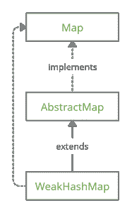

# 实现 WeakHashMap API 的 Java 程序

> 原文:[https://www . geesforgeks . org/Java-程序到实现-weakashmap-API/](https://www.geeksforgeeks.org/java-program-to-implement-weakhashmap-api/)

WeakHashMap 类是 [Java 集合框架](https://www.geeksforgeeks.org/java-collection-tutorial/)的一部分，实现了[地图接口](https://www.geeksforgeeks.org/map-interface-java-examples/)并扩展了[抽象地图类](https://www.geeksforgeeks.org/abstractmap-in-java/)。映射接口帮助我们将键映射到值，而抽象映射类使映射接口的实现更加容易。



地图中的每个键都必须是唯一的，并且最多只能有一个值。请注意，地图本身不能是一把钥匙。在 WeakHashMap 中，键值对的顺序是不保证的。weakashmap 与常规 [HashMap](https://www.geeksforgeeks.org/java-util-hashmap-in-java-with-examples/) 的不同之处在于 weakashmap 使用弱键。

**强引用:**强引用是通常使用的引用类型。垃圾收集器不会回收具有强引用的对象。

**示例:**

```java
Geek strongRef=new Geek();
```

**弱引用:**如果一个对象没有强引用或[软引用](https://www.geeksforgeeks.org/types-references-java/)，则称该对象有弱引用。

**示例:**

```java
new Geek();
```

> 也可以使用 weak reference 类生成显式弱引用

**示例:**

```java
WeakReference<Geek> weakRef=new WeakReference(new Geek());

// Now use the the get() method to obtain the object
// weakRef.get()
```

弱密钥的存在意味着一旦密钥不再使用，垃圾收集器将删除它们。另一方面，这些值由强引用持有。所以值对象不能直接引用它们的键 else 这将阻止密钥被回收。WeakHashMap 支持空键和值。

**负载系数:**在此之后，WeakHashMap 的容量翻倍的占用率。例如，如果初始容量为 16，负载系数为 0.75 (75%)，即 12。，那么在添加第 13 个元素后，WeakHashMap 的大小会翻倍。

**构造函数:***weakashmap 类提供 4 个构造函数:*

**1。weakashmap():**这将生成一个初始容量为 16、负载系数为 0.75 的 weakashmap 对象

**语法:**

```java
WeakHashMap<K,V> wHM=new WeakHashMap<K,V>();
```

**2。weakashmap(int InitialCapacity):**这将生成一个 weakashmap 对象，它具有所需的 initial capacity 和 0.75 的负载系数

**语法:**

```java
WeakHashMap<K,V> wHM=new WeakHashMap<K,V>(20);

// This will generate a WeakHashMap 
// object with an initial capacity of 20
```

**3。weakashmap(int InitialCapacity，float LoadFactor):** 这将生成一个 weakashmap 对象，该对象具有所需的 initial capacity 和 LoadFactor。

**语法:**

```java
WeakHashMap<K,V> wHM=new WeakHashMap<K,V>(20,0.9);

// This will generate a WeakHashMap object with an
// initial capacity of 20 and load factor of 90%
```

**4。WeakHashMap(映射图):**这将生成一个 WeakHashMap 对象，并将复制过程中指定映射的所有键值对。

**语法:**

```java
WeakHashMap<K,V> wHM=new WeakHashMap<K,V>( oldMap);

// This will generate a WeakHashMap object and
//  will copy all the mappings of oldMap
```

### 在 WeakHashMap 上的操作

武器地图的操作可以分为破坏性的和非破坏性的。破坏性方法会修改它们操作的地图。

### 破坏性操作

**1。添加或更新**

当钥匙插入 WeakHashMap 时，内部会发生以下过程:

*   为该特定密钥生成唯一的散列码
*   这个哈希代码用于生成索引值
*   键值对存储在哈希表中的特定索引处

**A)公共 T put(K 键，T 值):**在 WeakHashMap 中插入给定的键值对。如果该键已经存在，则更新该值。此方法返回键的前一个值。如果键是第一次插入，或者前一个值为 null，则返回 null

**B)公共 void putAll(地图 m):** 将地图中的所有地图插入当前地图。如果有任何键是公共的，那么该值将被更新。如果指定的映射 m 为空，则会引发 NullPointerException。

**2。删除**

**A)公共 void clear():** 从地图中移除所有映射

**B)** **公共 T remove(对象键):**从给定的映射中移除与键对象相关联的映射。此方法将返回与要移除的键相关联的值。如果不存在这样的键，或者如果值本身为空，将返回空值。

### **非破坏性操作**

非破坏性方法不会改变其操作的地图。非破坏性方法如下:

**1。containsKey:** 如果映射包含指定的键，则返回 true，否则返回 false。

```java
public boolean containsKey(Object Key)
```

**2。containsValue:** 如果映射包含具有指定值的键，则返回 true，否则返回 false。

```java
public boolean containsValue(Object Value)
```

**3。get:** 返回指定键附带的值。如果键不存在或者值本身为 null，则返回 null。**T3】**

```java
public T get(Object Key)
```

**4。size:** 返回调用该方法时地图中出现的键值对的数量。

```java
public int size() 
```

**5。isEmpty:** 如果在调用方法的瞬间映射中没有键值对，则返回 true，否则返回 false。

```java
public boolean isEmpty()
```

**6。entrySet:** 键值对也称为映射条目。[地图。入口](https://www.geeksforgeeks.org/map-entry-interface-java-example/)界面允许我们使用地图入口。entrySet 方法将返回一组所有当前地图条目。

```java
public Set<Map.Entry<K,V>> entrySet()
```

**7。** **键集:**返回包含地图中所有键的集合。地图中所做的更改将反映在此集合中。在地图上执行操作并同时遍历集合可能会导致未定义的行为。

```java
public Set<k> keySet()
```

**8。值:**返回地图中所有值的集合视图。地图中所做的更改反映在此集合中。在地图上执行操作并同时遍历集合可能会导致未定义的行为。

```java
public Collection<V> values()
```

**实施武器地图**

下面的程序包含 WHI 类，它实现了 WeakHashMap API。然后在这里使用这个实现将成绩映射到分数。

## Java 语言(一种计算机语言，尤用于创建网站)

```java
// Java Program to implement WeakHashMap

import java.util.Collection;
import java.util.Map;
import java.util.Set;
import java.util.WeakHashMap;

// The class WHI will implement WeakHashMap
class WHI<K, V> {

    // Make a private WeakHashMap reference
    // variable

    private WeakHashMap<K, V> obj;

    // Constructors

    // Create WeakHashMap with capacity 16
    // and 0.75 load-factor
    public WHI() { obj = new WeakHashMap<K, V>(); }

    // Create WeakHashMap with desired capacity
    // and 0.75 load-factor
    public WHI(int initialCapacity)
    {
        obj = new WeakHashMap<K, V>(initialCapacity);
    }

    // Create WeakHashMap with desired capacity
    // and desired load-factor
    public WHI(int initialCapacity, float loadFactor)
    {
        obj = new WeakHashMap<K, V>(initialCapacity,
                                    loadFactor);
    }

    // Destructive-Methods

    // Place the key-value pair in the
    // WeakHashMap

    public V put(K key, V value)
    {
        return obj.put(key, value);
    }

    // Copy all the key-value pairs
    // from a map
    public void putAll(Map<K, V> map) { obj.putAll(map); }

    // Remove all the key-value pairs
    public void clear() { obj.clear(); }

    // Remove a particular key
    public V remove(Object key) { return obj.remove(key); }

    // Non-Destructive methods

    // Check if the map contains
    // a specific key
    public boolean containsKey(Object key)
    {
        return obj.containsKey(key);
    }

    // Check if the map contains a key
    // with specific value
    public boolean containsValue(Object value)
    {
        return obj.containsValue(value);
    }

    // get the value for a specific
    // key
    public V get(Object key) { return obj.get(key); }

    // get size of the map
    public int size() { return obj.size(); }

    // Check if the map is empty
    public boolean isEmpty() { return obj.isEmpty(); }

    // get a set of Map entries
    public Set<Map.Entry<K, V> > entrySet()
    {
        return obj.entrySet();
    }

    // get a set of keys
    public Set<K> keySet() { return obj.keySet(); }

    // get a Collection of values
    public Collection<V> values() { return obj.values(); }
}

public class Main {

    public static void main(String args[])
    {

        // Create an object of WHI class
        // key will be of type String
        // value will be of type Integer
        WHI<String, Integer> obj1
            = new WHI<String, Integer>();

        System.out.println(
            "The grades and cut off are as follows: ");

        // insert key-value pairs in the WeakHashMap object

        obj1.put("A+", 90);
        obj1.put("A", 80);
        obj1.put("B", 70);
        obj1.put("C", 60);

        // Traverse the set containing map entries
        // entrySet() is used to obtain the set
        for (Map.Entry<String, Integer> ivar :
             obj1.entrySet()) {
            System.out.println(ivar.getKey() + " "
                               + ivar.getValue());
        }

        // get value associated with key "B"
        System.out.println("The cut-off for B grade is "
                           + obj1.get("B"));
    }
}
```

**Output**

```java
The grades and cut off are as follows: 
A+ 90
C 60
B 70
A 80
The cut-off for B grade is 70
```

> **注意:**等级和截止可能会以无序的方式打印。这是因为订单在 WeakHashMap 中没有保证。