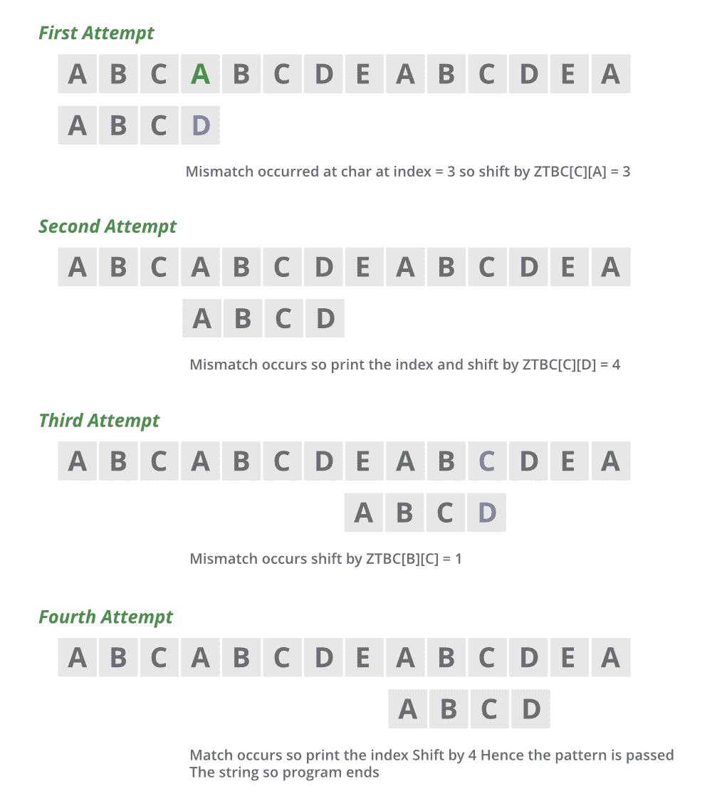

# 实现朱-高冈字符串匹配算法的 Java 程序

> 原文:[https://www . geesforgeks . org/Java-程序到实现-Zhu-takaoka-字符串匹配-算法/](https://www.geeksforgeeks.org/java-program-to-implement-zhu-takaoka-string-matching-algorithm/)

朱-高冈字符串匹配算法是用于字符串中模式匹配的 [Boyer Moore 算法](https://www.geeksforgeeks.org/boyer-moore-algorithm-for-pattern-searching/)的变体。这个算法中坏图的概念略有变化。好后缀的概念与博耶·摩尔的相同，但不是使用一个字符来表示坏移位，现在在这个算法中，我们将执行两个移位。

因此，这个算法比博耶的算法速度稍快。好的后缀和两个坏的字符移位可以在代码中一起使用，以在算法的性能上提供额外的优势。我们正在讨论如何为这个算法改变坏字符移位的计算的想法，好后缀的想法可以从 Boyer 的算法中得到。

**算法工作:**

首先，该算法的开始与 Boyer 的算法相同，即从右到左将模式与字符串进行比较。因此，模式的每个字符从右向左与字符串的字符进行比较。所以比较的起始索引应该是模式的长度。

```
String :     ABCDEFGH

Pattern:    BCD
```

因此，比较应该从字符串中的索引“C”开始，即 2(使用基于 0 的索引)。因此，比较从索引=模式长度–1 开始。如果找到匹配，则索引递减，直到找到匹配为止。一旦找不到匹配，就该给坏角色换班了。

```
String :     ABCDEFGH

Pattern:    BCC
```

a)在索引 2 处，字符串包含字符“C”，由于模式[2]= =“C”，因此找到了字符匹配。所以我们现在要检查以前的索引，即 1，0。所以在字符串[1](等于“B”)处，模式[1]！='B '所以找不到匹配，是时候移动字符了。

**不良字符移位计算表(命名为 ZTBC 表):**该阶段是预处理阶段，即应该在开始比较之前完成。坏字符表是一个散列图，它以模式的所有字母作为关键字，该值代表模式应该给出的移动次数，以便:

*   不匹配变成匹配。
*   该模式传递了字符串中不匹配的字符。

因此，在朱-高冈算法中，我们维护了一个二维数组，该数组可以根据开始比较的字符串的前两个字符给出移位的次数。因此，增加移位次数和减少比较次数会导致性能更高。

**程序:**逻辑构建。计算该表的思路如下所示:

该表是使用 2D 数组制作的，其中所有的列和行都是由模式的字符命名的。该表用模式的长度初始化，因为如果在模式中找不到字符对，那么唯一的方法是通过传递不匹配的字符来传递整个模式。

```
If pattern is  = "ABCD"

The ZTBC =  A  B  C  D  E...

                 A  4  4  4  4  4 

                 B  4  4  4  4  4

                 C  4  4  4  4  4

                 D  4  4  4  4  4

                 E.....
```

如果两个字符中的第二个字符是模式的起始字符，那么移动整个模式不是正确的想法，我们应该将第二个字符与模式的第一个字符进行匹配。所以我们应该通过 Len-1 来改变模式。

```
so For all i in size of array 

ZTBC[i][pattern[0]] = len-1.

so ZTBC now looks like :

ZTBC =         A  B  C  D  E....

                A   3  4  4  4  4

                B   3  4  4  4  4

                C   3  4  4  4  4

                D   3  4  4  4  4

                E.....
```

现在，如果两个字符都连续出现在模式中，那么我们应该只移动模式那么多，以便字符串和模式中的一对字符匹配。

```
for all i in array.size

ZTBC[pattern[i-1]][pattern[i]] = len-i-1 ; //This is the amount of shifts if two matching pair is found.

So finally ZTBC looks like

ZTBC =         A  B  C  D  E ......

                A   3  2  4  4  4

                B   3  4  1  4  4

                C   3  4  4  4  4

                D   3  4  4  4  4

                E.......
```

插图:

因此，假设字符串和模式如下所示:

```
String S  = "ABCABCDE"
Pattern P = "ABCD"
```

下面借助视觉艺术描述性地展示如下:



因此，考虑基于 0 的索引，我们将从索引 3 开始

```
so s[3]!=P[3]  // p[3]=='D' and S[3]=='A'
```

因此，出现了不匹配，我们将数组移动

```
ZTBC[C][A] since last two consecutive char is CA in string. 
```

现在我们将模式改变 3

```
Since ZTBC[C][A] == 3, and now we are at index 6 ( 3+3 )
```

现在我们应该像第 1 步一样再次开始字符串和模式的比较，然后我们会在字符串中找到匹配的模式，所以打印它。我们发现了一件事。现在，由于继续进一步**、**我们现在应该通过移动最后两个字符，即字符串中的 CD，因为它们只在先前的索引处。因此，我们应该将我们的模式改变 1，并继续同样的过程。此外，我们可以在这个程序中加入好后缀的概念，以找到必要的最大移位次数**，从而使我们的代码性能更好。好后缀的概念和博耶的一样。因此，如果字符串的字符处出现不匹配，我们将给出上述移位思想的一般公式。说**

```
Say S[i+m-k]!=P[m-k] //m is the size of pattern and j is the index of the start of matching .
```

**那么**档的次数应该给出为:****

```
**ZTBC[S[i+m-2]][S[i+m-1]] // two consecutive char at the index where comparisons starts.**
```

******示例:******

## ****Java 语言(一种计算机语言，尤用于创建网站)****

```
**// Java Program to Implement Zhu–Takaoka String Matching
// Algorithm

// Importing required classes
import java.io.*;
import java.lang.*;
import java.util.*;

// Main class
public class GFG {

    // Declaring custom strings as inputs and patterns
    public static String string = "ABCABCDEABCDEA";
    public static String pattern = "ABCD";

    // And their lengths
    public static int stringlen = 14;
    public static int patternlen = 4;

    // Preprocessing and calculating the ZTBC for above
    // pattern by creating an integer array

    // As alphabets are 26 so
    // square matrix of 26 * 26
    public static int[][] ZTBC = new int[26][26];

    // Method
    // To calculate ZTBC to
    // print the indepattern at which the patternlenatches
    // occurs
    public static void ZTBCCalculation()
    {

        // Declaring variables within this scope
        int i, j;

        // Iterating over to compute
        // using nested for loops
        for (i = 0; i < 26; ++i)
            for (j = 0; j < 26; ++j)
                ZTBC[i][j] = patternlen;

        for (i = 0; i < 26; ++i)
            ZTBC[i][pattern.charAt(0) - 'A']
                = patternlen - 1;
        for (i = 1; i < patternlen - 1; ++i)
            ZTBC[pattern.charAt(i - 1) - 'A']
                [pattern.charAt(i) - 'A']
                = patternlen - 1 - i;
    }

    // Main driver method
    public static void main(String args[])
    {
        // Declare variables in main() body
        int i, j;

        // Calling the above created Method 1
        ZTBCCalculation();

        // Lastly, searching pattern and printing the
        // indepattern

        j = 0;

        // Till condition holds true
        while (j <= stringlen - patternlen) {

            i = patternlen - 1;
            while (i >= 0
                   && pattern.charAt(i)
                          == string.charAt(i + j))
                --i;
            if (i < 0) {

                // Pattern detected
                System.out.println("Pattern Found at "
                                   + (j + 1));
                j += patternlen;
            }

            // Not detected
            else
                j += ZTBC[string.charAt(j + patternlen - 2)
                          - 'A']
                         [string.charAt(j + patternlen - 1)
                          - 'A'];
        }
    }
}**
```

******Output**

```
Pattern Found at 4
Pattern Found at 9
```**** 

> ******注:******
> 
> *   ****运行时复杂度为 0(字符串*模式)，用于搜索 1 和 0(模式+ (26*26))。****
> *   ****发现空间复杂度为 0(26×26)，对于大型测试用例，该复杂度几乎不变。****