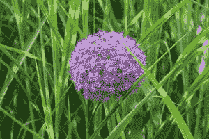
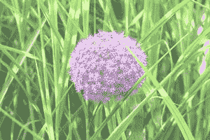

# 增加或降低图像亮度的 Java 程序

> 原文:[https://www . geesforgeks . org/Java-程序增加或减少图像亮度/](https://www.geeksforgeeks.org/java-program-to-increase-or-decrease-brightness-of-an-image/)

在了解任何图像的亮度是如何调整的之前，我们首先要了解图像是如何表现的。图像以像素的 2D 形式表示，像素是图像的最小元素。任何一点的像素值都对应于撞击该点的光子的光强。每个像素存储 N 位无符号 int 值，其中 N 是图像的深度(8 位图像、16 位图像、24 位图像)。对于 8 位图像，像素值可以从 0 到 255 变化，其中 0 对应于黑色，255 对应于白色。每个像素颜色由 RGB 值的组合组成。亮度只不过是图像感知到的光量。

> 图像的亮度可以通过增加或减少图像像素的 RGB 值来增加或减少，亮度值通常在-255 到+255 的范围内。负值会使图像变暗，正值会使图像变亮。

**步骤:**

我们需要按如下顺序遵循 3 个步骤:

1.  使用 ImageIO 类读取图像
2.  获取图像的宽度和高度，并遍历每个像素
3.  获取每个像素的 RGB 值以增加亮度

**实施:**

考虑一个任意输入图像的样本，我们将使用它来增加或减少对比度以说明变化。



照片. jpg

**例**

## Java 语言(一种计算机语言，尤用于创建网站)

```
// Java Program to Increase or Decrease Brightness of an
// Image

import java.io.*;

class GFG {

    // Method 1
    // Helper method to method 2
    public static int Truncate(int value)
    {

        if (value < 0) {
            value = 0;
        }
        else if (value > 255) {
            value = 255;
        }
        return value;
    }

    // Method 2
    // To adjust the brightness of image
    public static void AdjustBrightness(String inpPath,
                                        String outPath)
        throws IOException
    {

        // Taking image path and reading pixels
        File f = new File(inpPath);
        BufferedImage image = ImageIO.read(f);

        // Decalring an array for spectrum of colors
        int rgb[];

        // Setting custom brightness
        int brightnessValue = 25;

        // Outer loop for width of image
        for (int i = 0; i < image.getWidth(); i++) {

            // Inner loop for height of image
            for (int j = 0; j < image.getHeight(); j++) {

                rgb = image.getRaster().getPixel(
                    i, j, new int[3]);

                // Using(calling) method 1
                int red
                    = Truncate(rgb[0] + brightnessValue);
                int green
                    = Truncate(rgb[1] + brightnessValue);
                int blue
                    = Truncate(rgb[2] + brightnessValue);

                int arr[] = { red, green, blue };

                // Using setPixel() method
                image.getRaster().setPixel(i, j, arr);
            }
        }

        // Throwing changes over the image as read above
        ImageIO.write(image, "jpg", new File(outPath));
    }

    // Method 3
    // Main driver method
    public static void main(String[] args) throws Exception
    {

        // Passing images present on directory on local
        // machine
        String inputPath = "E:\\photo.jpg";
        String outputPath = "E:\\outphoto.jpg";

        // Calling method 2 inside main() to
        // adjust the brightness of image
        AdjustBrightness(inputPath, outputPath);
    }
}
```

**输出:**亮图像



图片. jpg