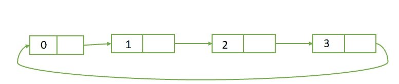

# 在循环链表开头插入新节点的 Java 程序

> 原文:[https://www . geesforgeks . org/Java-program-to-insert-一个循环链表开头的新节点/](https://www.geeksforgeeks.org/java-program-to-insert-a-new-node-at-the-beginning-of-the-circular-linked-list/)

**循环链表:**循环链表是一个元素序列，其中每个元素都指向序列中的下一个元素，最后一个元素链接到第一个元素。这意味着循环链表类似于单个链表，只是最后一个节点指向列表中的第一个节点。

**在循环链表开头插入新节点:**

如果链表是空的，那么头和尾都指向新添加的节点。如果列表不是空的，那么我们将最后一个节点指向新添加的节点，并将新添加的节点指向头节点，最后，我们将新添加的节点作为头节点。

 

**算法:**

1.  创建一个节点类，代表列表中的一个节点。它有两个变量数据和下一个指针(指向下一个节点)。
2.  创建另一个类来创建循环链表，它有两个节点，即头和尾。
3.  当添加一个新节点到列表中时，我们将首先检查头部是否为空。如果列表为空或者头部为空，那么我们将插入节点作为头部，尾部也指向新添加的节点。
4.  如果列表不为空，则新添加的节点将指向头部，尾部将指向新添加的节点，新节点将作为头部节点。

**代码片段:**

## Java 语言(一种计算机语言，尤用于创建网站)

```
// Java Program to Insert a nodes at the Beginning of the
// Circular Linked List

public class AddAtBeginning {

    // Represents the node of list.
    public class Node {
        char data;
        Node next;
        public Node(char data) { this.data = data; }
    }

    // Declaring head and tail pointer as null.
    // head indicates the starting node and tail indicates
    // last node.
    public Node head = null;
    public Node tail = null;

    // This function will add the new node at the Beginning
    // of the circular linked list.
    public void addNode(char data)
    {
        // Create new node
        Node newNode = new Node(data);

        // Checks if the list is empty.
        if (head == null) {

            // make newnode as both head and tail node.
            head = newNode;
            tail = newNode;

            // point the tail to head node.
            tail.next = head;
        }
        else {

            // point the newnode to head
            newNode.next = head;

            // point the rail to new node.
            tail.next = newNode;

            // make the newnode as head.
            head = newNode;
        }
    }

    // printLinkedList prints all the nodes in the list
    public void printLinkedList()
    {
        Node presentNode = head;
        if (head == null) {
            System.out.println("List is empty");
        }
        else {
            System.out.println("\n");

            // here with out checking anything we will print
            // the first node, And print the rest of the
            // nodes till the pointer again reaches the head
            // node.
            do {
                System.out.print(" " + presentNode.data);

                // incrementing the nodes using next
                // property.
                presentNode = presentNode.next;

                // if present node is head, stop printing
                // the nodes.
            } while (presentNode != head);
        }
    }

    public static void main(String[] args)
    {
        AddAtBeginning obj = new AddAtBeginning();

        System.out.println(
            "Adding nodes at the beginning of the list: ");
        obj.addNode('s');
        obj.printLinkedList();

        // add k at the beginning
        obj.addNode('k');
        obj.printLinkedList();

        // add e at the beginning
        obj.addNode('e');
        obj.printLinkedList();

        // add e at the beginning
        obj.addNode('e');
        obj.printLinkedList();

        // add G at the beginning
        obj.addNode('G');
        obj.printLinkedList();
    }
}
```

**Output**

```
Adding nodes at the beginning of the list: 

 s

 k s

 e k s

 e e k s

 G e e k s
```

**时间复杂度:** O(1)