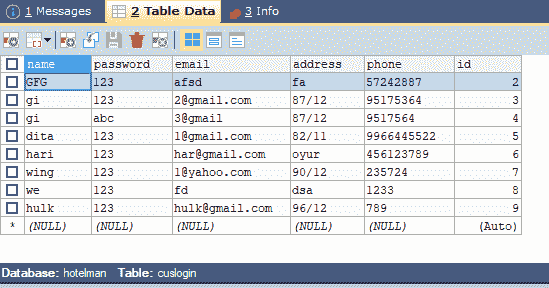
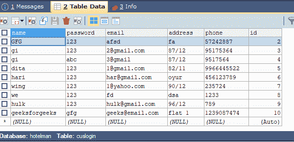

# 使用 JDBC 在表格中插入细节的 Java 程序

> 原文:[https://www . geesforgeks . org/Java-program-to-insert-details-in-a-table-use-JDBC/](https://www.geeksforgeeks.org/java-program-to-insert-details-in-a-table-using-jdbc/)

java 数据库连接基本上是 Java 编程语言和各种数据库(如 Oracle、SQL、Postgress、SQL 等)之间的标准 API(应用程序接口)。它连接前端(用于与用户交互)和后端(用于存储数据)。

**算法:**在 [JDBC](https://www.geeksforgeeks.org/jdbc-drivers/) 搜索/插入/删除/更新

为了应对 JDBC 标准，应该遵循 7 个步骤:

1.  导入数据库
2.  加载和注册驱动程序
3.  创建连接
4.  创建语句
5.  执行查询
6.  处理结果
7.  关闭连接

**程序:**

1.  **创建数据库**不考虑 [*SQL*](https://www.geeksforgeeks.org/sql-tutorial/) 或 [*NoSQL*](https://www.geeksforgeeks.org/introduction-to-nosql/) 。使用 [*sqlyog*](https://www.geeksforgeeks.org/how-to-update-contents-of-a-table-using-jdbc-connection/amp/?ref=rp) 创建数据库，并在其中创建一些表，并填充其中的数据，以便搜索表的内容。例如，数据库名为“hotelman”，表名为“cus log in”&“admin log in”。
2.  **创建连接:**打开任何 IDE，在那里可以按照标准方法生成 java 可执行文件。创建包进一步创建类。在包中，打开一个新的 java 文件，键入下面的 JDBC 连接代码，并用 connection.java 保存文件名。
3.  在输入样本图像中使用 JDBC 在表格中插入细节，参数如下
    *   “cuslogin”表有列，即–
        *   名字
        *   密码
        *   电子邮件
        *   地址
        *   电话
        *   身份证明（identification）
    *   需要的是在“cuslogin”表中插入新的详细信息。

**I**T2**nput 样图:**T5】



**3.1:** 用 SQL 查询初始化一个字符串，如下所示

> String sql = " insert into cuslogin 值(' geeksforgeeks '，' gfg '，' geeks@email.com '，' flat 1 '，' 1239087474 '，10)"；

**3.2:** 初始化 Connection 类的以下对象，准备 Statement 类(JDBC 需要)并按如下方式连接数据库

```java
Connection con=null;
PreparedStatement p=null;
con=connection.connectDB();
```

**3.3** :现在，在 PrepareStatement 里面加入步骤 3.1 的 SQL 查询，执行如下

```java
p =con.prepareStatement(sql);
p.execute();
```

**3.4:** 在同一个包中打开一个新的 java 文件(这里是它的 result.java)，并键入完整的代码(如下所示)，以便在表“cuslogin”中插入客户的详细信息。

> 注意:两个文件即 result.java 和 connection.java 应该在同一个包中，否则程序不会给出期望的输出。

**实施:**

*   例 1 是 JDBC 的连接类
*   示例 2 是应用程序(主)类，其中连接类用作主类中连接类的调用对象。

**例 1:连接类**

## Java 语言(一种计算机语言，尤用于创建网站)

```java
// Java Program to Insert Details in a Table using JDBC
// Connections class

// Importing all SQL classes
import java.sql.*;

public class connection {

    // object of Connection class
    // initially assigned NULL
    Connection con = null;

    public static Connection connectDB()

    {

        try {

            // Step 2 is involved among 7 in Connection
            // class i.e Load and register drivers

            // 2(a) Loading drivers using forName() method
            // name of database here is mysql
            Class.forName("com.mysql.jdbc.Driver");

            // 2(b) Registering drivers using DriverManager
            Connection con = DriverManager.getConnection(
                "jdbc:mysql://localhost:3306/hotelman",
                "root", "1234");
            // For DB here (custom sets)
            // root is the username, and
            // 1234 is the password

            // returning the object of Connection class
            // to be used in main class (Example2)
            return con;
        }

        // Catch block to handle the exceptions
        catch (SQLException | ClassNotFoundException e) {

            // Print the exceptions
            System.out.println(e);

            return null;
        }
    }
}
```

**例 2: App/Main 类**调用上述连接类对象编译运行程序的地方

## Java 语言(一种计算机语言，尤用于创建网站)

```java
// Java Program to Insert Details in a Table using JDBC
// Main class

// Step 1: Importing DB classes
// DB is SQL here
import java.sql.*;

// Main/App class of above Connection class
public class GFG {

    // MAin driver method
    public static void main(String[] args)
    {
        // Step 2: Showing above Connection class i.e
        // loading and registering drivers

        // Initially assigning NULL parameters
        // to object of Connection class
        Connection con = null;
        PreparedStatement ps = null;

        // Step 3: Establish the connection
        con = connection.connectDB();

        // Try block to check if exception/s occurs
        try {

            // Step 4: Create a statement
            String sql = "insert into  cuslogin values('geeksforgeeks','gfg','geeks@email.com','flat 1','1239087474',10)";

            // Step 5: Execute the query
            ps = con.prepareStatement(sql);

            // Step 6: Process the results
            ps.execute();
        }

        // Optional but recommended
        // Step 7: Close the connection

        // Catch block to handle the exception/s
        catch (Exception e) {

            // Print the exception
            System.out.println(e);
        }
    }
}
```

**输出:**



> **此处添加详细信息:**“geeks forgeeks”命名客户详细信息已添加。