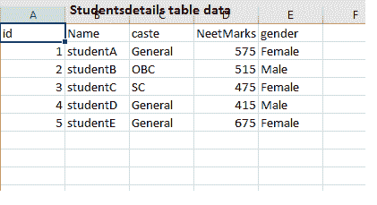
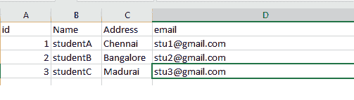
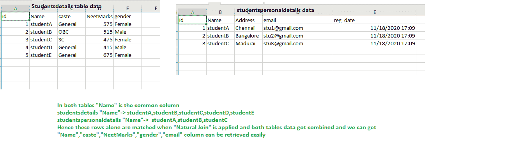

# Java 程序连接多个表的内容&显示在 JDBC

> 原文:[https://www . geesforgeks . org/Java-program-to-join-contents-in-over-table-display-in-JDBC/](https://www.geeksforgeeks.org/java-program-to-join-contents-of-more-than-one-table-display-in-jdbc/)

Java 支持许多数据库，对于每个数据库，我们需要将它们各自的 jar 文件放在构建路径中，以便进行 JDBC 连接。首先，需要决定我们使用的是哪个数据库，因此，我们需要添加 jars。对于其他数据库，如 Progress、Cassandra 等，我们也有 jars，需要将它们包含在构建路径中。MySQL 中有不同类型的连接，根据需求，我们可以构建查询。

联接是一种联接，它提供了连接两个表的功能，这两个表根据一个公共字段相互合并，并创建一个新的虚拟表。

*   **自然连接**:这是一种将指定表中的数据检索到匹配的特定字段的连接类型。
*   **NATURAL LEFT JOIN** :在这个操作中，两个表按照公共字段进行合并，但是优先考虑数据库中的第一个表。
*   **NATURAL RIGHT JOIN** :它也和 Natural left join 一样，但是它从数据库的第二个表中检索数据。

**代码中使用的 MySQL 表:**

第一张桌子

```java
CREATE TABLE `studentsdetails` (
 `id` int(6) unsigned NOT NULL,
 `Name` varchar(50) NOT NULL,
 `caste` varchar(10) NOT NULL,
 `NeetMarks` int(11) NOT NULL,
 `gender` varchar(10) DEFAULT NULL,
 PRIMARY KEY (`id`)
) ENGINE=InnoDB DEFAULT CHARSET=latin1;
```



第二张桌子

```java
CREATE TABLE `studentspersonaldetails` (
 `id` int(6) unsigned NOT NULL AUTO_INCREMENT,
 `Name` varchar(30) NOT NULL,
 `Address` varchar(30) NOT NULL,
 `email` varchar(50) DEFAULT NULL,
 `reg_date` timestamp NOT NULL DEFAULT current_timestamp() ON UPDATE current_timestamp(),
 PRIMARY KEY (`id`)
) ENGINE=InnoDB AUTO_INCREMENT=4 DEFAULT CHARSET=utf8mb4;
```



在这两个表中，“名称”是公共列。第一个表指定了性别、工作、种姓等，而第二个表指定了地址、电子邮件等。现在唯一需要的是创建一个 SQL 查询来连接表，如下所示:

```java
SELECT * FROM " + "studentsdetails" + " NATURAL JOIN " + "studentspersonaldetails"
```

现在，当执行这个查询时，它检索指定表中的数据，以匹配特定的字段，它将根据“名称”列匹配两个表中的记录，实现自然连接概念。现在，程序依赖于两个表中的数据以及两个表中“名称”列的匹配值来获得所需的输出。

**实现:**现在按照自然连接，在下面程序的帮助下执行上面的查询命令。

## Java 语言(一种计算机语言，尤用于创建网站)

```java
// Java Program to Join Contents
// of More than One Table & Display in JDBC

// Step 1: Importing DB files

// Provides the API for accessing and processing
// data stored in a data source
import java.sql.*;

// Class for Joining of multiple tables
public class GFG {

    // Main driver method
    public static void main(String[] args)
    {

        // Display message
        System.out.println(
            "Joining 2 MySQL tables using Natural Join");

        // DB 'Connection' object of Connection class
        Connection con = null;

        // Try block to check exceptions
        try {
            // Step 2: Load and register drivers

            // Loading driver
            // Jars(relevant) or mysql-connector-java-8.0.22
            // in build path of project
            Class.forName("com.mysql.cj.jdbc.Driver");

            // Registering driver

            // test is database name here
            // serverTimezone=UTC, if not provided we will
            // have java.sql.SQLException
            // Credentials here are root/""
            // i.e. username is root
            // password is ""

            // Step 3: Establishing a connection
            con = DriverManager.getConnection(
                "jdbc:mysql://localhost:3306/test?serverTimezone=UTC",
                "root", "");

            // Try block to check java exceptions
            try {

                // Step 4: Write a statement
                // Join
                Statement st = con.createStatement();
                // Combining two tables in query using
                // NATURAL JOIN studentsdetails columns :
                // Name,caste,NeetMarks,gender
                // studentspersonaldetails columns :
                // Name,Address,email

                // In both tables, connecting columns are
                // Name Name is taken Here res will have the
                // data from
                // both studentsdetails and
                // studentspersonaldetails whenever "Name"
                // in both tables are matched join
                ResultSet res = st.executeQuery(
                    "SELECT *FROM "
                    + "studentsdetails"
                    + " NATURAL JOIN "
                    + "studentspersonaldetails");

                // Step 5: Execute the query
                System.out.println("   StuName"
                                   + "    Gender"
                                   + "     Caste  "
                                   + "Neet Marks"
                                   + "     Email");

                // Step 6: Process the statements
                // Iterate the resultset and retrieve the
                // required fields
                while (res.next()) {
                    String name = res.getString("Name");
                    String gender = res.getString("gender");
                    String caste = res.getString("caste");
                    String neetMarks
                        = res.getString("NeetMarks");
                    String email = res.getString("email");

                    // Beautification of output
                    System.out.format(
                        "%10s%10s%10s%10s%20s\n", name,
                        gender, caste, neetMarks, email);
                }

                // Step 7: Close the connection
                con.close();
            }

            // Catch bloack to handle DB exceptions
            catch (SQLException s) {

                // If there is error in SQL query, this
                // exception occurs
                System.out.println(
                    "SQL statement is not executed!");
            }

            // Catch bloack to handle generic java
            // exceptions
        }
        catch (Exception e) {

            // General exception apart from SQLException are
            // caught here
            e.printStackTrace();
        }
    }
}
```

**输出:**



同样，我们也可以在 SQL 查询中使用其余的连接。仅联接和自然联接就使两个表中的列匹配，并显示两个表中的数据。根据要求，对于

1.  **自然左加入**:优先级到第一个表。
2.  **自然右加入**:优先级到第二张表。

对于不同的服务器，使用不同的 jar 文件。

**对于 SQL**

**步骤 1:** 加载驱动程序类

要使用的 jar:sqljdb C4 . jar

```java
Class.forName("com.microsoft.sqlserver.jdbc.SQLServerDriver");
```

**步骤 2:** 创建一个连接，该连接的连接字符串“HOSP_SQL1.company.com”是用户定义的。同样，我们可以使用用户名、密码，数据库可以如图所示使用

> connection conn = drivermanager . getconnection(" JDBC:SQL server://HOSP _ SQL 1 . company . com；用户=名称；password = abcdefg 数据库=测试”)；

**为甲骨文**

**步骤 1:** 加载驱动程序类

要使用的 jar:ojdbc 14 . jar

```java
Class.forName("oracle.jdbc.driver.OracleDriver");
```

**步骤 2:** 创建一个连接对象，后跟用户名和密码

```java
Connection con=DriverManager.getConnection( "jdbc:oracle:thin:@localhost:1521:xe","system","oracle");
```