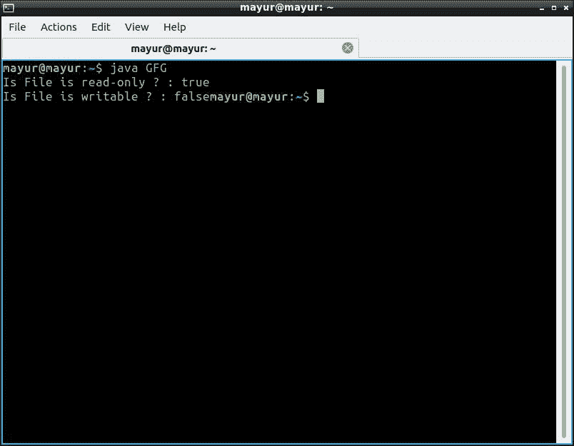
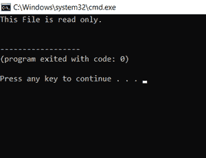

# 将文件设为只读的 Java 程序

> 原文:[https://www . geesforgeks . org/Java-program-to-make-a-file-read-only/](https://www.geeksforgeeks.org/java-program-to-make-a-file-read-only/)

只读是操作系统分配给文件的文件属性。当文件被标记为只读时，意味着它只能被打开或读取，不能更改文件的名称，不能重写或追加文件的内容，也不能删除文件。

**方法 1:**

**使用 setLastModified 方法**

要使文件成为只读文件，请使用文件类的 setReadOnly()方法。此方法返回布尔值，该值用于检查任务(使文件成为只读)是否成功。如果方法返回的值为真，则意味着任务成功，反之亦然。

**参数:**该功能不需要任何参数。

**返回值:**该函数返回**布尔数据类型**。如果文件对象可以设置为只读，则函数返回真，否则返回假。

**异常:**如果该方法不允许对文件进行写访问，则该方法抛出**安全异常**

## Java 语言(一种计算机语言，尤用于创建网站)

```java
// Java program to make the file as read only

import java.io.File;

public class GFG {

    public static void main(String[] args)
    {
        // flag variable which contains the boolean
        // value returned by setReadOnly() function
        boolean flag;

        try {

            File file = new File("/home/mayur/GFG.java");

            // creates a new file
            file.createNewFile();

            // flag the file to be read-only
            flag = file.setReadOnly();

            System.out.println("Is File is read-only ? : "
                               + flag);

            // checking whether Is file  writable
            flag = file.canWrite();
            System.out.println("Is File is writable ? : "
                               + flag);
        }

        catch (Exception e) {
            e.printStackTrace();
        }
    }
}
```

**输出:**



**方法二:使用 setWritable()方法**

这里，通过将“false”作为参数传递给 setWritable()方法，我们可以使文件成为只读的。

下面的代码将帮助您理解如何使用 setWritable()使文件成为只读文件。

## Java 语言(一种计算机语言，尤用于创建网站)

```java
import java.io.File;

public class ChangetoReadOnly {

    public static void main(String[] args)
    {
        try {
            File file = new File(
                "C://Users//sai mohan pulamolu//Desktop//test.txt");

            // making the file to read only mode
            file.setWritable(false);

            // check if the  file is writable or not
            // if not writable then it is readonly file.
            if (!file.canWrite()) {
                System.out.println(
                    "This File is read only.");
            }
            else {
                System.out.println(
                    "This File is writable.");
            }
        }
        catch (Exception e) {
            System.out.println(
                "Sorry unable to change to readonly mode.");
        }
    }
}
```

**输出:**

