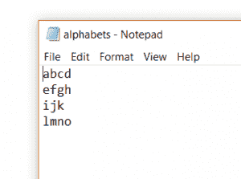
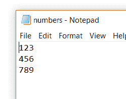
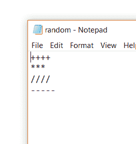
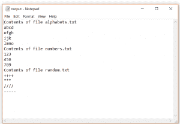

# Java 程序将所有文件的内容合并到一个目录中

> 原文:[https://www . geesforgeks . org/Java-program-to-merge-目录中所有文件的内容/](https://www.geeksforgeeks.org/java-program-to-merge-contents-of-all-the-files-in-a-directory/)

**先决条件:** [版画作家](https://www.geeksforgeeks.org/java-io-printwriter-class-java-set-1/)[布费雷德勒。](https://www.geeksforgeeks.org/java-io-bufferedreader-class-java/)
给我们一个目录/文件夹，其中存储了 n 个文件(我们不知道文件的数量)，我们想将所有文件的内容合并成一个文件，比如说 output.txt
对于下面的例子，比如说文件夹存储在路径:F:\ geekes forgeks
下面是步骤:

1.  创建目录实例。
2.  为“output.txt”创建一个 PrintWriter 对象。
3.  以字符串数组的形式获取所有文件的列表。
4.  循环读取极客目录中所有文件的内容。
5.  在每个文件的循环中

## Java 语言(一种计算机语言，尤用于创建网站)

```java
// Java program to merge all files of a directory
import java.io.*;
class sample {

    public static void main(String[] args) throws IOException
    {
        // create instance of directory
        File dir = new File("F:\\GeeksForGeeks");

        // create object of PrintWriter for output file
        PrintWriter pw = new PrintWriter("output.txt");

        // Get list of all the files in form of String Array
        String[] fileNames = dir.list();

        // loop for reading the contents of all the files
        // in the directory GeeksForGeeks
        for (String fileName : fileNames) {
            System.out.println("Reading from " + fileName);

            // create instance of file from Name of
            // the file stored in string Array
            File f = new File(dir, fileName);

            // create object of BufferedReader
            BufferedReader br = new BufferedReader(new FileReader(f));
            pw.println("Contents of file " + fileName);

            // Read from current file
            String line = br.readLine();
            while (line != null) {

                // write to the output file
                pw.println(line);
                line = br.readLine();
            }
            pw.flush();
        }
        System.out.println("Reading from all files" +
        " in directory " + dir.getName() + " Completed");
    }
}
```

**文件夹内容\极客文件夹**


**极客文件夹中 3 个文件的内容:**







**输出文件:**

