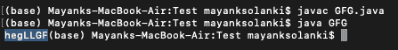

# 将所有大写字符移动到最后的 Java 程序

> 原文:[https://www . geesforgeks . org/Java-program-to-move-all-大写字符-to-end/](https://www.geeksforgeeks.org/java-program-to-move-all-uppercase-characters-to-the-end/)

给定一个包含大写字母和小写字母的字符串。任务是移动字符串末尾的所有大写字符。大写字符的顺序必须与原始字符串的顺序相同。

```java
Input    : "heLLGFg"
Output   : "hegLLGF"

Input    : "Hello"
Output   : "elloH"
```

这里我们有两种不同的方法来解决这个问题，如下所示:

1.  使用字符的 ASCII 值。
2.  使用队列数据结构

**方法 1:** 使用字符的 [ASCII 值](https://www.geeksforgeeks.org/program-print-ascii-value-character/)。

*   逐个迭代字符串的字符，并检查字符串中相应字符的 ASCII 值。
*   对于所有大写字母，ASCII 值位于**【65-90】**字符值下。将这些 ASCII 值的字符存储在字符串变量中，并在迭代结束时打印字符串。

**示例:**

## Java 语言(一种计算机语言，尤用于创建网站)

```java
// Java Program to Move All Uppercase Characters to the End

// Importing input output classes
import java.io.*;

// Mai class
class GFG {

    // Method 1
    // To shift uppercase characters
    static void shiftuppercase(String m, int length)
    {

        // Taking an empty string
        String temp = "";

        for (int i = 0; i < length; ++i) {

            // Condition check
            // If the character is uppercase via
            // the ASCII values of the  character
            if (m.charAt(i) >= 65 && m.charAt(i) <= 90) {
                temp += m.charAt(i);
            }

            // The character is already lowercase
            else
                System.out.print(m.charAt(i));
        }

        // Now, Printing the uppercase string
        System.out.print(temp);
    }

    // Method 2
    // Main driver method
    public static void main(String[] args)
    {
        // Custom input string
        String m = "heLLGFg";

        // Computing the length of the string
        // using length() method
        int length = m.length();

        // Calling the method 1 over the custom string taken
        // above to move all uppercase char to the end
        shiftuppercase(m, length);
    }
}
```

**输出:**



**方法 2:** 使用队列数据结构

*   队列数据结构实现了先进先出的概念，我们使用这个概念并将大写字符存储在队列中。
*   打印除大写字符以外的所有字符。
*   迭代之后，从队列中移除所有元素。

**示例:**

## Java 语言(一种计算机语言，尤用于创建网站)

```java
// Java Program to Move All Uppercase Characters to the End
// Using Queue data structures

// Importing input output classes
import java.io.*;
// Importing utility classes
import java.util.*;

// Main class
class GFG {

    // Method 1
    // Main driver method
    static void shiftuppercase(String m, int length)
    {
        // Creating an object of Queue class of character
        // type
        Queue<Character> Q = new LinkedList<Character>();

        // Declaring an initializing to empty string
        String temp = "";

        for (int i = 0; i < length; ++i) {

            // Condition checkfor the uppercase characters
            // If uppercase use ASCII values of the
            // character
            if (m.charAt(i) >= 65 && m.charAt(i) <= 90) {
                Q.add(m.charAt(i));
            }

            // Character is lowercase
            else

                // Leave it asities on its index
                System.out.print(m.charAt(i));
        }

        // Now, printing the uppercase string till
        // there are elements in queue
        while (Q.size() != 0) {

            // Removing all the elements from the queue
            System.out.print(Q.peek());

            // Clear the queue
            Q.remove();
        }
    }

    // Method 2
    // main driver method
    public static void main(String[] args)
    {

        // Given input string
        String m = "heLLGFg";

        //  Computing the length of the string
        // using length() method
        int length = m.length();

        // Calling the
        shiftuppercase(m, length);
    }
}
```

**输出:**

