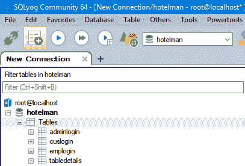
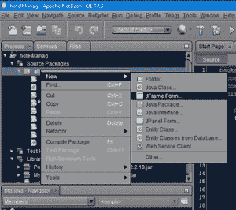
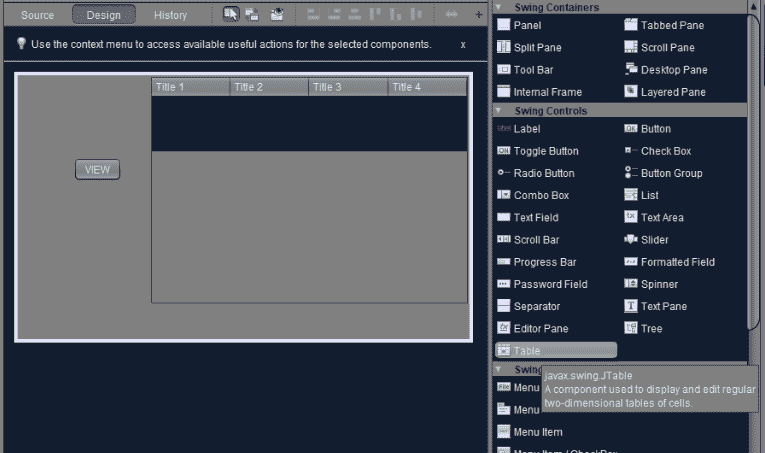
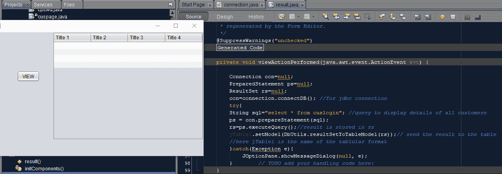
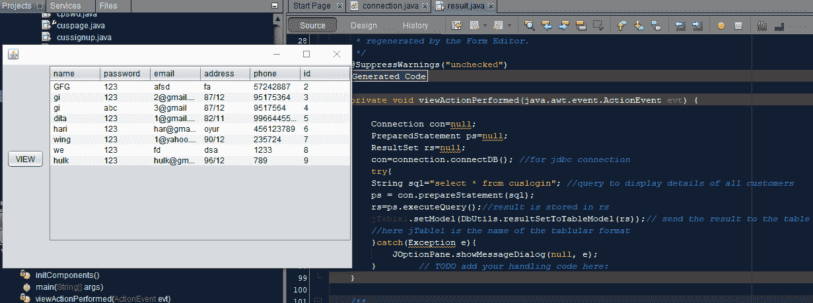

# 在 JDBC 以表格形式输出查询结果的 Java 程序

> 原文:[https://www . geesforgeks . org/Java-程序到输出-查询-结果-表格格式-in-jdbc/](https://www.geeksforgeeks.org/java-program-to-output-query-results-in-tabular-format-in-jdbc/)

JDBC (Java 数据库连接)是 Java 编程语言和各种数据库(如 oracle、SQL 等)之间的标准 API(应用程序接口)，它将与用户交互的前端与存储数据的后端连接起来。

**程序:**

1.  创建数据库
2.  连接类
3.  以表格格式输出结果。
    *   在同一个包中，右键单击它，打开一个 JFrame 表单并给出一个名称
    *   添加一个桌子摆动控制(拖放)和一个“查看”按钮
    *   单击“源”选项卡并导入以下库
    *   下载一个 [rs2xml。如果单独的 JAR 文件不起作用，可以额外导入 *DbUtils* 。](https://hacksmile.com/rs2xml-jar-free-download/)
    *   转到“设计”选项卡，双击“查看”按钮，为 jdbc 连接和获取结果编写程序。
4.  通过双击“视图”按钮来编写代码，同时注意不要在主方法中编写代码。
5.  显示输出

**实施:**

**步骤 1:** 使用 sqlyog 创建一个数据库，并在其中创建一些表，并在其中填充数据，以便输出表的内容。

> 例如，这里数据库被命名为“hotelman”，其中表名是“cuslogin”和“adminlogin”。数据库刚创建时的图示如下



**步骤 2:** 连接类

*   打开 IDE。Netbeans 通常用于说明，因为它已经包含了预安装的所需 jar 文件。对于任何其他 IDE，首先，在创建连接类之前导入所需的 4 个 jar 文件。
*   在内部创建一个包，以便在数据库和程序之间建立连接。
*   在包中，打开一个新的 java 文件并创建一个连接类，这样就可以在 main(App 类)中访问它的对象，从而实现 JDBC 连接
*   最后，用 connection.java 保存文件名。

**例**

## Java 语言(一种计算机语言，尤用于创建网站)

```java
// Java Program to Output Query Results in Tabular Format in
// JDBC

// Importing database classes for
// handling sql exception and for jdbc connectivity
// name of database here is mysql
import java.sql.*;

// Connection class
public class connection {

    // Initially setting object to NULL in order to
    // avoid any garbage value isse
    Connection con = null;

    public static Connection connectDB()

    {
        // Try block to check all exceptions
        try {

            // Loading driver using forName() method
            Class.forName("com.mysql.jdbc.Driver");

            // Registering driver using DriverManager
            // root is the username
            // 1234 is the password
            // Can set your own username and password
            Connection con = DriverManager.getConnection(
                "jdbc:mysql://localhost:3306/hotelman",
                "root", "1234");

            // eturning connection object which later on
            // to be used in Main/App class
            return con;
        }

        // Catch block to handle DB exceptions
        catch (SQLException e) {

            // Print the exception occured
            System.out.println(e);
        }
    }
}
```

**步骤 3:** 以表格形式输出结果。

> 考虑到上表“cuslogin”有列，即“id”、“姓名”、“电子邮件”、“密码”，我们希望以表格形式显示。

**3.1** 在同一个包里面，右击它，打开一个 JFrame 表单，给出你选择的名称(如下图)



**3.2** 添加一个表格摆动控件(拖放)和一个“查看”按钮(单击该按钮将在表格中显示结果)



**3.3** 点击来源选项卡，导入以下库

```java
import java.sql.*; //for handling jdbc related syntax
import javax.swing.JOptionPane;  //for showing message
import net.proteanit.sql.DbUtils; //for displaying the result of query to table form
```

**3.4** 下载一个 [rs2xml。如果单独的 jar 文件不起作用，JAR 文件](https://hacksmile.com/rs2xml-jar-free-download/)另外导入 *DbUtils* 。现在，只需按照以下步骤解压缩并上传 jar 文件:

> ***3.4.1*** 右键**–**点击库，点击添加 jar/文件夹
> 
> ***3.4.2*** 上传解压后的 jar 文件，点击打开。

**3.5** 转到设计选项卡，双击‘查看’按钮，为函数内部的哪个写相应的代码，程序如下:

## Java 语言(一种计算机语言，尤用于创建网站)

```java
// Java Program for for jdbc connection
// and for obtaining the result

Connection con = null;
PreparedStatement ps = null;
ResultSet rs = null;
the above code is con = connection.connectDB();

// Query to display details of all customers
String sql = "select * from cuslogin";

// Try block to check for exceptions
try {
    ps = con.prepareStatement(sql);

    // result is stored in rs
    rs = ps.executeQuery();

    // send the result to the table
    // Here, jTable1 is the name of the tablular format
    jTable1.setModel(DbUtils.resultSetToTableModel(rs));
}

// Catch block to handle exceptions
catch (Exception e) {

    // Display exception message as in dialog box
    JOptionPane.showMessageDialog(null, e);
}
```

**3.5** 双击“查看”按钮写代码，在主方法中保留不写的备注。

**例**

## Java 语言(一种计算机语言，尤用于创建网站)

```java
// Importing input output java files
import java.io.*;

// Class
class GFG {

    // Main friver method
    public static void main(String[] args)
    {

        // Assigning NULL to connection object
        Connection con = null;

        PreparedStatement ps = null;

        ResultSet rs = null;

        // For jdbc connection
        con = connection.connectDB();

        // Query to display details of all customers
        String sql = "select * from cuslogin";

        try {

            ps = con.prepareStatement(sql);

            // Result is stored in rs
            rs = ps.executeQuery();

            // Send the result to the table
            jTable1.setModel(
                DbUtils.resultSetToTableModel(rs));

            // Here, jTable1 is name of the tablular format
        }

      // Catch block to handle if exception occured
        catch (Exception e) {

            // Display exception message in dialog block
            JOptionPane.showMessageDialog(null, e);
        }
    }
}
```

**输出:**

*   运行 java 文件后



*   单击查看按钮，输出如下

