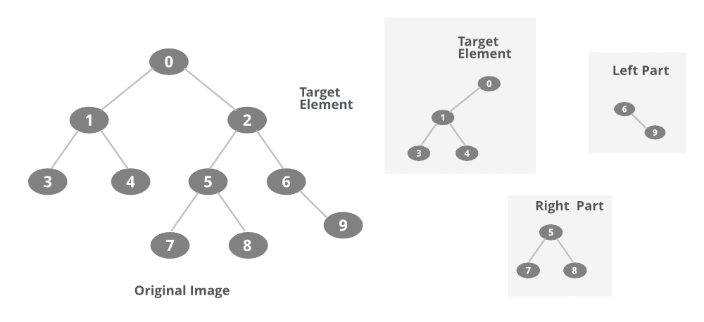

# 使用 DFS 从给定元素中分割树的 Java 程序

> 原文:[https://www . geesforgeks . org/Java-程序到分区-从给定元素到树-使用-dfs/](https://www.geeksforgeeks.org/java-program-to-partition-a-tree-from-a-given-element-using-dfs/)

图的深度优先遍历(或搜索)类似于树的深度优先遍历 [。](https://www.geeksforgeeks.org/tree-traversals-inorder-preorder-and-postorder/) 这里唯一的问题是，与树不同，图可能包含循环，一个节点可能被访问两次。为了避免多次处理节点，请使用布尔访问数组。 DFS 是一种遍历方法，用于从给定的图或树中找出生成树。

从给定元素中划分一棵树意味着我们必须找到通过从树中移除该元素而生成的不同的强连通树。因此，我们将使用 DFS 来查找在移除给定元素后形成的分区树的不同组件。因此，使用 java 的 [DFS 算法](https://www.geeksforgeeks.org/depth-first-search-or-dfs-for-a-graph/)是一个先决条件。

**过程:**从任何元素分割树会导致以下三种情况:

**情况 1:** 如果该元素有一个父元素和一个左子树和一个右子树，那么会有如下不同的生成树:

*   第一个生成树是通过在特定元素节点的父节点上执行 DFS 而形成的。
*   第二个将由左子树产生，因为左子树的所有节点将与父节点分离，并将产生一个单独的生成树。
*   第三个将是右子树，与上述情况相同。

**情况 2:** 如果节点只有一个父节点，那么可能只有一个分区(生成树)，即该树中除该节点之外的所有节点。

**情况 3:如果节点没有父节点，只有子节点(根元素)，那么如果有两个子节点，则可能有另外两个生成树。**

**情况 4:** 如果节点只有一个子节点和一个父节点，那么可能有两个生成树。



下图显示并清除了所有案例。

因此，我们必须编写一个分区函数，该函数接受输入元素和树的邻接表，然后在如上所述决定情况后调用 [DFS 方法](https://www.geeksforgeeks.org/depth-first-search-or-dfs-for-a-graph/)。然后，DFS 函数返回分区生成的生成树。因此，下面给出了 Java 程序，它从给定的元素中划分树。

**例**

## Java 语言(一种计算机语言，尤用于创建网站)

```java
// Java Program to Partition a Tree from a Given Element using DFS

// Importing required libraries
import java.lang.*;
import java.io.*;
import java.util.*;

// Main class
public class Main {

    public static int V;
    // Adjacency List Representation
    public static LinkedList<Integer> adj[];

    // Constructor
    @SuppressWarnings("unchecked") Main(int v) {
        V = v;
        adj = new LinkedList[v];
        for (int i = 0; i < v; ++i)
            adj[i] = new LinkedList();
    }

    // Method 1
    // To add an edge into the graph
    static void addEdge(int v, int w) {
        adj[v].add(w); // Add w to v's list.
    }

    // Method 2
    // DFS function
    static void DFSUtil(int v, boolean visited[]) {
        visited[v] = true;
        System.out.print(v + " ");
        Iterator<Integer> i = adj[v].listIterator();
        while (i.hasNext()) {
            int n = i.next();
            if (!visited[n])
                DFSUtil(n, visited);
        }
    }

    // Method 3
    // To Partition the tree as it calls DFS
    // for parent, Right and Left trees.
    static void Partition(int v) {

        Iterator<Integer> i = adj[v].listIterator();
        int k = 1;
        boolean visited[] = new boolean[V];
        // Flag variable
        visited[v] = true;

        // The current element is separated from partition
        while (i.hasNext()) {

            // DFS for all the partitions like parent ,left and right.
            System.out.println();
            System.out.println(k + "Tree");

            ++k;

            int n = i.next();
            DFSUtil(n, visited);
        }
    }

    // Method 4
    // main driver method
    public static void main(String args[]) {

        // Creating an object of class
        // in main() method
        Main g = new Main(10);

        // Sample illustration of a tree
        // as how it will look like

        /*  0
           /  \
          1    2 -> Target Node.
         / \  / \
        3  4 5   6

            / \   \
           7   8   9
        */

        // Adding edges passing arguments
        // as per above generated tree
        g.addEdge(0, 1); g.addEdge(1, 0);
        g.addEdge(0, 2); g.addEdge(2, 0);
        g.addEdge(1, 3); g.addEdge(3, 1);
        g.addEdge(1, 4); g.addEdge(4, 1);
        g.addEdge(2, 5); g.addEdge(5, 2);
        g.addEdge(2, 6); g.addEdge(6, 2);
        g.addEdge(5, 7); g.addEdge(7, 5);
        g.addEdge(5, 8); g.addEdge(8, 5);
        g.addEdge(6, 9); g.addEdge(9, 6);

        // Calling the Method3 to
        // partition the tree
        Partition(2);
    }
}
```

**Output**

```java
1Tree
0 1 3 4 
2Tree
5 7 8 
3Tree
6 9 
```