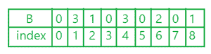

# Java 程序打印数组中所有重复的频率数字

> 原文:[https://www . geesforgeks . org/Java-program-to-print-数组中所有重复出现的数字-频率/](https://www.geeksforgeeks.org/java-program-to-print-all-the-repeated-numbers-with-frequency-in-an-array/)

数组中某个元素的出现频率是该元素在整个数组中出现的次数。给定可能包含重复项的数组，打印所有重复/重复的元素及其频率。

以下是通过两种方法对该计划的讨论:

1.  **使用** **计数器数组**:通过维护一个单独的数组来维护每个元素的计数。
2.  **使用 HashMap** :通过更新 HashMap <中每个数组元素的计数，整数>。

**示例:**

```
Input :  arr[] = {1, 2, 2, 1, 1, 2, 5, 2}
Output : 1 3
         2 4
// here we will not print 5 as it is not repeated 

Input : arr[] = {1, 2, 3}
Output : NULL

// output will be NULL as no element is repeated.
```

### 方法 1:(使用计数器阵列)

**说明:**

*   数组可以排序，也可以不排序。
*   首先，使用另一个数组计算数组中的所有数字。
*   A 是一个数组，A[ ] = {1，6，4，6，4，8，2，4，1，1}
*   B 是计数器数组 B[x] = {0}，其中 x =数组 A 中的最大值“对于上面的示例 8”。
*   在 for 循环中，用 I 初始化。为数组 a 中的每个元素增加计数器数组中的值
*   b[A[I]]++；这将给出计数器数组



对元素计数后的数组 B

*   最后，只要元素大于 1，就打印 B 的索引及其元素。

## Java 语言(一种计算机语言，尤用于创建网站)

```
// Java program to count the frequency of
// elements in an array by using an extra
// counter array of size equal to the maximum
// element of an array

import java.io.*;

class GFG {
    public static void main(String[] args)
    {

        int A[] = { 1, 6, 4, 6, 4, 8, 2, 4, 1, 1 };

        int max = Integer.MIN_VALUE;
        for (int i = 0; i < A.length; i++) {
            if (A[i] > max)
                max = A[i];
        }

        int B[] = new int[max + 1];
        for (int i = 0; i < A.length; i++) {

            // increment in array B for every integer
            // in A.
            B[A[i]]++;
        }
        for (int i = 0; i <= max; i++) {
            // output only if element is more than
            // 1 time in array A.
            if (B[i] > 1)
                System.out.println(i + "-" + B[i]);
        }
    }
}
```

**输出:**

```
1-3
4-3
6-2
```

上述方法会消耗更多的空间，这等于数组元素的最大约束

**时间复杂度:** O(n)

**空间复杂度:** O(K)，其中 K 是数组的最大元素/约束

### 方法二:(使用 HashMap)

*   这是一个简单的方法，并且有一个基本的逻辑，你也可以通过使用一个无序的地图来实现。
*   地图会节省很多空间和时间。

## Java 语言(一种计算机语言，尤用于创建网站)

```
// Java program to maintain
// the count of each element
// by using map.
import java.util.*;

class GFG {

    public static void main(String[] args)
    {

        int[] a = { 1, 6, 4, 6, 4, 8, 2, 4, 1, 1 };
        int n = a.length; // size of array

        HashMap<Integer, Integer> map = new HashMap<>();
        for (int i = 0; i < n; i++) {

            if (map.containsKey(a[i])) {

                // if element is already in map
                // then increase the value of element at
                // index by 1

                int c = map.get(a[i]);
                map.replace(a[i], c + 1);
            }

            // if element is not in map than assign it by 1.
            else
                map.put(a[i], 1);
        }
        for (Map.Entry<Integer, Integer> i :
             map.entrySet()) {

            // print only if count of element is greater
            // than 1.
            if (i.getValue() > 1)
                System.out.println(i.getKey() + " "
                                   + i.getValue());

            else
                continue;
        }
    }
}
```

**Output**

```
1 3
4 3
6 2
```

**时间复杂度:** O(n)

**空间复杂度:** O(n)