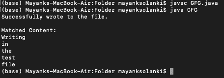

# 从文件中打印所有符合给定模式的字符串的 Java 程序

> 原文:[https://www . geesforgeks . org/Java-program-to-print-all-the-strings-match-a-给定模式-from-a-file/](https://www.geeksforgeeks.org/java-program-to-print-all-the-strings-that-match-a-given-pattern-from-a-file/)

找出一种方法来打印文件中与给定模式匹配的所有字符串。为了更接近目标，文件的概念应该非常清晰，以便在以后实现字符串时想出打印字符串的方法来达到最终目标。所以在处理字符串之前，当务之急是讨论出文件概念。一旦掌握了文件概念，字符串处理将继续进行。从头开始，目录中没有文件。

**思维过程:文件概念+字符串**

*   **步骤 1:** 文件的创建。
*   **第二步**
    *   写入同一个文件。
    *   条件检查消息是否成功写入。
    *   沉迷于上述文件的字符串概念。
    *   如果与上述文件中的给定模式匹配，则显示所有字符串。

### 文件概念

**步骤 1:创建新文件**

文件是一个抽象的路径，它没有物理存在。只有在“使用”该文件时，底层物理存储才会受到影响。当文件被间接创建时，抽象路径被创建。文件是一种方式，其中数据将按照要求存储。

主要的，为了创建一个新的文件，使用了内置的文件和函数，为了安全起见，这里肯定会抛出[异常](https://www.geeksforgeeks.org/exceptions-in-java/)。所以为了处理它，我们将使用异常处理技术。在这里，我们将使用其中一种被称为尝试-捕获块的技术。

第二，额外的工作只是我们将导入文件类，我们将为其导入文件类。

**语法:**导入文件库或类

```
import java.util.File ;
```

**语法:**创建新文件

```
File object_name = new File(Directory); 
```

**语法:**指定目录在不同的操作系统中是不同的(假设 java 文件在一个名为‘Folder’的文件夹中是在桌面上创建的)

在 Linux 和 Mac 中

```
/Users/mayanksolanki/Desttop/Folder/
```

在 Windows 中，使用“\\”代替“/”来转义“\”字符。所以访问相同的目录

```
\\Users\\mayanksolanki\\Desktop\\Folder\\
```

**创建新文件**有两种标准方法，或者直接借助 file 类，或者通过在两种方法中创建文件的对象，间接借助 FileOutputStream。

*   **使用文件类**
*   **通过使用文件输出流类**

<figure class="table">

| 

文件类别

 | 

文件输出流类

 |
| --- | --- |
| 这是一个类，只是一个句柄 | 它是一个可以写入[文件输出流 JavaDoc](https://www.geeksforgeeks.org/dataoutputstream-in-java/) 的输出流 |
| 方法:File.createNewFile() | 方法:文件输出流示例:echo > myFile.txt |
| 它用于那些没有物理存在的物体 | 它用于那些已经存在的对象 |

</figure>

这两个类都提供了一些主要用于文件操作的方法。例如，创建、写入、比较两个路径名、检查特定文件是否存在**、**等等。要理解这个话题，首先**，**考虑两种方法的一个例子。

> *   用于在机器上编译任何 java 代码的终端命令
> *   用于在机器上运行任何 java 代码的终端命令
>     *   javac _ class _ name . Java//用于编译
>     *   java 类名//用于执行
>         
> 
> Mac 操作系统的终端将用于实现和提供访问目录的输出
> 
> 使用的目录:/Users/mayanksolanki/Desktop/Folder/

**第二步:重写文件:**现在第一步结束。现在进入下一步，文件将被写入

为此，需要导入一个名为“[***【file writer】***](https://www.geeksforgeeks.org/file-handling-java-using-filewriter-filereader/)的类”

**语法:**用于导入要编写的类

```
import java.io.FileWriter;    // Class imported to write over a file
```

**语法:**覆盖哪个文件

```
FileWriter myWriter = new FileWriter("filename.txt");
```

**语法:**写入文件

```
myWriter.write("Insert the string here which later is supposed to be checked present or not");
```

**第三步:打印文件中的字符串:**

为此，需要导入一个名为“[*【Util . regex】*](https://www.geeksforgeeks.org/regular-expressions-in-java/)”和的类，该类的方法只用于匹配文件中存在的字符串。

```
Pattern pattern_name = Pattern.compile("[A-Za-z][a-z]+");
```

因此，现在提出了名为“test.txt”的演示类方法

**进场:**

*   阅读文件。
*   定义要搜索的模式。
*   在文件的每一行中寻找模式。

考虑一个通过实施来讨论上述内容的示例，以便检查内部工作:

## Java 语言(一种计算机语言，尤用于创建网站)

```
// Java Program to print all the
// Strings that match a given
// Pattern from a File

// Importing Classes/Files
import java.io.*;

// Importing Special Class 
// for matching patterns
import java.util.regex.*;

public class GFG {

    // Main driver method
    public static void main(String[] args)
        throws IOException
    {

        // Try block for detecting exception
        try {

            // Creating a file
            FileWriter writer = new FileWriter("test.txt");

            // Writing in file
            writer.write("Writing in the test file!");
            writer.close();

            // Success Message
            System.out.println(
                "Successfully wrote to the file.\n");
        }

        // Catch block to handle exception
        catch (IOException e) {

            // Catching any error
            System.out.println("An error occurred.");
            e.printStackTrace();
        }

        // FileReader
        BufferedReader read = new BufferedReader(
            new FileReader("test.txt"));

        // The regex pattern
        Pattern pattern = Pattern.compile("[A-Za-z][a-z]+");

        System.out.println("Matched Content:");
        // For each line of input, try matching the pattern

        String line;
        while ((line = read.readLine()) != null) {

            // For each match in the 
            // line, extract and print it
            Matcher match = pattern.matcher(line);

            while (match.find()) {

                // One method:
                // System.out.println(match.group(0));

                // Another method:
                // Get the starting position of the text
                int start = match.start(0);

                // Get ending position
                int end = match.end(0);

                // Print whatever matched.
                System.out.println(
                    line.substring(start, end));
            }
        }
    }
}
```

**输出:**



上述输入是在 mac 上的终端上运行的硬编码输入，其中:

*   第一行“javac file_name.java”编译文件名为 GFG 的目录中的文件
*   第二行“java file_name”表示执行上述代码
*   第三行到最后一行是在创建的类“test.txt”中匹配的字符串的硬编码输出，作为上述代码的示例类