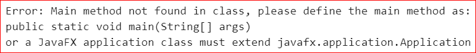

# 不使用主方法打印任何语句的 Java 程序

> 原文:[https://www . geesforgeks . org/Java-程序-打印任意语句-不使用 main-method/](https://www.geeksforgeeks.org/java-program-to-print-any-statement-without-using-the-main-method/)

我们知道[静态块](https://www.google.com/url?client=internal-element-cse&cx=009682134359037907028:tj6eafkv_be&q=https://www.geeksforgeeks.org/g-fact-79/&sa=U&ved=2ahUKEwij-I7Y84btAhVD7XMBHci2CM8QFjAAegQIBhAB&usg=AOvVaw0nPCYCJgvF5sJDFA-apuWw)在主方法之前执行，因此我们可以将我们想要执行的语句放在静态块中，但是对于 JDK7 和上述版本的 **JDK** ，代码不会执行，因为编译器首先会在任何其他事情之前寻找主方法。此外，这取决于运行程序所使用的集成开发环境，即程序可能在某些集成开发环境中成功执行，而在某些集成开发环境中可能无法成功执行。此外，我们可以在静态块中异常退出我们的程序，这样 [JVM](https://www.google.com/url?client=internal-element-cse&cx=009682134359037907028:tj6eafkv_be&q=https://www.geeksforgeeks.org/jvm-works-jvm-architecture/&sa=U&ved=2ahUKEwjOvqrK84btAhVq8XMBHalXBEUQFjAAegQIAhAC&usg=AOvVaw3lCDxWnbz8fH9VLWLNKoBQ) 就不会检查主方法，但是正如所讨论的，它取决于 IDE，程序是否会运行。

**示例:**下面是上述方法的代码实现。

## Java 语言(一种计算机语言，尤用于创建网站)

```
// Java Program printing the statement without using main
// method.

class PrintWithoutMain {

    // static block
    static
    {
        // prints "Hello World!!" to the console
        System.out.println("Hello World!!");

        // exit from the program
        System.exit(1);
    }
}
```

**输出**

```
Hello World!!
```

上述代码在 JDK7 之前和之后都不会编译。此外，如果在某些集成开发环境(如 Intellij、Netbeans 或控制台)上运行上述代码，可能会出现如下错误。

