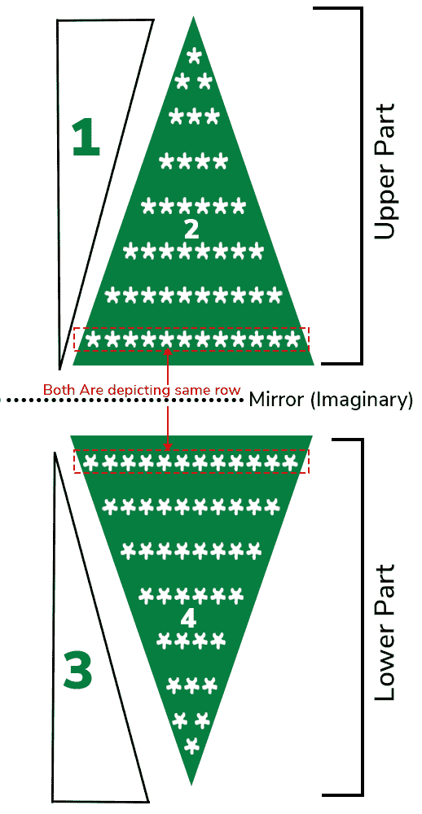

# Java 程序打印镜像上星三角图案

> 原文:[https://www . geesforgeks . org/Java-程序转打印-镜像-上-星-三角-图案/](https://www.geeksforgeeks.org/java-program-to-print-mirror-upper-star-triangle-pattern/)

这个图案有两部分，都是彼此的镜像。三角形的底部必须在假想镜子的底部，顶端必须在顶部。

插图:

```java
Input:
size = 7

Output:

      * 
     * * 
    * * * 
   * * * * 
  * * * * * 
 * * * * * * 
* * * * * * * 
* * * * * * * 
 * * * * * * 
  * * * * * 
   * * * * 
    * * * 
     * * 
      * 
```

**进场:**

将模式分成子模式

*   把它分成两部分
    *   上部
    *   下面部分
*   这两个部分是彼此的镜像。每个部分由两个三角形组成。因此，总的来说，我们必须打印 4 个三角形才能获得所需的图案。



**例 1:** 上部

## Java 语言(一种计算机语言，尤用于创建网站)

```java
// Java Program to Print Upper Part of Mirror Upper Star
// Triangle Pattern

// Importing input output classes
import java.io.*;

// Main Class
class GFG {

    // Method 1
    // To print upper part of the pattern
    private static void displayUpperPart(int size)
    {

        // Declaring variables for rows and columns
        // respectively
        int m, n;

        // Outer loop for rows
        for (m = size - 1; m >= 0; m--) {

            // Inner loop 1
            // to print triangle 1
            for (n = 0; n < m; n++) {

                // Printing whitespace
                System.out.print(" ");
            }

            // Inner loop 2
            // to print triangle 2
            for (n = m; n <= size - 1; n++) {

                // Printing star with whitespace
                System.out.print("*"
                                 + " ");
            }

            // By now done with one rpw so next line
            System.out.println();
        }
    }

    // Method 2
    // Main driver method
    public static void main(String[] args)
    {
        // Declaring and initializing variables to
        // size of the triangle
        int size = 7;

        // Calling the above Method 1 to
        // print and display the upper part of triangle
        displayUpperPart(size);
    }
}
```

**Output**

```java
      * 
     * * 
    * * * 
   * * * * 
  * * * * * 
 * * * * * * 
* * * * * * * 
```

**例 2:** 三角形的下部

## Java 语言(一种计算机语言，尤用于创建网站)

```java
// Java Program to Print Lower Part of Mirror Upper Star
// Triangle Pattern

// Importing input output classes
import java.io.*;

// Main Class
class GFG {

    // Method 1
    // To print lower part of the pattern
    private static void displayLowerPart(int size)
    {

        // Declaring variables for rows and columns
        // respectively
        int m, n;

        // Outer loop fo Rows
        for (m = 1; m <= size; m++) {

            // Inner loop 1 to print triangle 3
            for (n = 1; n < m; n++) {

                // Printing whitespace
                System.out.print(" ");
            }

            // Inner loop 2 to print triangle 4
            for (n = m; n <= size; n++) {

                // Printing star and whitespace
                System.out.print("*"
                                 + " ");
            }

            // By now done with one row so new line
            System.out.println();
        }
    }

    // Method 2
    // Main driver method
    public static void main(String[] args)
    {
        // Declaring and initializing variable to
        // size of the triangle
        // This is number of rows
        int size = 7;

        // Calling the above Method1
        // to display lower part of the triangle
        displayLowerPart(size);
    }
}
```

**Output**

```java
* * * * * * * 
 * * * * * * 
  * * * * * 
   * * * * 
    * * * 
     * * 
      * 
```

**例 3:** 完整镜像上星形三角图案

## Java 语言(一种计算机语言，尤用于创建网站)

```java
// Java Program to Print Mirror upper Star triangle Pattern

// Importing input output classes
import java.io.*;

// Main Class
public class GFG {

    // Method 1
    // To print upper part of the pattern
    private static void displayUpperPart(int size)
    {

        // Declaring variables for rows and columns
        // respectively
        int m, n;

        // Outer loop for rows
        for (m = size - 1; m >= 0; m--) {

            // Inner loop 1
            for (n = 0; n < m; n++) {

                // Printing whitespace
                System.out.print(" ");
            }

            // Inner loop 2
            for (n = m; n <= size - 1; n++) {

                // Printing star with whitespace
                System.out.print("*"
                                 + " ");
            }

            // By now we are done with one row so new line
            System.out.println();
        }
    }

    // Method 2
    // To print lower part of the pattern
    private static void displayLowerPart(int size)
    {

        // Declaring variables for rows and columns
        // respectively
        int m, n;

        // Outer loop for rows
        for (m = 1; m <= size; m++) {

            // Inner loop 1
            for (n = 1; n < m; n++) {

                // Printing whitespace
                System.out.print(" ");
            }

            // Inner loop 2
            for (n = m; n <= size; n++) {

                // Printing star and whitespace
                System.out.print("*"
                                 + " ");
            }

            // By now we are done with one row so new line
            System.out.println();
        }
    }

    // Method 3
    // Main driver method
    public static void main(String[] args)
    {
        // Declaring and initializing variable to
        // size of the triangle
        int size = 7;

        // Calling Method 1 to
        // display the upper part
        displayUpperPart(size);

        // Calling Method 2 to
        // display lower part
        displayLowerPart(size);
    }
}
```

**Output**

```java
      * 
     * * 
    * * * 
   * * * * 
  * * * * * 
 * * * * * * 
* * * * * * * 
* * * * * * * 
 * * * * * * 
  * * * * * 
   * * * * 
    * * * 
     * * 
      * 
```