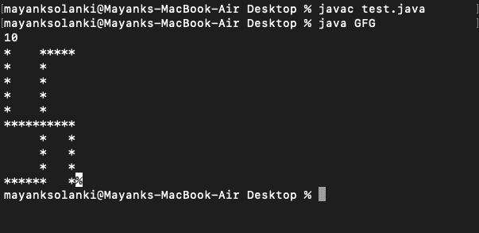

# 通过用户输入打印卐字符号的 Java 程序

> 原文:[https://www . geesforgeks . org/Java-程序转打印-纳粹党所用的十字记号-用户输入/](https://www.geeksforgeeks.org/java-program-to-print-swastika-sign-by-taking-user-input/)

取一个奇数(> =5)作为输入 N。对于 N = 7，打印下面给出的图案。这里的输入格式是 N 值，输出结果是卍字图案打印。

插图:

```
Input Format: Enter value of N ( >=5 )
Constraints: 5 <= N <= 99
```

```
Output Format: Print the required pattern.
```

```
*     * * * *

*     *

*     *

* * * * * * *

        *     *

        *     *

* * * *       *
```

让我们想一个办法，在编写任何代码之前列出逻辑，以便生成所需的模式。

**程序:**

1.  首先，从用户那里获取一个输入(N)。
2.  将行和列初始化为 1，以便在语句中循环。
3.  在第一行，我们肯定知道我们必须打印一个*然后给一些空格直到 N/2，然后再次打印星星直到 N。
4.  在第二行到第 N/2 行，首先，我们需要打印一个*然后空格直到第 N/2 行(也就是说，我们不需要在这里提供空格)
5.  在第(N/2)+1 行中，只需打印*直到 N
6.  同样在(N/2) +第 2 行到 N -1，我们需要首先打印空格直到 N/2，然后打印 a *和空格直到 N-1，最后是 a *
7.  在最后一行，我们需要打印*直到(N/2) + 1，然后现在打印空格直到 N-1，最后以*结尾。
8.  最后，不要忘记添加[*system . out . println()*](https://www.geeksforgeeks.org/system-out-println-in-java/)在每一行工作后添加一个空行

现在让我们通过编写相同的核心来实现一些。

**例**

## Java 语言(一种计算机语言，尤用于创建网站)

```
// Java program to Illustrate Swastika Sign Pattern Printing

// Main class
// SwastikaSign
class GFG {

    // Main driver method
    public static void main(String args[])
    {

        // Creating an object of Scanner clas to read input
        // from user
        Scanner sc = new Scanner(System.in);

        // Reading number N from user
        int N = sc.nextInt();
        // Custom setting the rows to be 10 to
        // understand the output

        // Initializing rows to unity initially
        int rows = 1;

        // This condition holds true
        // Till rows are lesser than input number from user
        while (rows <= N) {

            if (rows == 1) {

                // Start work
                System.out.print("*");

                // Space work
                for (int csp = 1; csp < N / 2; csp++)
                    System.out.print(" ");

                // Star work
                for (int cst = (N / 2) + 1; cst <= N; cst++)

                    System.out.print("*");
                System.out.println();
            }

            else if (rows <= N / 2 && rows > 1) {
                // Star work
                System.out.print("*");

                // Space work
                for (int csp = 1; csp < N / 2; csp++)

                    System.out.print(" ");
                System.out.print("*");
                System.out.println();
            }

            else if (rows == (N / 2) + 1) {

                for (int cstt = 1; cstt <= N; cstt++)

                    System.out.print("*");
                System.out.println();
            }

            else if (rows <= N - 1 && rows > (N / 2) + 1) {

                // Space work
                for (int csp = 1; csp <= N / 2; csp++)
                    System.out.print(" ");

                // Star work
                System.out.print("*");

                // Space work
                for (int cspp = 1 + (N / 2); cspp < N - 1;
                     cspp++)

                    System.out.print(" ");

                // Star work
                System.out.print("*");
                System.out.println();
            }
            else {

                for (int csttt = 1; csttt <= (N / 2) + 1;
                     csttt++)

                    System.out.print("*");

                for (int csppp = (N / 2) + 2;
                     csppp <= N - 1; csppp++)

                    System.out.print(" ");
                System.out.print("*");
            }
            rows++;
        }
    }
}
```

**输出:**



> **注意:**如果你想从用户那里获取输入，在这里输入行数，也可以使用 BufferedReader 类。