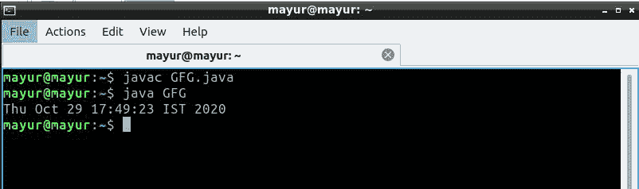
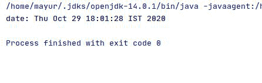

# 打印目录最后修改时间的 Java 程序

> 原文:[https://www . geesforgeks . org/Java-程序-打印-目录的最后修改时间/](https://www.geeksforgeeks.org/java-program-to-print-the-last-modification-time-of-a-directory/)

可以使用 Java 显示任何包含多个文件的文件夹/目录的最后修改日期。使用 Java 中的[最后修改时间](https://www.geeksforgeeks.org/file-lastmodified-method-in-java-with-examples/)方法，可以提取任意文件夹中任意文件的最后修改时间。

**进场:**

在一个文件夹中，我们有多个文件，所以会有多个形成日期。那么获得文件夹的正确修改日期是困难的，因为存在文件被创建/修改然后从文件夹中删除的情况。

因此，查找文件夹的修改日期的方法是迭代到该文件夹中的每个文件，并计算每个文件的修改时间/日期，无论哪个时间/日期小，都将被视为文件夹的修改日期

下面是上述方法的实现

## Java 语言(一种计算机语言，尤用于创建网站)

```
// Java Program to Print the last
// modification time of a directory
import java.io.*;
import java.util.*;
class GFG {

    public static void main(String[] args)
    {
        // Create an object of the File class
        // Replace the file path with path of the file
        // who's "last modified" date you want to change
        File myFile = new File("/home/mayur/GFG.java");

        long modifiedValue = myFile.lastModified();
        Date modifiedDate = new Date(modifiedValue);
        System.out.println(modifiedDate);
    }
}
```

**输出:**



**文件夹的修改日期/时间:**

这里我们使用[比较器](https://www.geeksforgeeks.org/comparable-vs-comparator-in-java/)将文件修改时间与同一文件夹中的其他文件进行比较

**接近**

1.  将所有文件放在一个名为**文件[]的数组中。**
2.  使用比较器以递增的顺序对最后修改日期/时间中基于数组的所有文件进行排序。
3.  返回数组的第一个索引，该索引将返回文件夹的修改日期/时间。

## Java 语言(一种计算机语言，尤用于创建网站)

```
package com.BotArmy;

// Java Program to Print the last
// modification time of a directory
import java.io.*;
import java.util.*;
class time {
    public static Date getLastModified(File directory)
    {
        // Accessing each file from a folder in File array:
        File[] files = directory.listFiles();
        if (files.length == 0)
            return new Date(directory.lastModified());
        // Sorting each file based on its lastModified
        // Time using the comparator
        Arrays.sort(files, new Comparator<File>() {
            public int compare(File o1, File o2)
            {
                // returning the file modified time
                // in the increasing way
                return Long.valueOf(o2.lastModified())
                        .compareTo(
                                o1.lastModified()); // latest 1st
            }
        });
        return new Date(files[0].lastModified());
    }
}
class Main {
    public static void main(String[] args)
    {
        // taking the file directory location
        File directory = new File(
                "/home/mayur/");
        Date myDate = time.getLastModified(directory);
        System.out.println("date: " + myDate);
    }
}
```

