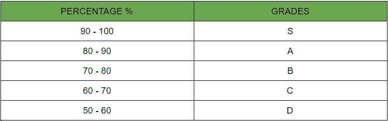

# Java 程序读取等级&显示等价描述

> 原文:[https://www . geesforgeks . org/Java-程序读取-等级-显示-等效描述/](https://www.geeksforgeeks.org/java-program-to-read-a-grade-display-the-equivalent-description/)

**问题陈述:**从 1 到 100 范围内的数字被随机地给定等级作为来自用户的输入，然后将用户的输入等级与给定的情况进行匹配，以产生期望的输出。

> **现实生活示例**
> 
> 考虑一个 1 到 100 的数字写在一张纸条上。现在，人们开始一个接一个地挑选纸条，并开始以这样的方式组织它们，即在决定制作 10 个不同的罐子之前，他开始将纸条放入 10 个不同的盒子中，以这样的方式排列纸条，在“罐子 A”中编号为 1-10，在“罐子 B”中编号为 11-20，以此类推，直到贴上标签并插入纸条，直到所有的纸条都被组织在贴有标签的罐子中。他这样做是为了轻松算出写在纸条上的数字。

所以用专业术语来说，机器通过这些方式

*   接受用户的输入
*   使用等于运算符(==)匹配等级
*   生成等效描述作为输出

有几种方法从蛮力(幼稚)开始到最理想。下面讨论的很少:

1.  **使用 If-Else 方法**
2.  **开关案例法**

**等级的分配使用以下**



**方法 1:**[**If-Else**](https://www.geeksforgeeks.org/decision-making-javaif-else-switch-break-continue-jump/)**语句**

下面是上述方法的实现

## Java 语言(一种计算机语言，尤用于创建网站)

```
// Java Program to Read Grade & Displaying Equivalent Desc

// Importing Classes/Files
import java.util.*;

public class GFG {

    // Main Driver Method
    public static void main(String[] args)
    {

        // User is supposed to enter grade among them
        System.out.println(
            "Enter Grade varying from S,A,B,C,D");
        String grade = "A";

        // Checking whether grade == "S" or not
        if (grade == "S") {
            System.out.println(
                "Student has scored between 90 to 100");
        }
        // Checking whether grade == "A" or not
        else if (grade == "A") {
            System.out.println(
                "Student has scored between 80 to 90");
        }
        // Checking whether grade == "B" or not
        else if (grade == "B") {
            System.out.println(
                "Student has scored between 70 to 80");
        }
        // Checking whether grade == "C" or not
        else if (grade == "C") {
            System.out.println(
                "Student has scored between 60 to 70");
        }
        // Checking whether grade == "D" or not
        else if (grade == "D") {
            System.out.println(
                "Student has scored between 50 to 60");
        }
        else {

            // Printing message-user pressed some other key
            System.out.println(
                "The grade you entered is not valid!");
        }
    }
}
```

**Output**

```
Enter Grade varying from S,A,B,C,D
Student has scored between 80 to 90
```

**接近 2:** [**切换情况**](https://www.geeksforgeeks.org/switch-statement-in-java/)

下面是上述方法的实现

## Java 语言(一种计算机语言，尤用于创建网站)

```
// Java Program to Read a Grade & Display the Equivalent

// Importing Classes/Files
import java.util.*;

public class GFG {

    //  Main driver method
    public static void main(String args[])
    {

        // Random grade taken for consideration
        String grade = "W";

        // Using Switch-Case.
        switch (grade) {
            // Checking whether grade == "S" or not.

        case "S":
            System.out.println(
                "Student has scored between 90 to 100");
            break;

            // Checking whether grade == "A" or not.
        case "A":
            System.out.println(
                "Student has scored between 80 to 90");
            break;

            // Checking whether grade == "B" or not.
        case "B":
            System.out.println(
                "Student has scored between 70 to 80");
            break;

            // Checking whether grade == "C" or not.
        case "C":
            System.out.println(
                "Student has scored between 60 to 70");
            break;

            // Checking whether grade == "D" or not.
        case "D":
            System.out.println(
                "Student has scored between 50 to 60");
            break;

        default:
            System.out.println(
                "The grade you entered is not valid!");
        }
    }
}
```

**Output**

```
The grade you entered is not valid!
```