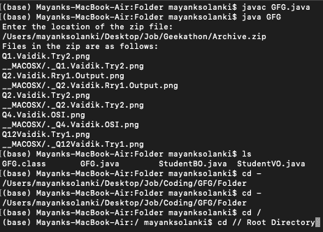

# 从压缩文件中读取和打印所有文件的 Java 程序

> 原文:[https://www . geesforgeks . org/Java-program-to-read-to-print-all-file-from-a-zip-file/](https://www.geeksforgeeks.org/java-program-to-read-and-print-all-files-from-a-zip-file/)

zip 文件是将一个或多个文件压缩在一起的文件，通常，zip 文件非常适合存储大型文件。这里，zip 文件将首先读取，同时使用 java 程序打印 zip 文件的内容，该程序使用 [java.util.zip.ZipEntry](https://www.geeksforgeeks.org/java-util-zip-zipentry-class-java/) 类来标记 zip 文件，并且在读取后，将打印其中的内容。如果没有找到 zip 文件，代码将抛出一个输入输出异常[文件未找到异常](https://www.geeksforgeeks.org/checked-vs-unchecked-exceptions-in-java/)

插图:

考虑一个存储名为

*   windows 操作系统中 D 驱动器上的 geekforgeeks.zip
*   windows 操作系统中的 D:/geeks.zip
*   macOS 操作系统中的 Archive.zip

**案例 1:**geek forkeks . zip

```java
Input  : D:/geekforgeeks.zip
Output : The files in the Zip are as follows:
         Java program to print a number.java
         Java program to print your name.java
         Java program to calculate.java
         Java program to print a pattern.java
```

现在，如果一个系统没有存储用户输入的特定 zip 文件，那么代码将抛出一个异常，并打印一条消息，指出该文件尚未找到。

**案例二:**D:/极客. zip

```java
Input  :  D:/geeks.zip
Output : java.io.FileNotFoundException: D:/geeks.zip (The system cannot find the file specified)
```

**案例 3:** 存档. zip

它与情况 1 相同，所以只在不同的操作系统上为实现部分保留它，如更深层次的示例所示。

**接近**

*   将 zip 文件的位置作为主方法中的输入。
*   zip 文件的位置现在被发送到方法。
*   在方法中，读取文件并打印其内容。
*   如果找不到文件，代码将引发异常。

**例**

## Java 语言(一种计算机语言，尤用于创建网站)

```java
// Java program to read and print all files
// from a zip file

// Importing input output classes
import java.io.BufferedInputStream;
import java.io.FileInputStream;
import java.io.FileNotFoundException;
import java.io.IOException;
// Importing zip classes and Scanner class
// from java.util package
import java.util.Scanner;
import java.util.zip.ZipEntry;
import java.util.zip.ZipInputStream;

// Class to Read and print the Zip Files
public class GFG {

    // Function to read and print the file names.
    public void printFileContent(String filePath)
    {

        // Creating objects for the classes and
        // initializing them to null
        FileInputStream fs = null;
        ZipInputStream Zs = null;
        ZipEntry ze = null;

        // Try block to handle if exception occurs
        try {

            // Display message when program compiles
            // successfully
            System.out.println(
                "Files in the zip are as follows: ");

            fs = new FileInputStream(filePath);
            Zs = new ZipInputStream(
                new BufferedInputStream(fs));

            // Loop to read and print the zip file name till
            // the end
            while ((ze = Zs.getNextEntry()) != null) {
                System.out.println(ze.getName());
            }

            // Closing the file connection
            Zs.close();
        }

        // Catch block to handle if any exception related
        // to file handling occurs
        catch (FileNotFoundException fe) {

            // Print the line line and exception
            // of the program where it occurred
            fe.printStackTrace();
        }

        // Catch block to handle generic exceptions
        catch (IOException ie) {

            // Print the line line and exception
            // of the program where it occurred
            ie.printStackTrace();
        }
    }

    // Main driver method
    public static void main(String[] args)
    {

        // Creating an object of the file
        GFG zf = new GFG();

        // Taking input of the zip file from local directory
        // Name of the zip file to be read should be entered
        Scanner sc = new Scanner(System.in);

        // Display message asking user to enter
        // zip file local directory
        System.out.println(
            "Enter the location of the zip file: ");
        String str = sc.nextLine();

        // Print the zip files(compressed files)
        zf.printFileContent(str);
    }
}
```

**输出:**

> 选择的压缩文件:存档
> 
> 本地计算机上的 Zip 文件目录:/Users/mayanksolanki/Desktop/Job/Geekathon/archive . zip



如上图所示，下面的 zip 文件打印出其中的 5 个文件。(所有形象的。png 格式)

> zip 中的文件如下:
> 
> 问题 1.Vaidik.Try2.png
> 
> __MACOSX/._Q1。Vaidik.Try2.png
> 
> 问题 2.Vaidik.Rry1.Output.png
> 
> 页:1。_ Q1 2。vaidik . berry 1 . output . png
> 
> 问题 2.Vaidik.Try2.png
> 
> __MACOSX/._Q2。Vaidik.Try2.png
> 
> 问题 4.Vaidik.OSI.png
> 
> __MACOSX/._Q4。Vaidik.OSI.png
> 
> Q12Vaidik.Try1.png
> 
> __MACOSX/._Q12Vaidik.Try1.png