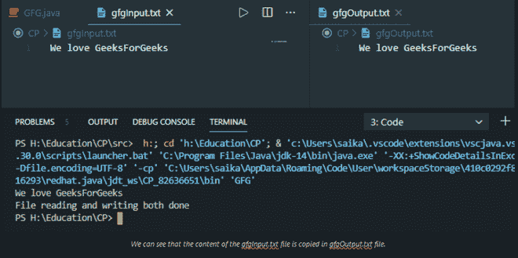
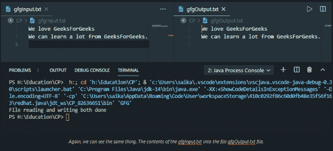

# 从一个文件读取内容并将其写入另一个文件的 Java 程序

> 原文:[https://www . geesforgeks . org/Java-从一个文件读取程序内容并将其写入另一个文件/](https://www.geeksforgeeks.org/java-program-to-read-content-from-one-file-and-write-it-into-another-file/)

[文件处理](https://www.geeksforgeeks.org/file-handling-java-using-filewriter-filereader/)在此过程中起着主要作用，因为第一个基本步骤是将内容写入文件。为此，必须知道如何使用[文件编写器类](https://www.geeksforgeeks.org/filewriter-class-in-java/)在文件中编写内容。第二步是从文件中读取内容并打印。为此，必须熟练掌握[文件阅读器类](https://www.geeksforgeeks.org/different-ways-reading-text-file-java/)才能做到这一点。

现在，为了从一个文件中读取内容并将其写入另一个文件，已经讨论了如何在文件上写入内容以及如何从文件中读取内容。现在，是时候把两者结合起来了。现在我们将使用文件阅读器类从一个类中读取内容，使用[文件写入器类](https://www.geeksforgeeks.org/filewriter-class-in-java/)将其写入另一个文件。

**方法:**为了从一个文件中读取内容并将其写入另一个文件，必须知道如何读取文件或写入文件。

1.  使用变量
2.  不使用任何变量

**方法 1:** 使用变量

**例 1:**

## Java 语言(一种计算机语言，尤用于创建网站)

```
// Java program to read content from one file
// and write it into another file

// Custom paths for this program 
// Reading from - gfgInput.txt
// Writing to - gfgOutput.txt

// Importing input output classes
import java.io.FileReader;
import java.io.FileWriter;
import java.io.IOException;

// Class
class GFG {

    // Main driver method
    public static void main(String[] args)
    {

        // The file reading process may sometimes give
        // IOException

        // Try block to check for exceptions
        try {

            // Creating a FileReader object and
            // file to be read is passed as in parameters
            // from the local directory of computer
            FileReader fr = new FileReader("gfgInput.txt");

            // FileReader will open that file from that
            // directory, if there is no file found it will
            // through an IOException

            // Creating a FileWriter object
            FileWriter fw = new FileWriter("gfgOutput.txt");

            // It will create a new file with name
            // "gfgOutput.text", if it is already available,
            // then it will open that instead

            // Declaring a blank string in which
            // whole content of file is to be stored
            String str = "";

            int i;

            // read() method will read the file character by
            // character and print it until it end the end
            // of the file

            // Condition check
            // Reading the file using read() method which
            // returns -1 at EOF while reading
            while ((i = fr.read()) != -1) {

                // Storing every character in the string
                str += (char)i;
            }

            // Print and display the string that
            // contains file data
            System.out.println(str);

            // Writing above string data to
            // FileWriter object
            fw.write(str);

            // Closing the file using close() method
            // of Reader class which closes the stream &
            // release resources that were busy in stream
            fr.close();
            fw.close();

            // Display message
            System.out.println(
                "File reading and writing both done");
        }

        // Catch block to handle the exception
        catch (IOException e) {

            // If there is no file in specified path or
            // any other error occured during runtime
            // then it will print IOException

            // Display message
            System.out.println(
                "There are some IOException");
        }
    }
}
```

**输出:**由于这段代码正在访问内部存储来保存那个文件，所以它不会在编译器上运行，所以输出是硬编码的，如下所示



> 该程序打印该文件中的内容，然后在下一行，它将打印文件读写完成(如果没有发生错误)，输入文件的内容将写入新的输出文件。如果有错误，就会打印有一些 [IOException](https://www.geeksforgeeks.org/scanner-ioexception-method-in-java-with-examples/) 。

**方法 2:** 不使用任何变量

在前面的程序中，我们将输入文件的所有内容存储在一个变量中，然后将字符串写入输出文件。现在我们可以直接将这些字符存储在输出文件中。

## Java 语言(一种计算机语言，尤用于创建网站)

```
// Java program to read content from one file
// and write it into another file

// Custom paths for this program
// Reading from - gfgInput.txt
// Writing to - gfgOutput.txt

// Importing FileWriter class
// to write into a file
import java.io.FileWriter;
// Also importing IOException class to
// throw exception if occurs
import java.io.IOException;

// Class
class GFG {

    // Main driver method
    public static void main(String[] args)
    {
        // The file writing and creating process may give
        // some IOException, that's why it is mandatory to
        // use try block

        // Try block to check for exception/s
        try {

            // Creating a FileWriter object which will
            // create a new file and if already available
            // it will open it
            FileWriter fw = new FileWriter("gfg.txt");

            // Content to be written on file
            // Custom input string

            // write() method will write the string
            // in the file
            fw.write("We love GeeksForGeeks");

            // Closing the file freeing up resources
            // in the memory
            fw.close();

            // Print and display message
            System.out.println("\nFile write done");
        }

        // Catch block to catch if exception/s occurs
        catch (IOException e) {

            // Print and display message
            System.out.println(
                "There are some IOException");
        }
    }
}
```

**输出:**由于这段代码正在访问内部存储来保存那个文件，所以它不会在编译器上运行，所以输出是硬编码的，如下所示



> 作为输出，程序将打印文件写完成(如果没有错误)，并将创建一个与给定文件名相同的文件，即，' *gfg.text'*