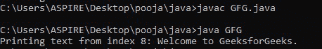

# 从指定索引读取文件中文本的 Java 程序

> 原文:[https://www . geesforgeks . org/Java-程序-从指定索引读取文件中的文本/](https://www.geeksforgeeks.org/java-program-to-read-text-from-file-from-a-specified-index/)

在文件系统中，如果不阅读前面的文本，我们就不能直接访问特定的索引。因此，从文件的特定索引中读取文本是通过跳过指定索引的所有先前字符来实现的。要从索引 n 中读取文本，我们需要跳过(n-1)个字节。这里，我们将使用 [FileInputStream](https://www.geeksforgeeks.org/java-io-fileinputstream-class-java/) 类从文件中读取文本。

[**长跳过(长 n)** :](https://www.geeksforgeeks.org/bufferedreader-skiplong-method-in-java-with-examples/) 跳过并丢弃输入流中的 n 字节数据。

**语法:**

```
public long skip(long n) throws IOException
```

**参数:** n —要跳过的字节数。

**返回:**实际跳过的字节数。

**投掷:**异常

## Java 语言(一种计算机语言，尤用于创建网站)

```
// Java program to read text from file from a specified
// index

import java.io.FileInputStream;

public class GFG {

    public static void main(String args[])
    {

        try {

            // attach the file to FileInputStream
            FileInputStream fin = new FileInputStream(
                "C:\\Users\\ASPIRE\\Desktop\\java folder\\Demo.txt");

            int i = 0;

            // discards 7 bytes of data from the input
            // stream.
            fin.skip(7);

            // read from the file
            System.out.print("Printing text from index 8: ");

            while ((i = fin.read()) != -1) {

                System.out.print((char)i);
            }

            fin.close();
        }
        catch (Exception e) {

            System.out.println(e);
        }
    }
}
```

**Demo.txt 文件:**


**输出:**

