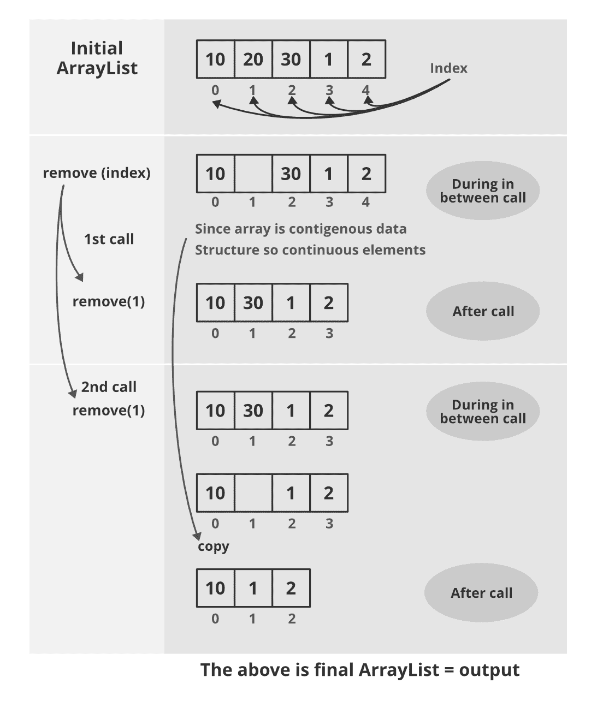

# 使用列表迭代器从数组列表中移除元素的 Java 程序

> 原文:[https://www . geesforgeks . org/Java-program-to-remove-an-element-from-ArrayList-use-listiterator/](https://www.geeksforgeeks.org/java-program-to-remove-an-element-from-arraylist-using-listiterator/)

[ListIterator.remove()](https://www.geeksforgeeks.org/iterators-in-java/) 方法从列表中移除由 next()或 previous()光标位置返回的最后一个元素。每次调用下一个或上一个只能调用一次。只有在最后一次调用下一个或上一个操作之后，还没有调用 add(E)操作时，才能执行该操作。

[数组列表](https://www.geeksforgeeks.org/arraylist-in-java/)中的内部工作如下图所示，即删除或添加元素。在切换到[列表迭代器](https://www.geeksforgeeks.org/arraylist-listiterator-method-in-java-with-examples/)之前，考虑元素的一般移除。

**语法:**

```java
listIterator.remove();
```

1.  要删除的索引
2.  要删除的索引值

插图:

> **输入:**数组列表= [“红色”、“白色”、“蓝色”、“粉色”]
> 
> **输出:**数组列表= [“红色”、“蓝色”、“粉色”]
> 
> 删除数组列表中的元素“白色”或第二个元素。

> **输入**:数组列表= [“红色”、“白色”、“蓝色”、“粉色”]
> 
> **输出:**数组列表= [“红色”、“白色”、“蓝色”、“粉色”]
> 
> 删除数组列表中的元素“黑色”或第五个元素。因为必须移除的元素不在数组列表中，所以不会移除任何东西。

**过程:**使用列表迭代器从数组列表中移除元素如下:

1.  创建数组列表实例新数组列表<string>()；</string>
2.  使用颜色在数组列表中添加元素。
3.  创建 colors.listIterator()的 ListIterator 实例；
4.  删除元素前打印列表元素。
5.  将迭代器增加 [*列表迭代器. next()*](https://www.geeksforgeeks.org/arraylist-listiterator-method-in-java-with-examples/) 并移动到要移除的元素；
6.  通过 listIterator.remove()移除元素；
7.  删除元素后打印列表。在这个例子中，我们删除了元素“白色”。

从数组列表中删除元素时的状态事务



**情况 1:** 如果要移除的元素的索引已知，则使用循环

## Java 语言(一种计算机语言，尤用于创建网站)

```java
// Java Program to Remove an element from ArrayList
// using ListIterator

// Importing ArrayList and ListIterator classes
// of java.util package
import java.util.ArrayList;
import java.util.ListIterator;

public class GFG {

    // Main driver method
    public static void main(String[] args)
    {

        // Create an  ArrayList
        ArrayList<String> colors = new ArrayList<String>();

        // Add elements to above ArrayList
        colors.add("Red");
        colors.add("White");
        colors.add("Blue");
        colors.add("Pink");
        colors.add("Black");
        colors.add("Green");

        // ArrayList ={Red, White, Blue, Pink, Black, Green}
        ListIterator<String> listIterator
            = colors.listIterator();

        System.out.println("List Before remove() method = "
                           + colors);

        // Removing ith element from ArrayList
        // using listiterator

        // Suppose i = 3, so traversing
        // till that element
        for (int i = 0; i < 3; i++) {
            listIterator.next();
        }

        // Removes one more element from list
        // 'blue' element is removed from arraylist
        listIterator.remove();

        // Printing the final ArrayList after removing
        // elements from originally created ArrayList
        System.out.println("List After remove() method =  "
                           + colors);
    }
}
```

**Output**

```java
List Before remove() method = [Red, White, Blue, Pink, Black, Green]
List After remove() method =  [Red, White, Pink, Black, Green]
```

**情况 2:** 如果要移除的元素是已知的

迭代器/遍历数组列表并递增列表迭代器。如果我们到达了所需的元素，那么打破这个循环，否则我们将到达终点，什么都不会被删除。

## Java 语言(一种计算机语言，尤用于创建网站)

```java
// Java Program to Remove an element from ArrayList
// using ListIterator

// Importing ArrayList and ListIterator classes
// of java.util package
import java.util.ArrayList;
import java.util.ListIterator;

public class GFG {

    // Main driver method
    public static void main(String[] args)
    {

        // Create an ArrayList
        ArrayList<String> colors = new ArrayList<String>();

        // Adding elements to the arraylist
        colors.add("Red");
        colors.add("White");
        colors.add("Blue");
        colors.add("Pink");
        colors.add("Black");
        colors.add("Green");

        ListIterator<String> listIterator
            = colors.listIterator();

        // Print the original ArrayList created
        System.out.println("List Before remove() :- "
                           + colors);

        // we want to remove Blue element from the arraylist
        for (String it : colors) {
            listIterator.next();
            // if we reched to required element break the
            // loop
            if (it == "Blue")
                break;
        }

        // remove color blue from arraylist
        listIterator.remove();

        System.out.println("List After remove():- "
                           + colors);
    }
}
```

**Output**

```java
List Before remove() :- [Red, White, Blue, Pink, black, green]
List After remove():- [Red, White, Pink, black, green]
```