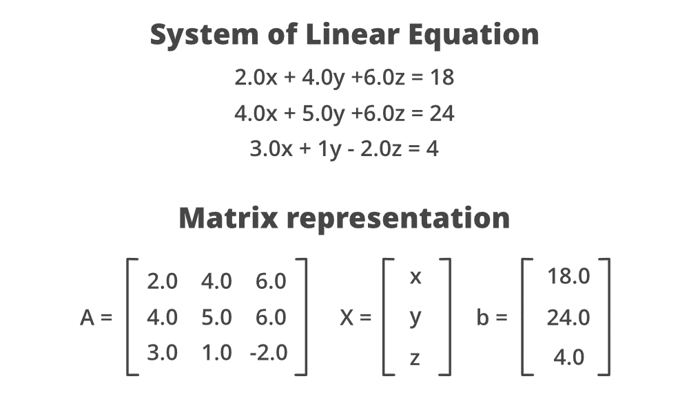
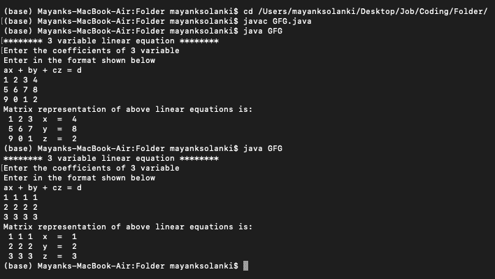
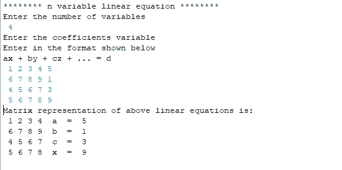
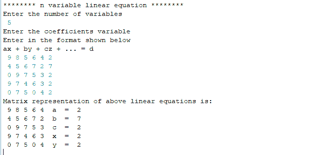

# 用矩阵形式表示线性方程的 Java 程序

> 原文:[https://www . geesforgeks . org/Java-程序-表示-矩阵形式的线性方程/](https://www.geeksforgeeks.org/java-program-to-represent-linear-equations-in-matrix-form/)

让我们借助一个例子来看看线性方程组:



考虑系数和变量的输入。

1.  扫描仪包应该导入到程序中，以便使用扫描仪类的对象从用户处获取输入。
2.  数组将被初始化以存储方程的变量。
3.  变量的系数将在 Scanner 类对象的帮助下从用户那里获取。
4.  这些方程将在循环的帮助下转换成矩阵的形式。

下面列举两个例子:

1.  矩阵形式的 3 变量线性方程。
2.  矩阵形式的可变线性方程。

**图解:**考虑数学中使用最多的实用线性方程，即 3 元线性方程。

```java
Input: ax + by + cz = d

Output- 1 2 3 x = 10
     5 1 3 y = 12
      7 4 2 z = 20
```

**例 1:** 矩阵形式的 3 变量线性方程的 Java 程序。

## Java 语言(一种计算机语言，尤用于创建网站)

```java
// Java Program to Represent Linear Equations in Matrix Form

// Importing Scanner class
// to take input from user
import java.util.Scanner;

public class GFG {

    // Mai driver method
    public static void main(String args[])
    {
        // Display message for better readability
        System.out.println(
            "******** 3 variable linear equation ********");

        // 3 variables of the linear equation
        char[] variable = { 'x', 'y', 'z' };

        // Creating Scanner class object
        Scanner sc = new Scanner(System.in);

        // Display message for asking user to enter input
        System.out.println(
            "Enter the coefficients of 3 variable");
        System.out.println(
            "Enter in the format shown below");
        System.out.println("ax + by + cz = d");

        // For 3*3 matrix or in other words
        // Dealing with linear equations of 3 coefficients

        // Input of coefficients from user
        int[][] matrix = new int[3][3];
        int[][] constt = new int[3][1];

        // Outer loop for iterating rows
        for (int i = 0; i < 3; i++) {
            // Inner loop for iterating columns
            for (int j = 0; j < 3; j++) {

                // Reading values from usr and
                // entering in the matrix form
                matrix[i][j] = sc.nextInt();
            }

            // One row input is over by now
            constt[i][0] = sc.nextInt();
        }

        // The linear equations in the form of matrix

        // Display message
        System.out.println(
            "Matrix representation of above linear equations is: ");

        // Outer loop for iterating rows
        for (int i = 0; i < 3; i++) {

            // Inner loop for iterating columns
            for (int j = 0; j < 3; j++) {

                // Printing matrix corresponding
                // linear equation
                System.out.print(" " + matrix[i][j]);
            }

            System.out.print("  " + variable[i]);
            System.out.print("  =  " + constt[i][0]);
            System.out.println();
        }

        // Close the stream and release the resources
        sc.close();
    }
}
```

**输出:**



现在，让它通用于 N 的任何值:“N 变量线性方程”

插图:

```java
Input: ax + by + cz + ... = d

Output: 1 2 3 x = 10
        5 1 3 y = 12
     7 4 2 z = 20
     ...
     ...
```

**例 2:** 矩阵形式的 N 变量线性方程组的 Java 程序。

## Java 语言(一种计算机语言，尤用于创建网站)

```java
import java.util.Scanner;

public class Linear_Equations_n {
    public static void main(String args[])
    {
        System.out.println(
            "******** n variable linear equation ********");
        // Initializing the variables
        char[] variable
            = { 'a', 'b', 'c', 'x', 'y', 'z', 'w' };
        System.out.println("Enter the number of variables");
        Scanner sc = new Scanner(System.in);
        int num = sc.nextInt();
        System.out.println(
            "Enter the coefficients variable");
        System.out.println(
            "Enter in the format shown below");
        System.out.println("ax + by + cz + ... = d");

        // Input of coefficients from user
        int[][] matrix = new int[num][num];
        int[][] constt = new int[num][1];
        for (int i = 0; i < num; i++) {
            for (int j = 0; j < num; j++) {
                matrix[i][j] = sc.nextInt();
            }
            constt[i][0] = sc.nextInt();
        }
        // Representation of linear equations in form of
        // matrix
        System.out.println(
            "Matrix representation of above linear equations is: ");
        for (int i = 0; i < num; i++) {
            for (int j = 0; j < num; j++) {
                System.out.print(" " + matrix[i][j]);
            }
            System.out.print("  " + variable[i]);
            System.out.print("  =  " + constt[i][0]);
            System.out.println();
        }
        sc.close();
    }
}
```

**输出–**



4–可变线性方程



5–可变线性方程