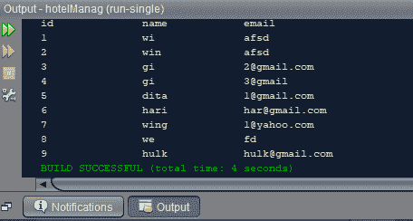

# 使用 JDBC 连接检索表格内容的 Java 程序

> 原文:[https://www . geesforgeks . org/Java-program-to-retrieve-contents-a-table-use-JDBC-connection/](https://www.geeksforgeeks.org/java-program-to-retrieve-contents-of-a-table-using-jdbc-connection/)

它可以有两种类型，即结构数据库和非结构数据库。结构数据库是可以以行和列存储的数据库。一个非结构化的数据库不能以行和列的形式存储，对于这些行和列，引入了这里不讨论的新概念。大多数真实世界的数据是非结构化的，比如照片、视频、社交媒体。因为它们没有预定义的数据类型，所以它们不在数据库中。因此，结构数据库存储在数据仓库中，而非结构数据库存储在数据湖中。 [Java 数据库连接](https://www.geeksforgeeks.org/establishing-jdbc-connection-in-java/)基本上是 Java 编程语言与 Oracle、SQL、PostgreSQL、MongoDB 等各种数据库之间的标准 API(应用程序接口)。它将前端(用于与用户交互)与后端(用于存储数据)连接起来

JDBC 由 7 个元素组成，称为连接步骤。它们如下所示:

<figure class="table">

| JDBC 连接步骤 | sep/连接号码 |
| --- | --- |
| one | 导入包 |
| Two | 加载并注册驱动程序 |
| three | 建立联系 |
| four | 创建语句 |
| five | 执行语句 |
| six | 过程结果 |
| seven | 关闭/终止 |

</figure>

导入包以处理 JDBC 操作的语法:

```
import java.sql.* ;
```

加载驱动程序类后注册驱动程序的语法:

```
forName(com.mysql.jdbc.xyz) ;
```

**步骤**:下面列出了 3 个步骤，涵盖所有 7 个组件并应用相同的步骤:

1.  将创建第一个数据库，从该数据库中提取数据。如果数据是结构化的，那么可以使用 SQL 来获取数据。如果数据是非结构化的，MongoDB 将从 da lakes 获取数据。这里创建了一个 SQL 数据库，所有进一步的执行也是如此。
2.  这个步骤是可选的，因为这里需要的只是太旧和注册驱动程序。在某些集成开发环境中，驱动程序是内置的，例如 NetBeans，但是在 eclipse 中却没有。这里需要安装驱动程序。Jar 文件需要下载，几乎不占用内存空间。
3.  使用 JDBC 连接检索表的内容

**第一步:使用 SQLyog** 创建数据库:用户可以使用‘*SQLyog‘*创建数据库，并在其中创建一些表，填充其中的数据。
考虑酒店数据库管理系统的随机示例。现在在上面应用 SQL 命令，将这个数据库命名为“hotelman”。现在假设用户开始在其中插入表，命名为“ *cuslogin* ”和“ *adminlogin* ”。


**第 2 步:创建连接:**考虑将 IDE 作为 Netbeans，以便清楚地理解，因为如果首先使用任何其他 IDE 安装驱动程序，现在就让这个包在其他地方工作。一旦被清除

1.  创建新包
2.  打开新的 java 文件
3.  为 JDBC 写下面的代码
4.  用***connection.java 保存文件名。**T3】*

为了清楚起见，这里将 IDE 视为 Netbeans。下图也是同样的情况:

## Java 语言(一种计算机语言，尤用于创建网站)

```
// Java Program  to Retrieve Contents of a Table Using JDBC
// connection

// Showing linking of created database

// Importing SQL libraries to create database
import java.sql.*;

public class connection {

    Connection con = null;

    public static Connection connectDB()

    {

        try {
            // Importing and registering drivers
            Class.forName("com.mysql.jdbc.Driver");

            Connection con = DriverManager.getConnection(
                "jdbc:mysql://localhost:3306/hotelman",
                "root", "1234");
            // here,root is the username and 1234 is the
            // password,you can set your own username and
            // password.
            return con;
        }
        catch (SQLException e) {

            System.out.println(e);
        }
    }
}
```

**步骤 3:使用 JDBC 连接检索表的内容:**假设“cuslogin”表有列，即“id”、“name”、“email”，并且用户想要查看“cuslogin”表的内容。它包括下面给出的一系列步骤，以及用于解释的声明和语法

**3.1:我**用如下的 SQL 查询初始化一个字符串

```
String sql="select * from cuslogin";
```

**3.2:** 初始化**z**e Connection 类、PreparedStatement 类和 ResultSet 类(JDBC 需要)的以下对象，并按如下方式连接数据库:

```
Connection con=null;
PreparedStatement p=null;
ResultSet rs=null;
con=connection.connectDB();
```

**3.3:** 现在，在 prepareStatement 内部添加 3.1 的 SQL 查询，执行如下

```
p =con.prepareStatement(sql);
rs =p.executeQuery();
```

**3.4** 运行一个循环，直到 rs.next()不等于 NULL，根据数据类型从表中获取值，例如我们使用 *getInt()* 表示整数数据类型值，使用 getString()表示字符串数据类型值。

**3.5** 在同一个包里面打开一个新的 java 文件(这里是它的 result.java)，输入完整的代码(如下所示)来检索表“cuslogin”的内容。

**3.6** 这两个文件即“*result . Java”*和“*connection . Java”*应该在同一个包中，否则程序不会给出想要的输出！

**实现:**下面是说明相同情况的 java 示例:

## Java 语言(一种计算机语言，尤用于创建网站)

```
// Java Program retrieving contents of
// Table Using JDBC connection

// Java code producing output which is based
// on values stored inside the "cuslogin" table in DB

// Importing SQL libraries to create database
import java.sql.*;

public class GFG {

    // Step1: Main driver method
    public static void main(String[] args)
    {
        // Step 2: Making connection using
        // Connection type and inbuilt function on
        Connection con = null;
        PreparedStatement p = null;
        ResultSet rs = null;

        con = connection.connectDB();

        // Try block to catch exception/s
        try {

            // SQL command data stored in String datatype
            String sql = "select * from cuslogin";
            p = con.prepareStatement(sql);
            rs = p.executeQuery();

            // Printing ID, name, email of customers
            // of the SQL command above
            System.out.println("id\t\tname\t\temail");

            // Condiion check
            while (rs.next()) {

                int id = rs.getInt("id");
                String name = rs.getString("name");
                String email = rs.getString("email");
                System.out.println(id + "\t\t" + name
                                   + "\t\t" + email);
            }
        }

        // Catch block to handle exception
        catch (SQLException e) {

            // Print exception pop-up on scrreen
            System.out.println(e);
        }
    }
}
```

**输出:**上面的输出完全基于“cuslogin”表中存储的值，如上面的代码所示

