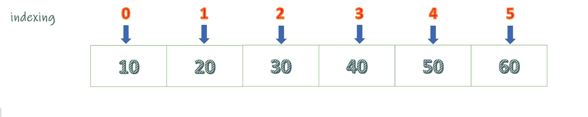

# 返回列表中奇数位置元素的 Java 程序

> 原文:[https://www . geesforgeks . org/Java-程序返回列表中奇数位置的元素/](https://www.geeksforgeeks.org/java-program-to-return-the-elements-at-odd-positions-in-a-list/)

给定一个[列表](https://www.geeksforgeeks.org/list-interface-java-examples/)，任务是返回列表中奇数位置的元素。让我们考虑以下列表。



显然，我们可以看到元素 20、40、60 位于奇数位置，因为列表的索引是从零开始的。现在我们应该返回这些元素。

**方法 1:**

*   用零初始化一个临时值。
*   现在遍历列表。
*   每次迭代检查临时值，如果值等于奇数，则返回该元素，否则继续。
*   每次迭代后，临时值增加 1。
*   但是，这可以在不使用临时值的情况下完成。由于列表中的数据是使用固定索引存储的，因此我们可以直接检查索引是奇数还是偶数，并相应地返回元素

**示例:**

## Java 语言(一种计算机语言，尤用于创建网站)

```java
// Java Program to Return the Elements
// at Odd Positions in a List
import java.io.*;
import java.util.*;

class GFG {

    public static void main(String[] args)
    {
        // Creating our list from above illustration
        List<Integer> my_list = new ArrayList<Integer>();
        my_list.add(10);
        my_list.add(20);
        my_list.add(30);
        my_list.add(40);
        my_list.add(50);
        my_list.add(60);

        // creating a temp_value for checking index
        int temp_val = 0;

        // using a for-each loop to
          // iterate through the list
        System.out.print("Elements at odd position are : ");
        for (Integer numbers : my_list) {
            if (temp_val % 2 != 0) {
                System.out.print(numbers + " ");
            }
            temp_val += 1;
        }
    }
}
```

**Output**

```java
Elements at odd position are : 20 40 60
```

**方法 2:**

*   从位置 1 开始遍历列表。
*   现在在每次迭代后将位置增加 2。这样做，我们总是处于一个奇怪的位置。
*   迭代 1: 1+2=3
*   迭代 2: 2+3=5
*   迭代 3: 5+2=7
*   等等。
*   在每次迭代期间返回元素的值。

**示例:**

## Java 语言(一种计算机语言，尤用于创建网站)

```java
// Java Program to Return the Elements
// at Odd Positions in a List

import java.io.*;
import java.util.*;

class GFG {

    public static void main(String[] args)
    {
        // creating list from above illustration
        List<Integer> my_list = new ArrayList<>();
        my_list.add(10);
        my_list.add(20);
        my_list.add(30);
        my_list.add(40);
        my_list.add(50);
        my_list.add(60);

        // iterating list from position one and incrementing
        // the index value by 2
        System.out.print(
            "Elements at odd positions are : ");

        for (int i = 1; i < 6; i = i + 2) {
            System.out.print(my_list.get(i) + " ");
        }
    }
}
```

**Output**

```java
Elements at odd positions are : 20 40 60
```