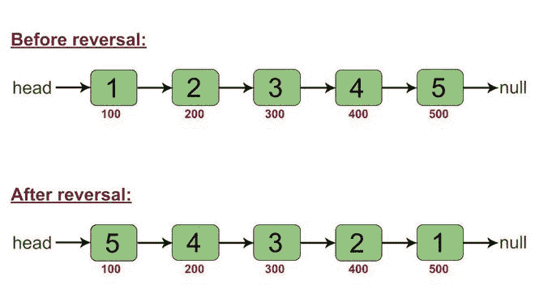

# 无需操作指针就能反转链表的 Java 程序

> 原文:[https://www . geesforgeks . org/Java-program-to-reverse-a-link-list-in-in-无需操作其指针/](https://www.geeksforgeeks.org/java-program-to-reverse-a-linked-list-in-without-manipulating-its-pointers/)

给定一个链表，任务是用 Java 编写一个程序，在不操作其指针的情况下反转链表，即反转应该只通过改变数据值而不是链接来发生。

**示例:**

```java
***Input:*** Original linked list
1->2->3->4->5->null
***Output:*** Linked list after reversal
5->4->3->2->1->null

***Input:*** Original linked list
5->14->20->8->null
***Output:*** Linked list after reversal
8->20->14->5->null

***Input:*** Original linked list
80->null
***Output:*** Linked list after reversal
80->null
```

对于反转，在连接链表节点的链接中不进行任何操作。仅更改数据值。为了更清楚地理解这一点，请看下图。



红色的数字代表节点的地址。要注意的是，即使在反转之后，链路也保持不变，即在反转之前，地址 **100** 处的节点连接到地址 **200** 处的节点，该节点又连接到地址 **300** 处的节点，以此类推，并且这些连接在反转之后也保持不变。

**进场:**

1.  变量“l”和“r”分别初始化为 0 和 size-1，表示第一个和最后一个节点的索引。
2.  在一个循环中，获取索引“l”和“r”处的节点，并交换相应的数据值。该循环通过递增“l”和递减“r”来工作。
3.  为了获取特定索引处的节点，定义了一个私有方法“fetchNode”。

**以下是上述方法的实现:**

## Java 语言(一种计算机语言，尤用于创建网站)

```java
// Java program to reverse a linked list without pointer
// manipulation

class Node {
    int value;
    Node next;

    Node(int val)
    {
        value = val;
        next = null;
    }
}

public class LinkedList {
    Node head;

    // this function returns the Node which is at a
    // particular index.
    // (The index is passed as the argument)
    private Node fetchNode(int index)
    {
        Node temp = head;
        for (int i = 0; i < index; i++) {
            temp = temp.next;
        }
        return temp;
    }

    // this function returns the size of linked list
    int getSize(Node head)
    {
        Node temp = head;
        int size = 0;
        while (temp != null) {
            size++;
            temp = temp.next;
        }
        return size;
    }

    // function to reverse the linked list
    void reverse()
    {
        int l = 0;
        int r = getSize(this.head) - 1;
        while (l < r) {
            Node leftSideNode = fetchNode(l);
            Node rightSideNode = fetchNode(r);

            int t = leftSideNode.value;
            leftSideNode.value = rightSideNode.value;
            rightSideNode.value = t;

            l++;
            r--;
        }
    }

    // function that prints the elements of linked list
    void printLinkedList()
    {
        Node temp = this.head;
        while (temp != null) {
            System.out.print(temp.value + " ");
            temp = temp.next;
        }
        System.out.println();
    }

    // Driver code
    public static void main(String[] args)
    {
        LinkedList list1 = new LinkedList();
        list1.head = new Node(1);
        list1.head.next = new Node(2);
        list1.head.next.next = new Node(3);
        list1.head.next.next.next = new Node(4);
        list1.head.next.next.next.next = new Node(5);

        System.out.println("Linked List Before Reversal: ");
        list1.printLinkedList();

        list1.reverse();

        System.out.println("Linked List After Reversal: ");
        list1.printLinkedList();
    }
}
```

**Output**

```java
Linked List Before Reversal: 
1 2 3 4 5 
Linked List After Reversal: 
5 4 3 2 1 
```