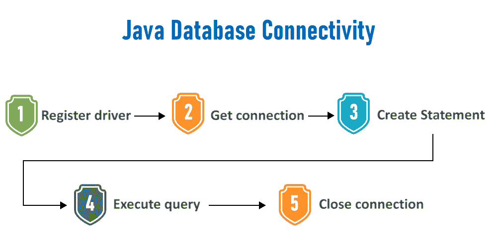
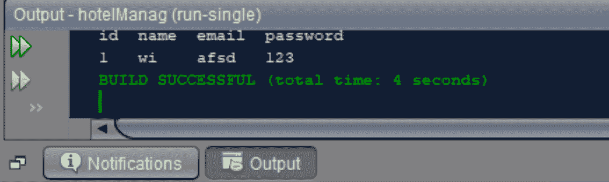

# 在 JDBC 搜索表格内容的 Java 程序

> 原文:[https://www . geesforgeks . org/Java-program-to-search-in-a-table-in-JDBC/](https://www.geeksforgeeks.org/java-program-to-search-the-contents-of-a-table-in-jdbc/)

为了应对 JDBC 标准，应该遵循 7 个步骤:

1.  导入数据库
2.  加载和注册驱动程序
3.  创建连接
4.  创建语句
5.  执行查询
6.  处理结果
7.  关闭连接



**程序:**

1.  **导入数据库**-用 java 导入 sql 数据库的语法是-
    导入 Java . SQL . *；
2.  **加载并注册驱动**-驱动类加载后注册驱动的语法为
    for name(com . MySQL . JDBC . XYZ)；
3.  **创建数据库**不考虑 [*SQL*](https://www.geeksforgeeks.org/sql-tutorial/) 或 [*NoSQL*](https://www.geeksforgeeks.org/introduction-to-nosql/) 。使用 [*sqlyog*](https://www.geeksforgeeks.org/how-to-update-contents-of-a-table-using-jdbc-connection/amp/?ref=rp) 创建数据库，并在其中创建一些表，并填充其中的数据，以便搜索表的内容。例如，数据库名为“hotelman”，表名为“cuslogin”和“adminlogin”。
4.  **创建连接:**打开任何 IDE，在那里可以按照标准方法生成 java 可执行文件。创建包进一步创建类。在包中，打开一个新的 java 文件，键入下面的 JDBC 连接代码，并用 connection.java 保存文件名。
5.  **搜索内容**在一个表中，假设我的“cuslogin”表有列，分别是“id”、“姓名”、“电子邮件”、“密码”，我们要搜索 id 为 1 的客户。
6.  用 SQL 查询初始化一个字符串，如下所示

```java
String sql="select * from cuslogin where id=1";
```

如果我们想搜索任何 id，那么 SQL 查询就变成了

```java
String sql="select * from cuslogin where id="+Integer.parseInt(textfield.getText());
```

textfield 是用户在“cuslogin”表中键入他想要搜索的 id 的区域(以 Jframe 形式)。

**4.1:** 初始化连接类、准备状态类和结果集类(JDBC 需要)的以下对象，并按如下方式连接数据库

```java
Connection con = null;
PreparedStatement p = null;
ResultSet rs = null;
con = connection.connectDB();
```

**4.2:** 现在，在 [prepareStatement](https://www.geeksforgeeks.org/how-to-use-preparedstatement-in-java/) 中添加步骤 3.1 的 SQL 查询，执行如下:

```java
p =con.prepareStatement(sql);
rs =p.executeQuery();
```

**4.3: W** e 检查 rs.next()是否不为空，然后我们在“cuslogin”表中显示该特定客户的详细信息

**4.4:** 在同一个包中打开一个新的 java 文件(这里是它的 result.java)，并键入完整的代码(如下所示)，以便从表“cuslogin”中搜索 id 为 1 的客户的详细信息。

> **注意:**result.java 和 connection.java 这两个文件应该在同一个包里面，否则程序不会给出想要的输出！！

**实施:**

**例 1**

通过在 1B 的 main(App) java 程序中创建一个要调用的对象来连接 JDBC 的类

## Java 语言(一种计算机语言，尤用于创建网站)

```java
// Java program to search the contents of
// a table in JDBC Connection class for JDBC
// Connection class of JDBC

// Importing required classes
import java.sql.Connection;
import java.sql.DriverManager;
import java.sql.SQLException;

public class connectionDB {

    final String DB_URL
        = "jdbc:mysql://localhost:3306/testDB?useSSL=false";

    //  Database credentials

    // We need two parameters to access the database
    // Root and password

    // 1\. Root
    final String USER = "root";

    // 2\. Password to fetch database
    final String PASS = "Imei@123";

    // Connection class for our database connectivity
   public Connection connectDB()
    {
        // Initially setting NULL
        // to connection class object
        Connection con = null;

        // Try block to check exceptions
        try {

            // Loading DB(SQL) drivers
            Class.forName("com.mysql.cj.jdbc.Driver");

            // Registering SQL drivers
            con = DriverManager.getConnection(DB_URL, USER,
                                              PASS);
        }

        // Catch block to handle database exceptions
        catch (SQLException e) {

            // Print the line number where exception occurs
            e.printStackTrace();
        }

        // Catch block to handle exception
        // if class not found
        catch (ClassNotFoundException e) {

            // Function prints the line number
            // where exception occurs
            e.printStackTrace();
        }

        // Returning Connection class object to
        // be used in (App/Main) GFG class
        return con;
    }
}
```

**App/Main 类**程序编译运行的地方调用上面的连接类对象

## Java 语言(一种计算机语言，尤用于创建网站)

```java
// Java program to Search the
// contents of a table in JDBC

// Main Java program (App Class) of JDBC

// Step 1: Importing database files
// Importing SQL libraries
import java.sql.*;

// Main class
// It's connection class is shown above
public class GFG {

    // Main driver method
    public static void main(String[] args)
    {
        // Step 2: Establishing a connection
        connectionDB connection = new connectionDB();

        // Assigning NULL to object of Connection class
        // as shown returned by above program
        Connection con = null;
        PreparedStatement p = null;
        ResultSet rs = null;

        // Step 3: Loading and registereding drivers
        // Loaded and registered in Connection class
        // shown in above program
        con = connection.connectDB();

        // Try block to check exceptions
        try {

            // Step 4: Write a statement
            String sql
                = "select * from cuslogin where id=1";

            // Step 5: Execute the query
            p = con.prepareStatement(sql);
            rs = p.executeQuery();

            // Step 6: Process the results
            System.out.println(
                "id\t\tname\t\temail\t\tpassword");

            // Condition check using next() method
            // Holds true till there is single element remaining
          // in the object
            if (rs.next()) {

                int id = rs.getInt("id");
                String name = rs.getString("name");
                String email = rs.getString("email");
                String password = rs.getString("password");

              // Print and display name, emailID and password
              System.out.println(id + "\t\t" + name
                                   + "\t\t" + email + "\t\t"
                                   + password);
            }
        }

        // Catch block to handle exceptions
        catch (SQLException e) {

            // Print the exception
            System.out.println(e);
        }
    }
}
```

**输出:**基于“cuslogin”表中存储的值。

