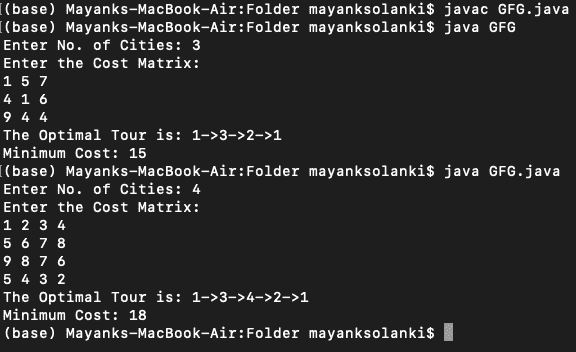

# 用增量插入法求解旅行推销员问题的 Java 程序

> 原文:[https://www . geesforgeks . org/Java-程序求解-旅行推销员-问题-使用-增量-插入-方法/](https://www.geeksforgeeks.org/java-program-to-solve-travelling-salesman-problem-using-incremental-insertion-method/)

增量实际上用在软件开发中，在软件开发中，模型是以增量方式设计、实现和测试的(每次增加一点点)，直到产品完成。它涉及开发和维护。当产品满足其所有要求时，即被定义为成品。

让我们简单讨论一下旅行推销员问题。在这里，我们应该找到推销员要去的所有城市之间最简单或最短的距离，即找到图的节点之间最短和最佳的路线。它也被称为 TSP，是现代世界中最著名的计算机科学优化问题。

**算法:**

1.  从仅包含节点“I”的子图开始。
2.  找到节点 r，使得 c <sub>ir</sub> 最小，形成子游 i-r-i。
3.  (选择步骤)给定子路线，找到不在子路线中最靠近子路线中任何节点 j 的节点 r；即具有最小的 c <sub>rj</sub>
4.  (插入步骤)在子流程中找到使 c<sub>IR</sub>+c<sub>rj</sub>–c<sub>ij</sub>最小化的弧(I，j)，在“I”和“j”之间插入“r”。
5.  如果所有的节点都添加到了程序中，请停止。否则请转到第 3 步

**实施:**

## Java 语言(一种计算机语言，尤用于创建网站)

```java
// Java Program to Solve Travelling Salesman Problem
// Using Incremental Insertion Method

// Importing input output classes
import java.io.*;
// Importing Scanner class to take input from the user
import java.util.Scanner;

// Main class
public class GFG {
    // Method 1
    // Travelling Salesman Incremental Insertion Method
    static int tspdp(int c[][], int tour[], int start,
                     int n)
    {

        int mintour[] = new int[10], temp[] = new int[10],
            mincost = 999, ccost, i, j, k;

        if (start == n - 1)

        {

            return (c[tour[n - 1]][tour[n]]
                    + c[tour[n]][1]);
        }

        // Logic for implementing the minimal cost

        for (i = start + 1; i <= n; i++)

        {

            for (j = 1; j <= n; j++)

                temp[j] = tour[j];

            temp[start + 1] = tour[i];

            temp[i] = tour[start + 1];

            if ((c[tour[start]][tour[i]]
                 + (ccost = tspdp(c, temp, start + 1, n)))
                < mincost)

            {

                mincost = c[tour[start]][tour[i]] + ccost;

                for (k = 1; k <= n; k++)

                    mintour[k] = temp[k];
            }
        }

        // Now, iterating over the path (mintour) to
        // compute its cost
        for (i = 1; i <= n; i++)

            tour[i] = mintour[i];

        // Returning the cost of min path
        return mincost;
    }

    // Method 2
    // Main driver method
    public static void main(String[] args)

    {
        // Creating an object of Scanner class to take user
        // input
        // 1\. Number of cities
        // 2\. Cost matrix
        Scanner in = new Scanner(System.in);

        // Creating matrices in the main body
        int c[][] = new int[10][10], tour[] = new int[10];

        // Declaring variables
        int i, j, cost;

        // Step 1: To read number of cities

        // Display message for asking user to
        // enter number of cities
        System.out.print("Enter No. of Cities: ");

        // Reading and storing using nextInt() of Scanner
        int n = in.nextInt();

        // Base case
        // If the city is 1 then
        // path is not possible
        // Cost doesnot play any role
        if (n == 1) {
            // Display on the console
            System.out.println("Path is not possible!");

            // terminate
            System.exit(0);
        }

        // Case 2
        // Many cities

        // Again, reading the cost of the matrix

        // Display message
        System.out.println("Enter the Cost Matrix:");

        // Travelling across cities using nested loops
        for (i = 1; i <= n; i++)

            for (j = 1; j <= n; j++)

                c[i][j] = in.nextInt();

        for (i = 1; i <= n; i++)

            tour[i] = i;

        // Calling the above Method 1 to
        cost = tspdp(c, tour, 1, n);

        // Now, coming to logic to print the optimal tour

        // Display message for better readability
        System.out.print("The Optimal Tour is: ");

        for (i = 1; i <= n; i++)

            // Printing across which cities should Salesman
            // travel
            System.out.print(tour[i] + "->");

        // Starting off with the city 1->
        System.out.println("1");

        // Print and display the (minimum)cost of the path
        // traversed
        System.out.println("Minimum Cost: " + cost);
    }
}
```

**输出:**

