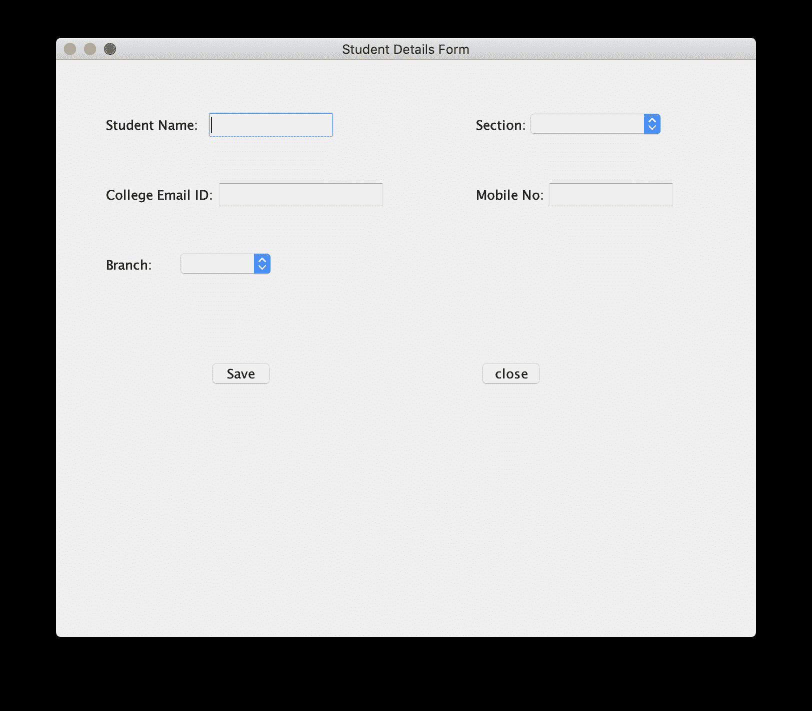
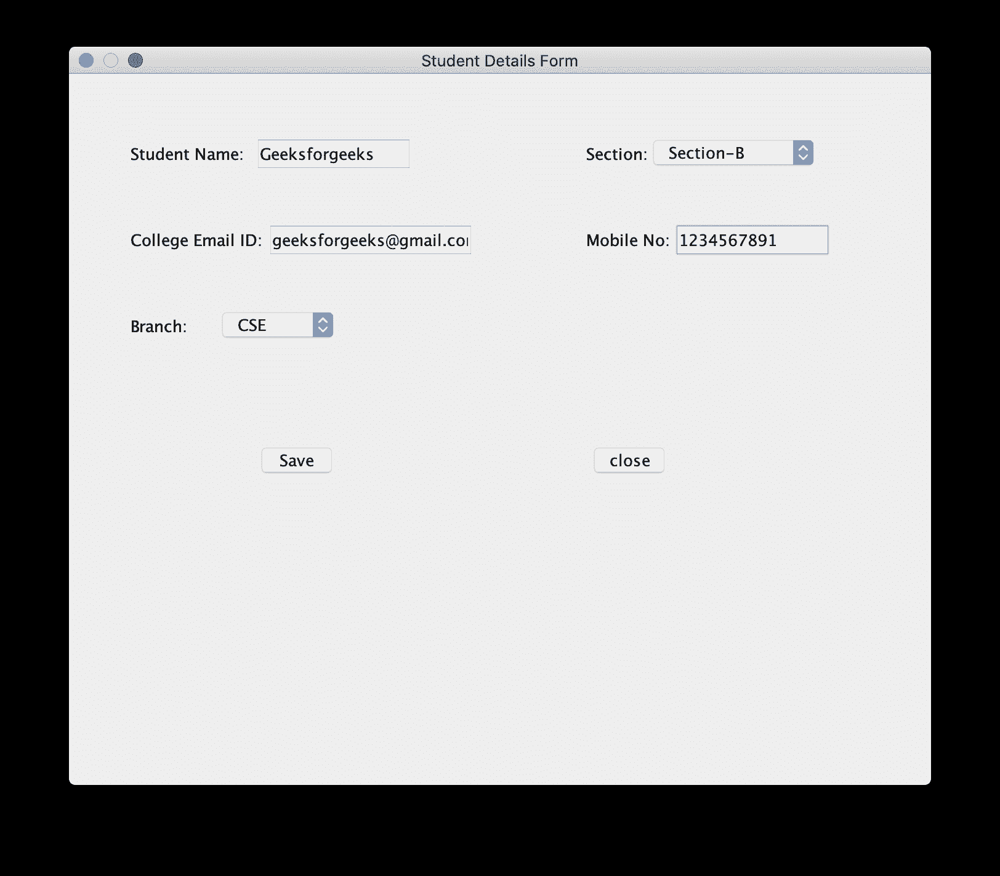
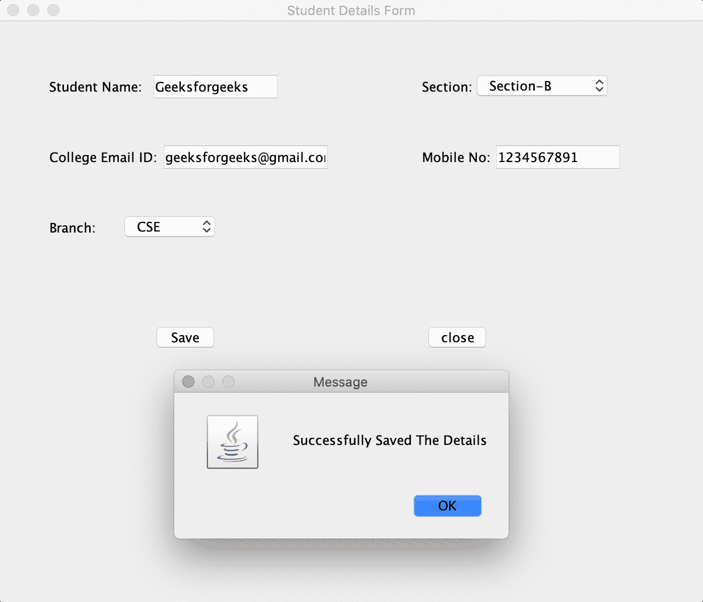
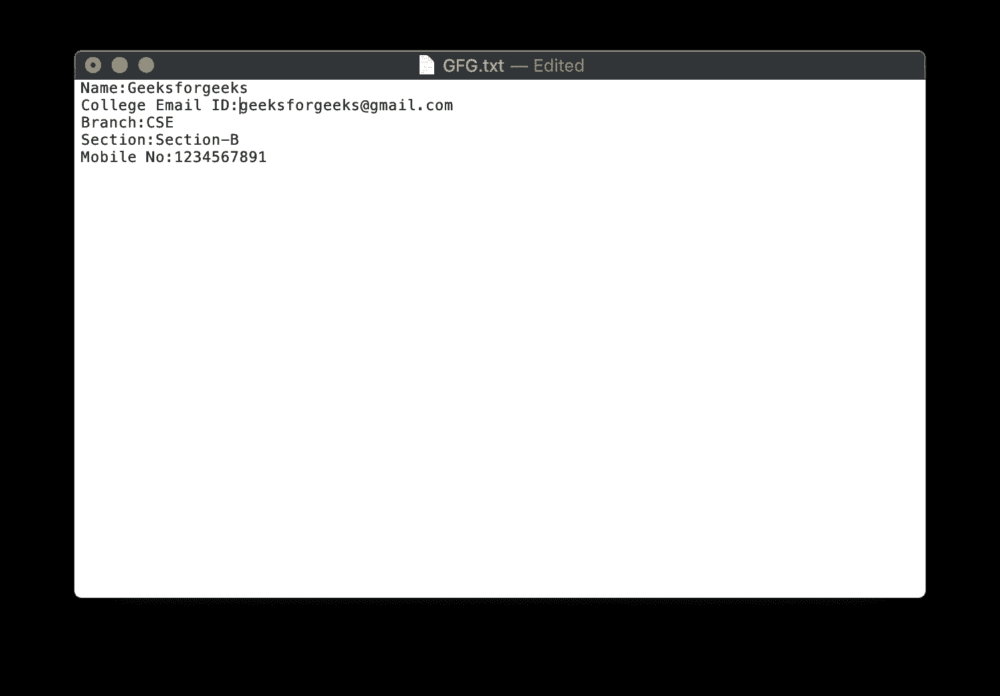

# 使用 AWT 将学生信息存储在文件中的 Java 程序

> 原文:[https://www . geesforgeks . org/Java-program-to-store-a-a-student-in-a-file-information-use-awt/](https://www.geeksforgeeks.org/java-program-to-store-a-student-information-in-a-file-using-awt/)

**[Swing](https://www.geeksforgeeks.org/java-swing-create-a-simple-text-editor/)** 是 **JFC (Java 基础类)**的一部分。用 Java 构建[图形用户界面](https://www.geeksforgeeks.org/what-is-the-difference-between-gui-and-cui/)需要使用 Swings。 **[Swing Framework](https://www.geeksforgeeks.org/tag/java-swing/)** 包含大量组件，这些组件允许高级定制并提供丰富的功能，用于创建基于窗口的应用程序。Java swing 组件是轻量级的，独立于平台，提供强大的组件，如表格、滚动面板、按钮、列表、颜色选择器等。

在本文中，我们将看到如何将学生信息写入 Jframe 并将其存储在文件中。

**方法:**要解决此问题，请遵循以下步骤:

1.  首先，我们需要使用 [JFrame 创建一个框架。](https://www.geeksforgeeks.org/creating-frames-using-swings-java/)
2.  接下来创建[jlables](https://www.geeksforgeeks.org/jlabel-java-swing/)、[jtextfield](https://www.geeksforgeeks.org/java-swing-jtextfield/)、[jcombobox](https://www.geeksforgeeks.org/java-swing-jcombobox-examples/)、[jbutton](https://www.geeksforgeeks.org/jradiobutton-java-swing/)并分别设置它们的边界。
3.  相应地命名这些组件并设置它们的边界。
4.  现在，为了在按钮点击时将数据保存到文本文件中，我们需要添加事件处理程序。在这种情况下，我们将添加 ActionListener 来执行一个称为 actionPerformed 的操作方法，首先我们需要从默认为“字符串”的文本字段中获取值。
5.  最后，Jbuttons、JLabels、JTextFields 和 JComboBoxes 被添加到 JFrame 中，文本被存储在一个文本文件中。

下面是上述方法的实现:

```java
// Java program to write a student
// information in JFrame and
// storing it in a file

import javax.swing.*;
import java.awt.*;
import java.awt.event.*;
import java.io.*;

public class GFG {

    // Function to write a student
    // information in JFrame and
    // storing it in a file
    public static void StudentInfo()
    {

        // Creating a new frame using JFrame
        JFrame f
            = new JFrame(
                "Student Details Form");

        // Creating the labels
        JLabel l1, l2, l3, l4, l5;

        // Creating three text fields.
        // One for student name, one for
        // college mail ID  and one
        // for  Mobile No
        JTextField t1, t2, t3;

        // Creating two JComboboxes
        // one for Branch and one
        // for Section
        JComboBox j1, j2;

        // Creating  two buttons
        JButton b1, b2;

        // Naming the labels and setting
        // the bounds for the labels
        l1 = new JLabel("Student Name:");
        l1.setBounds(50, 50, 100, 30);
        l2 = new JLabel("College Email ID:");
        l2.setBounds(50, 120, 120, 30);
        l3 = new JLabel("Branch:");
        l3.setBounds(50, 190, 50, 30);
        l4 = new JLabel("Section:");
        l4.setBounds(420, 50, 70, 30);
        l5 = new JLabel("Mobile No:");
        l5.setBounds(420, 120, 70, 30);

        // Creating the textfields and
        // setting the bounds for textfields
        t1 = new JTextField();
        t1.setBounds(150, 50, 130, 30);
        t2 = new JTextField();
        t2.setBounds(160, 120, 130, 30);
        t3 = new JTextField();
        t3.setBounds(490, 120, 130, 30);

        // Creating two string arrays one for
        // braches and other for sections
        String s1[]
            = { "  ", "CSE", "ECE", "EEE",
                "CIVIL", "MEC", "Others" };
        String s2[]
            = { "  ", "Section-A", "Section-B",
                "Section-C", "Section-D",
                "Section-E" };

        // Creating two JComboBoxes one for
        // selecting branch and other for
        // selecting the section
        // and setting the bounds
        j1 = new JComboBox(s1);
        j1.setBounds(120, 190, 100, 30);
        j2 = new JComboBox(s2);
        j2.setBounds(470, 50, 140, 30);

        // Creating one button for Saving
        // and other button to close
        // and setting the bounds
        b1 = new JButton("Save");
        b1.setBounds(150, 300, 70, 30);
        b2 = new JButton("close");
        b2.setBounds(420, 300, 70, 30);

        // Adding action listener
        b1.addActionListener(new ActionListener() {
            public void actionPerformed(ActionEvent e)
            {

                // Getting the text from text fields
                // and JComboboxes
                // and copying it to a strings

                String s1 = t1.getText();
                String s2 = t2.getText();
                String s3 = j1.getSelectedItem() + "";
                String s4 = j2.getSelectedItem() + "";
                String s5 = t3.getText();
                if (e.getSource() == b1) {
                    try {

                        // Creating a file and
                        // writing the data
                        // into a Textfile.
                        FileWriter w
                            = new FileWriter(
                                "GFG.txt", true);

                        w.write(s1 + "\n");
                        w.write(s2 + "\n");
                        w.write(s3 + "\n");
                        w.write(s4 + "\n");
                        w.write(s5 + "\n");
                        w.close();
                    }
                    catch (Exception ae) {
                        System.out.println(ae);
                    }
                }

                // Shows a Pop up Message when
                // save button is clicked
                JOptionPane
                    .showMessageDialog(
                        f,
                        "Successfully Saved"
                            + " The Details");
            }
        });

        // Action listener to close the form
        b2.addActionListener(new ActionListener() {
            public void actionPerformed(ActionEvent e)
            {
                f.dispose();
            }
        });

        // Default method for closing the frame
        f.addWindowListener(new WindowAdapter() {
            public void windowClosing(WindowEvent e)
            {
                System.exit(0);
            }
        });

        // Adding the created objects
        // to the frame
        f.add(l1);
        f.add(t1);
        f.add(l2);
        f.add(t2);
        f.add(l3);
        f.add(j1);
        f.add(l4);
        f.add(j2);
        f.add(l5);
        f.add(t3);
        f.add(b1);
        f.add(b2);
        f.setLayout(null);
        f.setSize(700, 600);
        f.setVisible(true);
    }
    // Driver code
    public static void main(String args[])
    {
        StudentInfo();
    }
}
```

**输出:**

1.  The window displayed on running the program:

    [](https://media.geeksforgeeks.org/wp-content/uploads/20200509164528/Screenshot-2020-05-09-at-4.39.15-PM.png)

2.  Entering the data:

    [](https://media.geeksforgeeks.org/wp-content/uploads/20200509164626/Screenshot-2020-05-09-at-4.35.28-PM.png)

3.  The dialog box showed after clicking on the save button:

    [](https://media.geeksforgeeks.org/wp-content/uploads/20200509164711/Screenshot-2020-05-09-at-4.36.27-PM.png)

4.  The text file in which the data is stored:

    [](https://media.geeksforgeeks.org/wp-content/uploads/20200509164808/Screenshot-2020-05-09-at-4.37.13-PM.png)