# 从系统摄像头拍摄快照的 Java 程序

> 原文:[https://www . geesforgeks . org/Java-程序-从系统摄像头拍摄快照/](https://www.geeksforgeeks.org/java-program-to-take-a-snapshot-from-system-camera/)

最好对 java 的 [Swing 类](https://www.geeksforgeeks.org/java-swing-jcolorchooser-class/)有一个简单的了解，因为它是在实现中应用的，因为每当需要处理图像或处理二维矩阵作为输出时，或者在用 java 生成输出时使用它时，Swing 类都会在实现中发挥作用。

我们将使用 [Netbeans](https://www.geeksforgeeks.org/how-to-install-netbeans-java-ide-on-windows/) 集成开发环境来创建图形用户界面应用程序，因为它是一个精心制作的开源集成开发环境，提供了组件检查器、小部件拖放、调试器、对象浏览器等功能，并且不需要像其他集成开发环境(如 eclipse)那样导入 JAR 文件。这使得这个集成开发环境比其他集成开发环境多了一个优势。

**概念:**

基本上，这个程序分为两部分。一个是使用摆动控制完成的设计部分。另一部分是捕捉图像的代码部分。

1.  在设计部分，我使用了 swing 控件来设计界面。我们只需要从调色板中拖放控件。这里使用了 2 个标签和 1 个按钮。第一个标签名是“ *lblclose* **”。**在那里，我设置了一个巴布亚新几内亚图像并编写了一个关于**事件的代码- >动作执行**。当您单击该图像时，输出窗口将关闭。本次**、**我使用了 *dispose()方法*。第二个标签名是'*lblpphoto '*。在这里你可以看到你运行程序时的图像。运行代码时网络摄像头会打开。这里我使用了一个名为*的按钮，点击***。你可以看到一个按钮**点击。**当你点击按钮时，图像将被捕捉到你的标签中。**
2.  ****在代码部分，**我已经用网络摄像头将其命名为‘WC’ie 创建了一个网络摄像头对象。该库允许您直接从 Java 使用内置或外部网络摄像头。它旨在抽象常用的相机功能，并支持多种捕捉框架。然后通过*打开()*功能，网络摄像头就会打开。然后点击点击按钮后，您将捕获一个图像。然后根据标签的大小转换这个图像。然后将此图像分配给标签。然后创建并启动线程。**

****程序:****

1.  **创建一个新的 java 应用程序，并进一步在项目下创建一个文件。 **`****
2.  **根据需要从位于右上角的调色板中开始拖动工具包小部件。**
3.  **单击面板区域的任意位置，然后转到属性以更改背景。**
4.  **现在双击背景区域，选择任意颜色，然后按“确定”按钮。**
5.  **现在开始在绘图区域拖动小部件。**
6.  **开始编写 java 程序，如下所述。**
7.  **选择需要导入的 JAR 文件。**

****实施:****

****步骤 1(a):** 通过点击“*新建项目→ Java → Java 应用程序*”创建一个新的 Java 应用程序，并给出一个合适的项目名称。考虑一个用于说明目的的随机示例'*我的框架'*并单击*完成*。**

****第 1 步(b):** 要在同一个 Java 项目“MyFirstFrame”下创建“New File”，右键单击窗口左侧的项目名称，如下图所示点击，点击完成。**例如 MyFrame.java****

```
New -> JFrame Form and give a suitable file name
```

**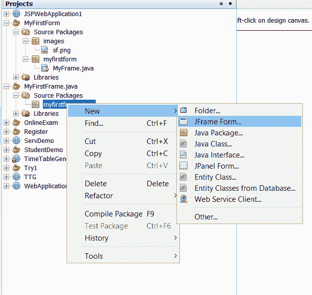**

****步骤 2:** 现在，从位于窗口右侧的调色板中，根据需求开始拖动工具包小部件。要更改框架的背景颜色，我们需要首先插入一个 [JPanel](https://www.geeksforgeeks.org/java-swing-jpanel-examples/) 并更改其属性。**

**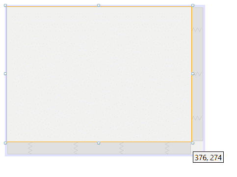**

****第三步:**点击面板区域的任意位置，进入*属性→背景***

**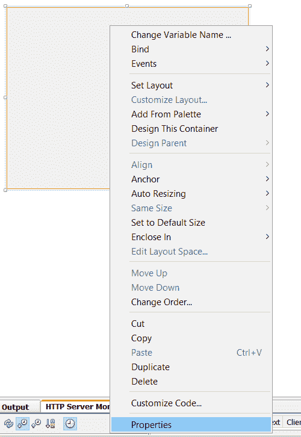**

****第四步:**双击背景选项，选择符合需求选择的任意颜色，点击*确定*。**

**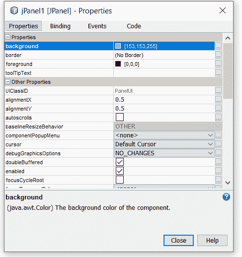**

****第五步:**设置好背景颜色后，将其他小部件拖到设计区域。这里我已经拖动了一个按钮和一个标签。名为 CLICK 和 label 的按钮用于捕获图像。此外，标签有边框。**

**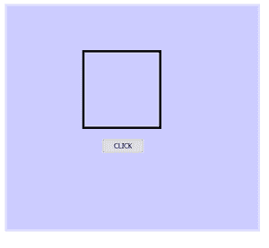**

****第 6 步(a):** 现在通过如下所示的右键**写代码****

```
*MyFrame.java → Split → Horizontally*
```

**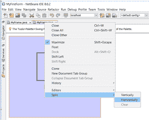**

****第 6 步(b):** 这时会出现这个弹出窗口。这里点击‘***来源**‘*写代码，进一步可以点击‘***设计*****‘**移动设计。**

**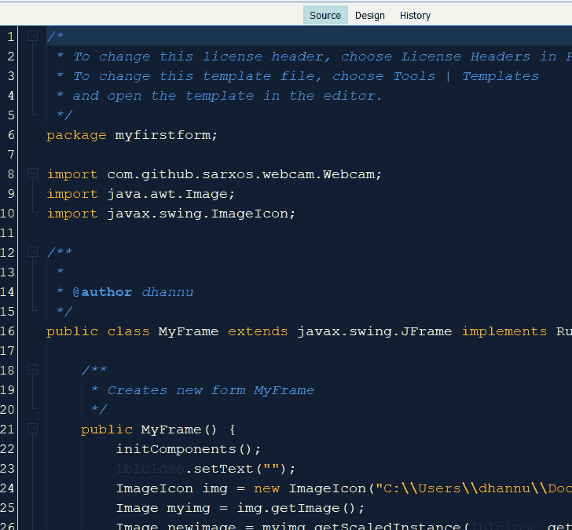**

****步骤 7(a):** 将 jar 文件相加，转到库。右键点击*库*，选择*添加 JAR/FOLDER* 。**

**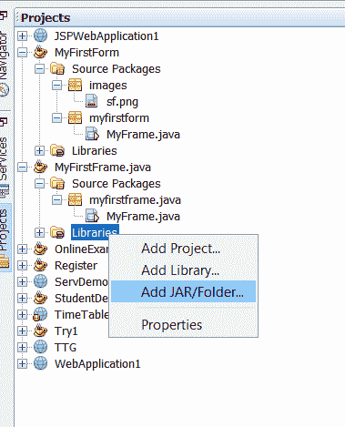**

****步骤 7(b):** 选择 3 个 jar 文件，然后点击*打开*。需求如下:在库中需要导入 JAR 文件更具体地说，需要导入 3 个 JAR 文件**

*   ***bridj-0.7.0.jar***
*   ***slf4j-api-1.7.2.jar***
*   ***网络摄像头-捕捉-0.3.12.jar***

**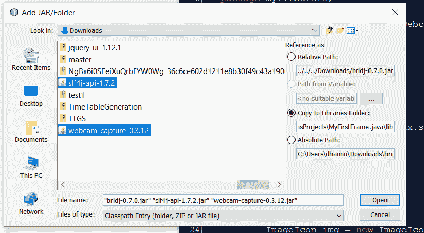**

****实施:****

**示例输入图像如下所示:**

**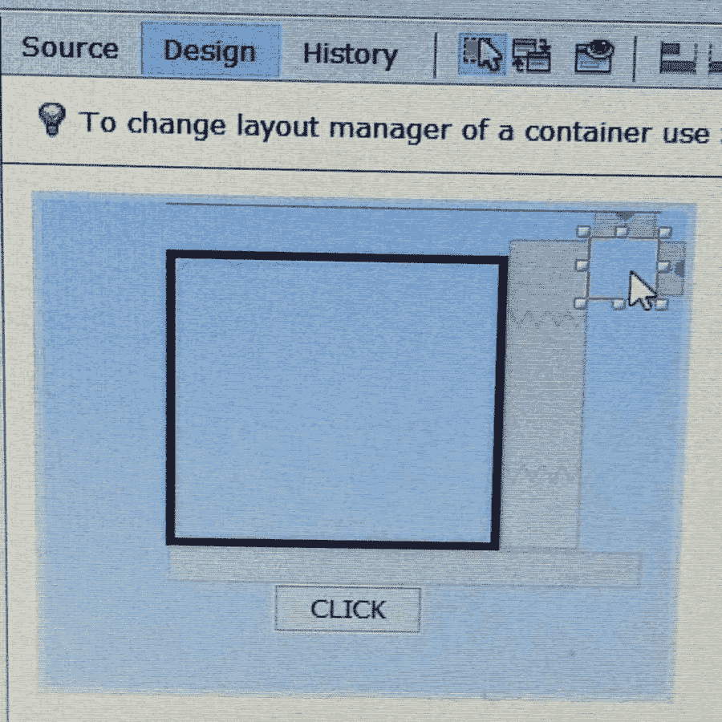**

****示例:****

## **Java 语言(一种计算机语言，尤用于创建网站)**

```
// Java Program to Take a Snapshot From System Camera

package myfirstform;

// The goal of this import com.github.sarxos.webcam.Webcam
// is to allow integrated or USB-connected webcams
// to be accessed directly from java
// Using provided libraries users are able to
// read camera images and detect motion
import com.github.sarxos.webcam.Webcam;

// Provides classes for creating and modifying images*/
import java.awt.Image;

// Creates an ImageIcon from an array of bytes
// which were read from an image file containing
// a supported image format, such as GIF, JPG, PNG
import javax.swing.ImageIcon;

// Class
// Main class
public class MyFrame
    extends javax.swing.JFrame implements Runnable {

    // Creates new form MyFrame
    public MyFrame()
    {

        // Initialising the components
        initComponents();

        // This is for the closing button
        lblclose.setText("");

        // Createing an image icon by adding path of image
        ImageIcon img = new ImageIcon(
            "C:\\Users\\dhannu\\Documents\\NetBeansProjects\\MyFirstForm\\src\\images\\sf.png");

        // Creating an object of Image type
        Image myimg = img.getImage();

        // Creating a new image whose size is same as label
        // size using algorithm - SCALE_SMOOTH
        Image newimage = myimg.getScaledInstance(
            lblclose.getWidth(), lblclose.getHeight(),
            Image.SCALE_SMOOTH);

        // Creating a image icon from new image
        ImageIcon ic = new ImageIcon(newimage);

        // Assigning the imageicon to the label
        lblclose.setIcon(ic);

        // Thread is created and started using
        // start() method which begins thread execution
        new Thread(this).start();
    }
    // generated code

    // This method is called from within the constructor to
    // initialize the form. WARNING: Do NOT modify this
    // code. The content of this method is always
    // regenerated by the Form Editor.

    @SuppressWarnings("unchecked")

    private void initComponents()
    {

        jPanel1 = new javax.swing.JPanel();
        lblclose = new javax.swing.JLabel();
        lblphoto = new javax.swing.JLabel();
        btnclick = new javax.swing.JButton();

        setDefaultCloseOperation(
            javax.swing.WindowConstants.EXIT_ON_CLOSE);
        setUndecorated(true);

        // Setting the background by providing
        // Custom input bounds as parameters
        jPanel1.setBackground(
            new java.awt.Color(204, 204, 255));

        lblclose.addMouseListener(
            new java.awt.event.MouseAdapter() {
                public void mouseClicked(
                    java.awt.event.MouseEvent evt)
                {
                    lblcloseMouseClicked(evt);
                }
            });

        lblphoto.setBorder(
            javax.swing.BorderFactory.createLineBorder(
                new java.awt.Color(0, 0, 0), 4));

        // Click button
        btnclick.setText("CLICK");

        btnclick.addActionListener(
            new java.awt.event.ActionListener() {
                public void actionPerformed(
                    java.awt.event.ActionEvent evt)
                {
                    btnclickActionPerformed(evt);
                }
            });

        javax.swing.GroupLayout jPanel1Layout
            = new javax.swing.GroupLayout(jPanel1);
        jPanel1.setLayout(jPanel1Layout);
        jPanel1Layout.setHorizontalGroup(
            jPanel1Layout
                .createParallelGroup(javax.swing.GroupLayout
                                         .Alignment.LEADING)
                .addGroup(
                    jPanel1Layout.createSequentialGroup()
                        .addGap(51, 51, 51)
                        .addComponent(
                            lblphoto,
                            javax.swing.GroupLayout
                                .PREFERRED_SIZE,
                            143,
                            javax.swing.GroupLayout
                                .PREFERRED_SIZE)
                        .addPreferredGap(
                            javax.swing.LayoutStyle
                                .ComponentPlacement.RELATED,
                            34, Short.MAX_VALUE)
                        .addComponent(
                            lblclose,
                            javax.swing.GroupLayout
                                .PREFERRED_SIZE,
                            28,
                            javax.swing.GroupLayout
                                .PREFERRED_SIZE)
                        .addContainerGap())
                .addGroup(
                    jPanel1Layout.createSequentialGroup()
                        .addGap(97, 97, 97)
                        .addComponent(btnclick)
                        .addContainerGap(
                            javax.swing.GroupLayout
                                .DEFAULT_SIZE,
                            Short.MAX_VALUE)));
        jPanel1Layout.setVerticalGroup(
            jPanel1Layout
                .createParallelGroup(javax.swing.GroupLayout
                                         .Alignment.LEADING)
                .addGroup(
                    jPanel1Layout.createSequentialGroup()
                        .addGroup(
                            jPanel1Layout
                                .createParallelGroup(
                                    javax.swing.GroupLayout
                                        .Alignment.LEADING)
                                .addGroup(
                                    jPanel1Layout
                                        .createSequentialGroup()
                                        .addContainerGap()
                                        .addComponent(
                                            lblclose,
                                            javax.swing
                                                .GroupLayout
                                                .PREFERRED_SIZE,
                                            28,
                                            javax.swing
                                                .GroupLayout
                                                .PREFERRED_SIZE))
                                .addGroup(
                                    jPanel1Layout
                                        .createSequentialGroup()
                                        .addGap(22, 22, 22)
                                        .addComponent(
                                            lblphoto,
                                            javax.swing
                                                .GroupLayout
                                                .PREFERRED_SIZE,
                                            143,
                                            javax.swing
                                                .GroupLayout
                                                .PREFERRED_SIZE)))
                        .addGap(18, 18, 18)
                        .addComponent(btnclick)
                        .addContainerGap(29,
                                         Short.MAX_VALUE)));

        javax.swing.GroupLayout layout
            = new javax.swing.GroupLayout(getContentPane());
        getContentPane().setLayout(layout);
        layout.setHorizontalGroup(
            layout
                .createParallelGroup(javax.swing.GroupLayout
                                         .Alignment.LEADING)
                .addComponent(
                    jPanel1,
                    javax.swing.GroupLayout.PREFERRED_SIZE,
                    javax.swing.GroupLayout.DEFAULT_SIZE,
                    javax.swing.GroupLayout
                        .PREFERRED_SIZE));
        layout.setVerticalGroup(
            layout
                .createParallelGroup(javax.swing.GroupLayout
                                         .Alignment.LEADING)
                .addComponent(
                    jPanel1,
                    javax.swing.GroupLayout.PREFERRED_SIZE,
                    javax.swing.GroupLayout.DEFAULT_SIZE,
                    javax.swing.GroupLayout
                        .PREFERRED_SIZE));

        pack();
        setLocationRelativeTo(null);
    }
    // End of generate code

    private void
    lblcloseMouseClicked(java.awt.event.MouseEvent evt)
    {

        // Setting flag as false to stop the thread
        // so that you can capture the snapshot
        flag = false;

        // Destroying and cleaning the JFrame window
        // by the operating system\
        // using dispose() method
        dispose();
    }

    private void
    btnclickActionPerformed(java.awt.event.ActionEvent evt)
    {

        flag = false;
    }

    // Main driver method
    public static void main(String args[])
    {
        // Set the Nimbus look and feel
        // If Nimbus(Java 6+) is not available
        // stay with the default look and feel.

        // Try block to check if any exceptions occur
        try {

            for (javax.swing.UIManager
                     .LookAndFeelInfo info :
                 javax.swing.UIManager
                     .getInstalledLookAndFeels()) {
                if ("Nimbus".equals(info.getName())) {
                    javax.swing.UIManager.setLookAndFeel(
                        info.getClassName());
                    break;
                }
            }
        }

        // Catch blocks to handle exceptions

        // First catch block to handle exception
        // if class is not found
        catch (ClassNotFoundException ex) {
            java.util.logging.Logger
                .getLogger(MyFrame.class.getName())
                .log(java.util.logging.Level.SEVERE, null,
                     ex);
        }

        // Second catch block to handle for exception
        // InstantiationException
        // In generic, this exception is thrown
        // rarely
        catch (InstantiationException ex) {
            java.util.logging.Logger
                .getLogger(MyFrame.class.getName())
                .log(java.util.logging.Level.SEVERE, null,
                     ex);
        }

        // 3rd catch block to handle
        // IllegalAccessException
        catch (IllegalAccessException ex) {
            java.util.logging.Logger
                .getLogger(MyFrame.class.getName())
                .log(java.util.logging.Level.SEVERE, null,
                     ex);
        }

        // 4th catch block to handle Swing class
        // UnsupportedLookAndFeelException
        catch (javax.swing
                   .UnsupportedLookAndFeelException ex) {
            java.util.logging.Logger
                .getLogger(MyFrame.class.getName())
                .log(java.util.logging.Level.SEVERE, null,
                     ex);
        }
        //</editor-fold>

        // Create and display the form
        java.awt.EventQueue.invokeLater(new Runnable() {
            // Method run() which will later on
            // over-ridden
            public void run()
            {
                new MyFrame().setVisible(true);
            }
        });
    }
    // End of generated code

    // Declaring variables
    private javax.swing.JButton btnclick;
    private javax.swing.JPanel jPanel1;
    private javax.swing.JLabel lblclose;
    private javax.swing.JLabel lblphoto;

    Webcam wc;

    // Initially setting flag as true
    boolean flag = true;

    // Overriding the run() method as
    // created above already

    // @Override
    public void run()
    {

        // Creating a webcam object
        wc = Webcam.getDefault();

        // Method to open the camera
        wc.open();

        // Checking condition over flag which
        // holds true for boolean true as
        // above flag is declared true
        while (flag) {
            // An image is clicked
            Image img = wc.getImage();

            // Create a image whose size is same as label
            img = img.getScaledInstance(
                lblphoto.getWidth(), lblphoto.getHeight(),
                Image.SCALE_SMOOTH);

            // The clicked image is assigned to a Label
            lblphoto.setIcon(new ImageIcon(img));

            // Try block to check for thread exception
            try {
                // Putting the thread to sleap
                Thread.sleep(20);
            }

            // Catch block in there is some
            // mishappening while the thread is
            // put to sleep
            catch (InterruptedException e) {
            }
        }
    }
}
```

****输出:****

**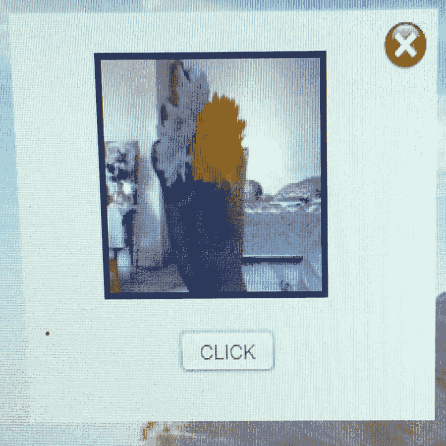**

> **这是从编译和运行代码的前置摄像头捕获的快照。当上述相同的代码被编译并再次运行时，它将不同于前置摄像头前面的实时基本功能。**