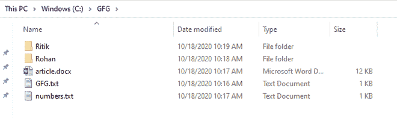

# 在目录中遍历的 Java 程序

> 原文:[https://www . geesforgeks . org/Java-程序在目录中遍历/](https://www.geeksforgeeks.org/java-program-to-traverse-in-a-directory/)

目录是包含[文件](https://www.geeksforgeeks.org/files-iswritable-method-in-java-with-examples/)和[目录](https://www.geeksforgeeks.org/files-iswritable-method-in-java-with-examples/)的组织文件系统结构。

在这里，攻击者甚至可以尝试遍历或访问一个我们称之为“文件遍历攻击”或“路径遍历攻击”的文件夹。简而言之，这里遍历主/根目录之外的目录。这些文件是服务器内部文件，用户无法访问。

让我们简单介绍一下遍历攻击

*   攻击者可以从不同的目录访问该文件
*   当服务器配置错误时，允许目录浏览
*   有时，攻击者甚至可以访问 web 浏览器根目录之外的文件

**先决条件**要求是 [**listFiles()**](https://www.geeksforgeeks.org/file-listfiles-method-in-java-with-examples/) 并且考虑到没有路径遍历攻击。

**在一个目录中有 2 种方法可以遍历**

*   **使用列表文件()方法**
*   **使用溪流<路径>**

假设存在一个路径为 C:\\GFG 的目录。下图显示了 GFG 文件夹中的文件和目录。子目录“Ritik”包含一个名为“Logistics.xlsx”的文件，子目录“Rohan”包含一个名为“Payments.xlsx”的文件。



GFG 目录

下面的 java 程序演示了如何在目录中遍历。

### 方法 1:使用列表文件()方法

*   创建一个文件数组来存储文件的名称和路径。
*   调用 displayFiles 方法()显示所有文件。

## Java 语言(一种计算机语言，尤用于创建网站)

```
// Java Program to traverse through a directory
import java.io.File;

class GFG {

    // function to display fies
    public static void displayFiles(File[] files)
    {
        // traversing through the files array
        for (File filename : files)
        {

            // if a sub directory is found,
            // print the name of the sub
            // directory

            if (filename.isDirectory())
            {
                System.out.println("Directory: "
                                   + filename.getName());

                // and call the displayFiles function
                // recursively to list files present
                // in sub directory
                displayFiles(filename.listFiles());
             }

            // print the file name present in given path
            else
            {
                System.out.println("File: "
                                   + filename.getName());
            }
        }
    }

    // Main Method
    public static void main(String[] args)
    {
        // array to store the name of files and directories
        File[] files = new File("C:\\GFG").listFiles();

        // call displayFiles function to display files
        displayFiles(files);
    }
}
```

**输出:**

```
File: article.docx
File: GFG.txt
File: numbers.txt
Directory: Ritik
File: Logistics.xlsx
Directory: Rohan
File: Payments.xlsx
```

### 方法二:使用流<path></path>

从 Java 8 开始，引入了 walk()方法来递归地遍历整个目录，并检索 Stream <路径>作为返回值。

*   创建文件路径流。
*   打印整个目录和文件路径
*   如果路径中提供的目录不存在，抛出异常。

## Java 语言(一种计算机语言，尤用于创建网站)

```
// Java Program to display files with
// complete path present in a directory

import java.io.*;

// Importing Files
import java.nio.file.*;
import java.util.stream.Stream;

class GFG {

    // Main Method
    public static void main(String[] args)
        throws IOException
    {

        // create try-catch block and provide
        // the directory path
        try (Stream<Path> filepath
             = Files.walk(Paths.get("c:\\GFG")))

        {
           // print the name of directories and files with
           // entire path
            filepath.forEach(System.out::println);
        }

        // if no such directory exists throw an exception.
        catch (IOException e)
        {
            throw new IOException("Directory Not Present!");
        }
    }
}
```

**输出:**

```
c:\GFG
c:\GFG\article.docx
c:\GFG\GFG.txt
c:\GFG\numbers.txt
c:\GFG\Ritik
c:\GFG\Ritik\Logistics.xlsx
c:\GFG\Rohan
c:\GFG\Rohan\Payments.xlsx
```