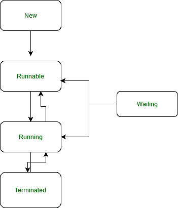
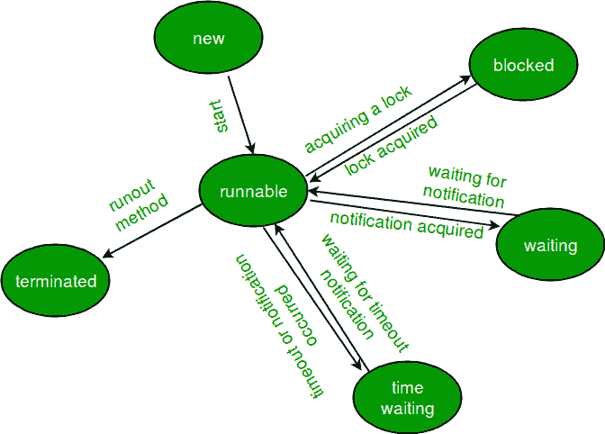

# 使用线程异常的 Java 程序

> 原文:[https://www . geesforgeks . org/Java-程序到使用-带线程的异常/](https://www.geeksforgeeks.org/java-program-to-use-exceptions-with-thread/)

异常是由于程序员错误或机器错误导致程序正常执行流程受到干扰而发生的事件。当一个方法遇到它无法处理的异常情况时，就会抛出一个异常作为异常语句。异常由处理程序捕获(这里是 catch 块)。异常由与线程的方法调用堆栈放在一起的处理程序捕获。如果调用方法没有准备好捕获异常，它会将异常抛出到它的调用方法，以此类推。所以在 java 程序中，异常处理程序应该被战略性地定位，这样程序就能捕捉到所有程序想要恢复的异常。

[**线程的生命周期**](https://www.geeksforgeeks.org/lifecycle-and-states-of-a-thread-in-java/) **:** 类实现一个 thread 类或 Runnable 接口，然后扩展类有 start()方法运行线程，sleep()方法使当前执行的线程休眠指定的毫秒数**、**等等。



在讨论方法之前，陈述。为了更好地理解，应该知道线程的事务来进一步处理异常。Java 中任意时间点的[线程](https://www.geeksforgeeks.org/multithreading-in-java/)存在于以下任意一种状态。线程在任何时刻都只处于所示状态之一:

1.  新的
2.  可追捕的
3.  堵塞的
4.  等待
5.  定时等待
6.  终止的



**1。**一个类名 [RunnableThread](https://www.geeksforgeeks.org/volante-technologies-interview-experience/runnable-thread-vowel-counter-and-shared-location/) 实现了 Runnable 接口，该接口给出了由线程执行的 run()方法。这个类的对象现在可以运行了

**2。**Thread 构造函数用于通过将 RunnableThread 类的对象作为参数传递来创建该对象。

**3。**在线程对象上调用 *start()* 方法，因为一旦线程产生，它就会立即返回。

**4。**run()方法结束时线程结束，这是正常终止或捕获到异常。

**5。**现在为了创建一个新线程

```java
runner = new Thread(this,threadName) ;
```

**6。**为了启动新线程。

```java
runner. start() ;
```

***7** 。public void run( )* 是一个可覆盖的方法，用于显示特定线程的信息。

***8。** Thread.currentThread()。sleep(2000)* 用于停用线程，直到下一个线程开始执行，或者用于延迟当前线程。

未捕获的异常处理程序将用于演示线程异常的使用。它是 Java 提供的一个特定接口，用于处理线程运行方法中的异常。

创建线程有两种方法:

1.  **扩展线程类(java.lang.thread)**
2.  **实现可运行接口(** **java.lang.thread)**

**1。**异常和线程异常处理

这里，在扩展线程类的类中创建了一个新的线程，其中 [*run()*](https://www.geeksforgeeks.org/overloading-thread-class-run-method/) 方法被覆盖。这会调用在扩展线程类的类中创建的新线程的入口点。此外， [*start()*](https://www.geeksforgeeks.org/start-function-multithreading-java/) 方法用于启动和运行程序中的线程。

## Java 语言(一种计算机语言，尤用于创建网站)

```java
// Java program to Use exceptions with thread

// Importing Classes/Files
import java.io.*;

// Child Class(Thread) is inherited from parent Class(GFG)
class GFG extends Thread {

    // Function to check if thread is running
    public void run()
    {
        System.out.println("Thread is running");

        // Using for loop to iterate
        for (int i = 0; i < 10; ++i) {
            System.out.println("Thread loop running " + i);
        }
    }

    // Main Driver Method
    public static void main(String[] args)
    {

        // Try-catch block to detect exception
        try {

            // Creating new thread
            GFG ob = new GFG();

            throw new RuntimeException();
        }

        // Catch block to handle exception
        catch (Exception e) {

            // Exception handler
            System.out.println(
                "Another thread is not supported");
        }
    }
}
```

**输出:**

```java
Another thread is not supported
```

**2。使用 sleep 方法()进行异常处理:**线程类的 sleep()方法用于为了代码的正确工作流而要求线程休眠特定时间段的情况。

**语法:**

> 公共静态无效睡眠(长毫秒)；//常用
> 
> 公共静态 void sleep(长毫秒，int 纳秒)；//仅用于说明精度

**参数:**

<figure class="table">

| 

名字

 | 

已执行的操作

 |
| --- | --- |
| 毫秒 | 线程休眠的持续时间 |
| 纳秒 | 线程休眠的额外持续时间，但限于 999999 |

</figure>

**返回类型:**从语法本身来看，它不返回任何值。

**异常:**它确实经常抛出异常，因为 java 语言涉及多线程的概念

1.  *当参数值为负时，抛出 IllegalArgumentException* ，因为它的边界在[0 — +999999]之间
2.  *中断异常*在线程被正在进行的线程中断时抛出，正如所讨论的，java 支持多线程的概念。

**实施:**

## Java 语言(一种计算机语言，尤用于创建网站)

```java
// Java program to Use exceptions with thread

/* Note: Dont confuse main method with Main class*/

// Importing Classes/Files
import java.io.*;

// Child Class(Thread) is inherited
// from parent Class(GFG)
class GFG extends Thread {
    public void run()
    {
        System.out.println("Throwing in "
                           + "MyThread");
        throw new RuntimeException();
    }
}

// Main driver method
public class Main {
    public static void main(String[] args)
    {
        GFG t = new GFG();
        t.start();

        // try block to deal with exception
        try {
            Thread.sleep(2000);
        }

        // catch block to handle the exception
        catch (Exception x) {
            // Print command when exception encountered
            System.out.println("Exception" + x);
        }

        // Print command just to show program
        // run successfully
        System.out.println("Completed");
    }
}
```

**输出:**

```java
Throwing in MyThread
Exception in thread "Thread-0" java.lang.RuntimeException
        at testapp.MyThread.run(Main.java:19)
Completed
```