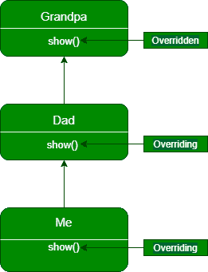
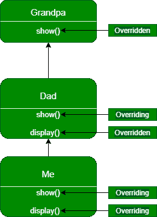

# Java 程序在子类继承中使用方法覆盖

> 原文:[https://www . geesforgeks . org/Java-程序到使用方法-在继承中覆盖子类/](https://www.geeksforgeeks.org/java-program-to-use-method-overriding-in-inheritance-for-subclasses/)

[方法覆盖](https://www.geeksforgeeks.org/overriding-in-java/)在 Java 中是子类实现一个已经存在于超类内部的方法。借助方法覆盖，我们可以实现运行时[多态性](https://www.geeksforgeeks.org/polymorphism-in-java/)。当我们覆盖一个方法时，我们必须记住三件事。

*   子类中的方法必须与超类中的方法同名。
*   子类中的方法应该有相同数量的参数。
*   子类中方法的返回类型(或子类型)应与超类内方法的返回类型相同。

在本文中，我们将讨论如何在子类的继承中使用方法重写。

让我们用下图来理解子类方法的覆盖。



在上图中，我们以爷爷类为例，它只包含一个方法，即 show()。Dad 类继承了爷爷类，并重写了 show()方法。之后，爸爸类被我类继承，我类覆盖了爸爸类的 show()方法。之后，如果我们想要访问上述类的 show()方法，那么我们可以创建该类的对象，因为将要调用的方法只取决于对象的类型，而不取决于引用该对象的引用变量的类型。

让我们用代码来理解上面的概念。

## Java 语言(一种计算机语言，尤用于创建网站)

```java
// Java Program to show the overriding using inheritance in
// subclasses

// Grandpa class is at the top of
// the inheritance hierarchy
class Grandpa {
    public void show()
    {
        System.out.println(
            "Inside show() method of Grandpa class");
    }
}

class Dad extends Grandpa {

    // Overriding show method of Grandpa class
    @Override public void show()
    {
        System.out.println(
            "Inside show() method of Dad class");
    }
}

// class Me is inheriting Dad class (i.e.
// a subclass of Grandpa class)
class Me extends Dad {

    // Overriding show method of Dad class
    @Override public void show()
    {
        System.out.println(
            "Inside show() method of Me class");
    }
}

public class GFG {
    public static void main(String[] args)
    {
        // Creating instance of Grandpa class
        Grandpa grandpa = new Grandpa();

        // Creating instance of Dad class
        Grandpa dad = new Dad();

        // Creating instance of Me class
        Grandpa me = new Me();

        // as discussed which show() function will get
        // execute depends upon the type of object

        // show function of Grandpa class will get execute
        grandpa.show();

        // show function of Dad class will get execute
        dad.show();

        // show function of Me class will get execute
        me.show();
    }
}
```

**Output**

```java
Inside show() method of Grandpa class
Inside show() method of Dad class
Inside show() method of Me class
```

**如果子类包含除** **父类/超类之外的方法，会发生什么？**

让我们借助下图来理解这一点。



在上图中，我们在 Dad 类中又采用了一个名为 display()的方法，该方法在 Me 类中被覆盖。现在，如果我们试图通过分别创建爸爸和我类的对象和爷爷类的引用变量来访问 display()方法，那么它将给出一个错误，因为该类的引用变量只能用于访问已经被它覆盖的子类在层次结构中的方法，即我们不能在调用 display 函数时使用爷爷类的引用变量，因为爷爷类在层次结构中是最顶层的，并且它不包含 display 函数。

如果我们试图使用爷爷()类的引用变量来调用 display()函数，我们会得到下面的错误。

```java
dad.display();
me.display();

GFG.java:52: error: cannot find symbol
        dad.display();
           ^
  symbol:   method display()
  location: variable dad of type Grandpa
GFG.java:53: error: cannot find symbol
        me.display();
          ^
  symbol:   method display()
  location: variable me of type Grandpa
```

我们可以通过使用下面提到的语法，使我们的爸爸类型或我类型的引用变量引用爸爸和我类的对象来解决这个问题。

```java
Dad dad1 = new Dad();
Dad me1 = new Me();
dad1.display();
me1.display();
```

现在，让我们借助下面提到的代码来理解这些概念。

## Java 语言(一种计算机语言，尤用于创建网站)

```java
// Java Program to show the overriding using inheritance in
// subclasses when subclass contains methods other than that
// of the parent/ superclass

// Grandpa class is at the top of
// the inheritance hierarchy
class Grandpa {
    public void show()
    {
        System.out.println(
            "Inside show() method of Grandpa class");
    }
}

class Dad extends Grandpa {

    // Overriding show method of Grandpa class
    @Override public void show()
    {
        System.out.println(
            "Inside show() method of Dad class");
    }

    // Creating a display method() for Dad class
    public void display()
    {
        System.out.println(
            "Inside display() method of class B");
    }
}

// class Me is inheriting Dad class (i.e.
// a subclass of Grandpa class)
class Me extends Dad {

    // Overriding show method of Dad class
    @Override public void show()
    {
        System.out.println(
            "Inside show() method of Me class");
    }

    @Override public void display()
    {
        System.out.println(
            "Inside display() method of class C");
    }
}

public class GFG {
    public static void main(String[] args)
    {

        // The code below works the same as in
        // previous example
        Grandpa grandpa = new Grandpa();
        Grandpa dad = new Dad();
        Grandpa me = new Me();

        grandpa.show();
        dad.show();
        me.show();

        // Making Dad type point to the
        // Dad object
        Dad dad1 = new Dad();

        // Making Dad type reference variable point to the
        // Me object
        Dad me1 = new Me();

        dad1.display();
        me1.display();
    }
}
```

**Output**

```java
Inside show() method of Grandpa class
Inside show() method of Dad class
Inside show() method of Me class
Inside display() method of class B
Inside display() method of class C
```