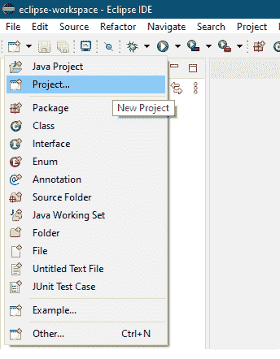
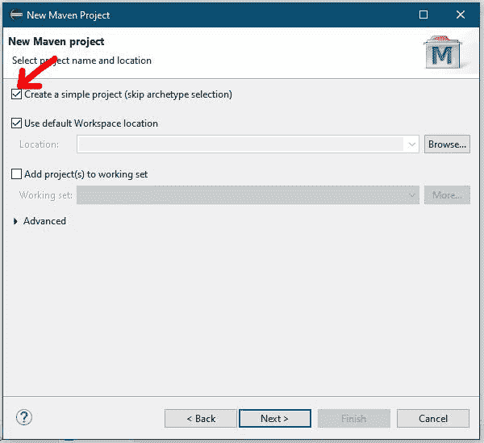
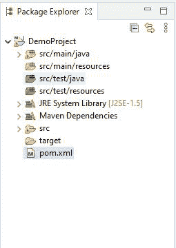

# 使用谷歌 libphonenumber 库验证电话号码的 Java 程序

> 原文:[https://www . geesforgeks . org/Java-程序-验证-电话号码-使用-谷歌-libphonenumber-library/](https://www.geeksforgeeks.org/java-program-to-validate-phone-numbers-using-googles-libphonenumber-library/)

在当今的网络、移动或桌面应用程序中，验证电话号码是一个常见的先决条件，但是 Java 没有一个集成的方法来执行这种常见的验证。因此，我们必须使用一些开源库来执行这样的验证。谷歌的电话号码库就是这样一个库。它有助于验证任何电话号码，无论是国外的、特定于印度的还是特定于任何国家的。

我们也可以使用正则表达式来验证电话号码，但是编写这样复杂的表达式需要一些技巧，然后测试将是一项没完没了的任务。

libphonenumber 是一个来自谷歌的开源库，用于格式化、解析和验证国际电话号码。它包含许多实现这种功能的方法。其中一些将在下面讨论:

<figure class="table">

| 

返回类型

 | 

方法

 | 

描述

 |
| --- | --- | --- |
| 线 | 格式(电话号码。电话号码号码，phonenumberutil(电话号码样式)。PhoneNumberFormat numberFormat) | 使用默认规则将电话号码格式化为指定的格式。 |
| 线 | formatNumberForMobileDialing(电话号码。PhoneNumber number，Java . lang . string regionCallingFrom，boolean withFormatting) | 以格式化字符串形式返回号码，以便可以从该地区的手机拨打。 |
| 布尔 | ismobi enumberportableregion(Java . lang . string regional code) | 如果作为参数传递的区域支持移动号码可移植性，则该方法返回 true。 |
| 布尔 | isnumbermatch(电话号码)。phonenumber firstnumberin，PhoneNumber .电话号码第一个号码，电话号码。phonenumber secondnumberin) | 它需要两个电话号码，并检查它们是否相等 |
| 布尔 | ispossibblenumber(Java . lang . charsequence number，Java . lang . string regional dialing rom) | 验证电话号码是否是以字符串形式给出的可能号码，以及可以拨打该号码的地区。 |
| 布尔 | isvalid number region(phone number . phone number、java.lang.String regionCode) | 检查给定的数字对于特定地区是否有效 |
| 布尔 | isValidNumber(电话号码。电话号码号码) | 验证电话号码是否符合特定模式 |
| 布尔 | 国际电话号码。电话号码号码) | 如果可以从指定区域外拨打该号码，则返回 true |
| （同 Internationalorganizations）国际组织 | getcountrrycode region(Java . lang . string region code) | 返回特定地区的国家/地区呼叫代码 |
| PhoneNumberUtil。电话号码类型 | getNumberType(Phonenumber)。PhoneNumber) | 此方法根据数字本身返回数字的类型。例如，免费、移动、固定电话等。 |

</figure>

这是一个丰富的库，具有更多的实用功能，并且满足了我们程序的大部分需求。

下面是使用谷歌 libphonenumber 库验证电话号码的 Java 实现。这里我们将使用 Eclipse 集成开发环境。

**步骤 1:创建一个 Maven 项目**

首先，在 Eclipse 中创建一个 Maven 项目。创建一个 Maven 项目而不是一个普通的 Java 项目背后的原因是 libphonenumber 库存在于 Maven 存储库中，所以我们必须在我们的项目中将其用作依赖项。






让一切都默认。工件标识将是您的 Maven 项目的名称。

**第二步:添加依赖关系**

创建 Maven 项目后，在 pom.xml 文件中添加 libphonenumber 依赖项。保存文件后，库将被下载以供脱机使用。



## 可扩展标记语言

```
<project xmlns="http://maven.apache.org/POM/4.0.0" 
         xmlns:xsi="http://www.w3.org/2001/XMLSchema-instance"
         xsi:schemaLocation="http://maven.apache.org/POM/4.0.0 https://maven.apache.org/xsd/maven-4.0.0.xsd">
  <modelVersion>4.0.0</modelVersion>
  <groupId>com.Demo</groupId>
  <artifactId>DemoProject</artifactId>
  <version>0.0.1-SNAPSHOT</version>
  <dependencies>
      <dependency>
        <groupId>com.googlecode.libphonenumber</groupId>
        <artifactId>libphonenumber</artifactId>
        <version>8.12.16</version>
      </dependency>
  </dependencies>
</project>
```

**步骤 3:创建驱动程序类**

现在，只需创建一个 Java 类来使用这个库的功能。

## Java 语言(一种计算机语言，尤用于创建网站)

```
import com.google.i18n.phonenumbers.NumberParseException;
import com.google.i18n.phonenumbers.PhoneNumberUtil;
import com.google.i18n.phonenumbers.Phonenumber.PhoneNumber;

public class GFG {

    public static void main(String args[])
    {
        // creating an array of random phone numbers
        String[] phonenumbers
            = { "+91 94483 76473", "1800 425 3800",
                "+91 83944 7484", "0294 2424447" };

        // iterating over each number to validate
        for (String phone : phonenumbers) {
            if (isPhoneNumberValid(phone)) {
                System.out.println(phone + " is valid.");
            }
            else {
                System.out.println(phone
                                   + " is not valid.");
            }
        }
    }

    // this method return true if the passed phone number is
    // valid as per the region specified
    public static boolean isPhoneNumberValid(String phone)
    {
        // creating an instance of PhoneNumber Utility class
        PhoneNumberUtil phoneUtil
            = PhoneNumberUtil.getInstance();

        // creating a variable of type PhoneNumber
        PhoneNumber phoneNumber = null;

        try {
            // the parse method parses the string and
            // returns a PhoneNumber in the format of
            // specified region
            phoneNumber = phoneUtil.parse(phone, "IN");

            // this statement prints the type of the phone
            // number
            System.out.println(
                "\nType: "
                + phoneUtil.getNumberType(phoneNumber));
        }
        catch (NumberParseException e) {

            // if the phoneUtil is unable to parse any phone
            // number an exception occurs and gets caught in
            // this block
            System.out.println(
                "Unable to parse the given phone number: "
                + phone);
            e.printStackTrace();
        }

        // return the boolean value of the validation
        // performed
        return phoneUtil.isValidNumber(phoneNumber);
    }
}
```

**输出:**

```
Type: MOBILE
+91 94483 76473 is valid.
Type: TOLL_FREE
1800 425 3800 is valid.
Type: UNKNOWN
+91 83944 7484 is not valid.
Type: FIXED_LINE
0294 2424447 is valid.
```