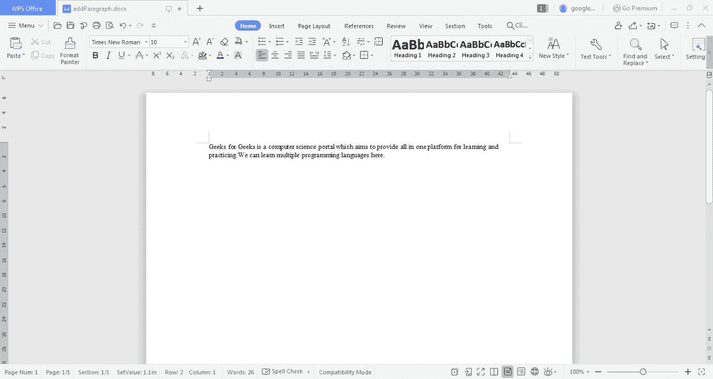

# 在 Word 文档中编写段落的 Java 程序

> 原文:[https://www . geesforgeks . org/Java-程序写一段话文档/](https://www.geeksforgeeks.org/java-program-to-write-a-paragraph-in-a-word-document/)

Java 为我们提供了内置于环境中的各种包，这有助于轻松阅读、编写和修改文档。包**org . Apache . poi . xwpf . user model**为我们提供了在 word 文档中格式化和追加内容的各种功能。这个包中有各种各样的类，比如创建新 word 文档的 XWPFDocument 和创建新段落并将其写入相应创建的文档的 XWPFParagraph。文件类可用于在指定的路径名创建文件，文件输出流可用于创建文件流连接。

**方法:**按照以下程序在文档中添加一个段落:

**1。****xwpfddocument:**一个可以创建和使用的 Java 类。docx 文件。每次都一片空白。docx 文档已创建。首先，使用 Java 中的**新 xfdocument()**创建这个类的一个对象。文件输出流也是并行创建的，用于在本地系统上创建文档内容并将其附加到文件中。流连接是通过使用文件输出流类建立的。

**2。** **XWPFParagraph:** 一个 Java 类，用来创建与所创建的 XWPFDocument 相对应的段落。可以在单个文档中创建多个段落，每个段落都使用指定的文档进行实例化。下面的方法是使用在 Java 中创建的 XWPFDocument 对象调用的。

**语法:**

**1。create aragraph()**

```
xwpfdocument.createParagraph()
```

**返回类型:【XWPF 段落类的一个对象。**

*t1。创建运行()T3*

**XWPFRun** 是一个 Java 类，为文档中创建的每个段落添加一个 Run。XWPFRun 使用 createRun()方法模拟向段落中添加内容。在 Java 中创建的段落上调用以下方法:

```
xwpfparagraph.createRun()
```

**返回类型:【XWPF Run 类的一个对象。**

**3。** ***setText()***

在这个创建的运行对象上调用 setText()方法来添加 Java 内容:

```
xwpfrun.setText(content)
```

**参数:**字符串形式的内容被接受为参数。

**返回类型:**不返回任何东西。

注意:然后使用流连接对象将文档中指定的内容写入文件流连接，并通过在 XWPFDocument 对象上调用 write()方法进行追加。然后，连接相继关闭。

**实现:**在 Word 文档中编写段落的 Java 编程

## Java 语言(一种计算机语言，尤用于创建网站)

```
// Java Programming to Write a paragraph in a Word Document

// Importing required packages
import java.io.File;
import java.io.FileOutputStream;
import org.apache.poi.xwpf.usermodel.XWPFDocument;
import org.apache.poi.xwpf.usermodel.XWPFParagraph;
import org.apache.poi.xwpf.usermodel.XWPFRun;

public class GFG {

    // Main driver method
    public static void main(String[] args) throws Exception
    {

        // Create a blank document
        XWPFDocument xwpfdocument = new XWPFDocument();

        // Create a blank file at C:
        File file = new File("C:/addParagraph.docx");

        // Create a file output stream connection
        FileOutputStream ostream
            = new FileOutputStream(file);

        /* Create a new paragraph using the document */

        // CreateParagraph() method is used
        // to instantiate a new paragraph
        XWPFParagraph para = xwpfdocument.createParagraph();

        // CreateRun method appends a new run to the
        // paragraph created
        XWPFRun xwpfrun = para.createRun();

        // SetText sets the text to the run
        // created using XWPF run
        xwpfrun.setText(
            "Geeks for Geeks is a computer science portal which aims "
            + "to provide all in one platform for learning and "
            + "practicing.We can learn multiple programming languages here. ");

        // Write content set using XWPF classes available
        xwpfdocument.write(ostream);

        // Close connection
        ostream.close();
    }
}
```

**输出:**程序在本地目录中生成以下文件:

