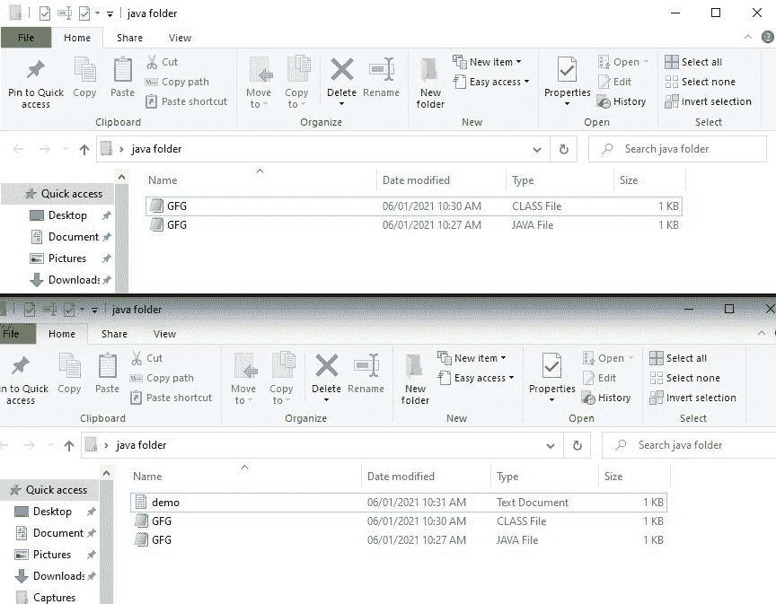
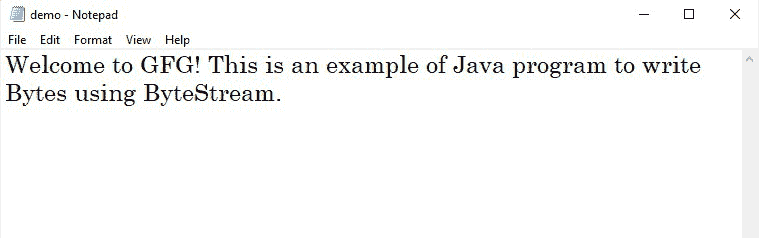

# 使用字节流写入字节的 Java 程序

> 原文:[https://www . geesforgeks . org/Java-程序写入字节-使用-bytestream/](https://www.geeksforgeeks.org/java-program-to-write-bytes-using-bytestream/)

Java 字节流用于执行 8 位字节的输入和输出。使用字节流将字节写入文件 Java 提供了一个专门的流，用于在文件系统中写入文件，称为文件输出流。该流提供了用于写入文件内容的基本输出流功能。

[FileOutputStream 类](https://www.geeksforgeeks.org/fileoutputstream-in-java/)是将数据写入文件的输出流。它是属于字节流的一个类。文件输出流类扩展了输出流抽象类。因此，它继承了写入文件的所有标准输出流功能。FileOutputStream 只提供了一个低级接口来写入数据。您可以从字符串路径名或文件对象创建文件输出流。文件输出流构造函数不会抛出[文件未找到异常](https://www.geeksforgeeks.org/built-exceptions-java-examples/)。如果指定的文件不存在，文件输出流将创建该文件。如果发生其他输入输出错误，文件输出流构造函数会抛出一个异常。如果指定的文件确实存在，文件输出流会打开它进行写入。当您实际调用 write()方法时，新数据会覆盖文件的当前内容。若要向现有文件追加数据，请使用接受追加标志的不同构造函数。

现在，讨论这些内置方法，以便在 java 中处理文件概念时理解内部工作。

1.  [*getBytes()*](https://www.geeksforgeeks.org/java-lang-string-getbyte-java/) 法
2.  [*写()*](https://www.geeksforgeeks.org/file-handling-java-using-filewriter-filereader/) *法*
3.  [*关()*](https://www.geeksforgeeks.org/reader-close-method-in-java-with-examples/) *法*

单独考虑它们，讨论更好理解的方法。

**1。**[***getBytes()***](https://www.geeksforgeeks.org/java-lang-string-getbyte-java/)法

为了写入文件，需要在将文本(内容)写入文件之前将其转换为字节数组。此方法通过将此字符串对象中的字符转换为字节值数组来完成此任务。字符串中的字符使用系统默认的字符编码方案转换为字节。

**语法:**

```java
 public byte[] getBytes() ; 
```

**参数:** NA

**返回:**包含该字符串字符的字节数组

**2。** [***写()***](https://www.geeksforgeeks.org/file-handling-java-using-filewriter-filereader/) ***法***

FileOutputStream 类的 write(byte[] b)方法用于将指定字节数组中的 b.length 字节写入此文件输出流

**语法:**

```java
public void write(byte[] b) throws IOException ; 
```

**参数:**数据

**返回:**该方法不返回值。

**3。** [***合()***](https://www.geeksforgeeks.org/reader-close-method-in-java-with-examples/) ***法***

FileOutputStream 类的 close()方法用于关闭文件输出流，并释放与该流关联的所有系统资源。

**语法:**

```java
public void close() ; 
```

**参数:** NA

**返回:**该方法不返回值。

**实施:**

*   创建文件的对象，并将文件的本地目录路径作为输入传递。
*   将随机文本存储为字符串数据类型。
*   将字符串转换为字节数组。
*   将字节数据写入文件输出。
*   使用 [*关闭文件()*](https://www.geeksforgeeks.org/reader-close-method-in-java-with-examples/) 方法。

**例**

## Java 语言(一种计算机语言，尤用于创建网站)

```java
// Java program to write Bytes using ByteStream

// Importing classes
import java.io.FileOutputStream;
import java.io.IOException;

// Class
class GFG {

    // Main driver method
    public static void main(String args[])
    {

        // Try block to check if any exception/s occur
        try {

            // Step 1: Creating object of the file and
            // passing local directory path of file as input
            FileOutputStream fout
                = new FileOutputStream("demo.txt");

            // Custom text to be written down in above file
            // Step 2: Storing text into String datatype
            String s
                = "Welcome to GFG! This is an example of Java program to write Bytes using ByteStream.";

            // Step 3: Converting string into byte array
            byte b[] = s.getBytes();

            // Step 4: Write byte data to file output
            fout.write(b);

            // Step 5: Close the file using close() method
            fout.close();
        }

        // Catch block to handle exceptions
        catch (IOException e) {

            // Display and print the exception
            System.out.println(e);
        }
    }
}
```

**输出:**

> 在提到的路径中创建了一个名为“demo”的文件。txt 扩展名



点击该文件后，所需结果如下，与上述程序中存储在字符串数据类型中的文本相同

