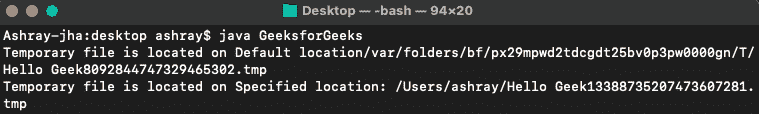
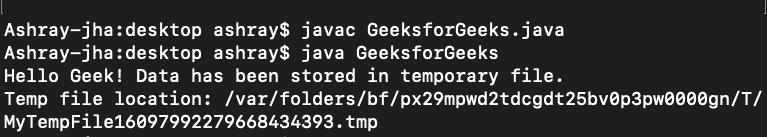
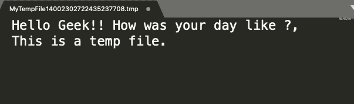

# 将数据写入临时文件的 Java 程序

> 原文:[https://www . geesforgeks . org/Java-程序写数据转临时文件/](https://www.geeksforgeeks.org/java-program-to-write-data-to-temporary-file/)

临时文件或临时文件是在创建或修改文件时为了保存信息一段时间而创建的文件。程序成功执行后或程序关闭后，临时文件被删除。拥有临时文件的其他优点是，它有助于存储和移动数据、管理设置、帮助恢复丢失的数据以及管理多个用户。临时数据可以称为互联网浏览器 cookies，即在我们关闭浏览器或结束会话后删除的缓存，删除它们会释放硬盘上的宝贵空间并加快计算机速度。

我们需要用 java 创建一个临时文件的唯一原因是，我们可能在各种情况下需要它，比如在创建单元测试时，我们不想存储中间 Java Operations 的输出。但是如果测试完成，我们可能会删除它们，因为它们可能会不必要地占用计算机空间。

***创建临时文件有两种方法，如下:***

1.  在默认位置创建临时文件
2.  在指定位置创建临时文件

**方法 1:** 在默认的 TEMP 文件夹位置创建临时文件。

**语法:**

```
File.createTempFile(String prefix, String suffix) throws IOException
```

**方法 2:** 在指定目录下创建临时文件。

**语法**:

```
File.createTempFile(String prefix, String suffix, File directory) throws IOException
```

**实现:**稍后在分析输出时将这两种方法集成到一个 Java 程序中

**例 1:**

## Java 语言(一种计算机语言，尤用于创建网站)

```
import java.io.File;
import java.io.IOException;

public class GeeksforGeeks {

    public static void main(String[] args)
    {
        try {

            // To create a temp file on Default location:
            File tempFile
                = File.createTempFile("Hello Geek", ".tmp");
            System.out.println(
                "Temporary file is located on Default location"
                + tempFile.getAbsolutePath());

            // To create a temp file on specified directory
            tempFile = File.createTempFile(
                "Hello Geek", ".tmp",
                new File("/Users/ashray"));
            System.out.println(
                "Temporary file is located on Specified location: "
                + tempFile.getAbsolutePath());
        }
        catch (IOException e) {
            e.printStackTrace();
        }
    }
}
```

**控制台输出:**



**输出解释:**

由于我们现在已经习惯了创建临时文件的过程，我们现在将使用它向临时文件中写入数据。将字符写入临时文件的最有效方法是使用 Java [BufferedWriter 类](https://www.geeksforgeeks.org/io-bufferedwriter-class-methods-java/)。它用于为编写器实例提供缓冲，并提高性能。

**实现:**将数据写入临时文件

**例 2:**

## Java 语言(一种计算机语言，尤用于创建网站)

```
import java.io.BufferedWriter;
import java.io.File;
import java.io.FileWriter;
import java.io.IOException;

public class GeeksforGeeks {

    public static void main(String[] args)
    {
        File tempFile = null;
        BufferedWriter writer = null;
        try {

            // Creating a temporary file
            tempFile
                = File.createTempFile("MyTempFile", ".tmp");
            writer = new BufferedWriter(
                new FileWriter(tempFile));
            writer.write(
                "Hello Geek!! How was your day like ?, This is a temp file.");
        }
        catch (IOException e) {
            e.printStackTrace();
        }
        finally {
            try {
                if (writer != null)
                    writer.close();
            }
            catch (Exception ex) {
            }
        }
        System.out.println(
            "Hello Geek! Data has been stored in temporary file.");
        System.out.println("Temp file location: "
                           + tempFile.getAbsolutePath());
    }
}
```

**输出:**

控制台输出如下



*“临时文件”*输出如下:

