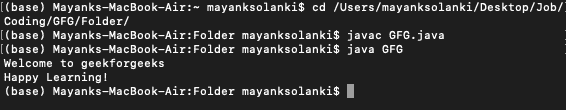
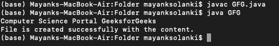
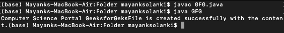

# 要写入文件的 Java 程序

> 原文:[https://www . geesforgeks . org/Java-程序写入文件/](https://www.geeksforgeeks.org/java-program-to-write-into-a-file/)

Java[file writer](https://www.geeksforgeeks.org/file-handling-java-using-filewriter-filereader/)Java 中的类用于将面向字符的数据写入文件，因为这个类是面向字符的类，因为它在 Java 中用于文件处理。

**方法:**在 java 中有很多方法可以写入文件，因为有很多类和方法可以实现以下目标:

1.  使用 [*写字符串()*方法](https://www.geeksforgeeks.org/io-writestring-function-in-golang-with-examples/)
2.  使用[文件编写器类](https://www.geeksforgeeks.org/filewriter-class-in-java/)
3.  使用 [BufferedWriter 类](https://www.geeksforgeeks.org/io-bufferedwriter-class-methods-java/)
4.  使用[文件输出流类](https://www.geeksforgeeks.org/creating-a-file-using-fileoutputstream/)

**方法 1:** 使用 [*writeString()* 方法](https://www.geeksforgeeks.org/io-writestring-function-in-golang-with-examples/)

Java 版本 11 支持这种方法。该方法可以采用四个参数。这些是文件路径、字符序列、字符集和选项。前两个参数是该方法写入文件所必需的。它将字符作为文件内容写入。它返回文件路径，可以抛出四种类型的异常。最好在文件内容比较短的时候使用。

**例**

它显示了使用[](https://www.geeksforgeeks.org/io-writestring-function-in-golang-with-examples/)*方法将数据写入文件。另一个类“路径”用于为文件名分配一个将写入内容的路径。file 类有另一个名为 *readString()* 的方法来读取代码中使用的任何现有文件的内容，以检查内容是否正确写入文件。*

## *Java 语言(一种计算机语言，尤用于创建网站)*

```java
*// Java Program to Write Into a File
// using writeString() Method

// Importing required classes
import java.io.IOException;
import java.nio.file.Files;
import java.nio.file.Path;

// Main class
public class GFG {

    // Main driver method
    public static void main(String[] args)
        throws IOException
    {
        // Assigning the content of the file
        String text
            = "Welcome to geekforgeeks\nHappy Learning!";

        // Defining the file name of the file
        Path fileName = Path.of(
            "/Users/mayanksolanki/Desktop/demo.docx");

        // Writing into the file
        Files.writeString(fileName, text);

        // Reading the content of the file
        String file_content = Files.readString(fileName);

        // Printing the content inside the file
        System.out.println(file_content);
    }
}*
```

***Output**

```java
Welcome to geekforgeeks
Happy Learning!
```* 

**

***方法 2:** 使用[文件编写器类](https://www.geeksforgeeks.org/filewriter-class-in-java/)*

*如果文件的内容很短，那么使用 FileWriter 类写入文件是另一个更好的选择。它还像 writeString()方法一样将字符流作为文件内容写入。此类的构造函数定义默认字符编码和默认缓冲区大小(以字节为单位)。*

*下面的示例说明了如何使用 FileWriter 类将内容写入文件。它需要用文件名创建 FileWriter 类的对象来写入文件。接下来，write()方法用于在文件中写入文本变量的值。如果在写入文件时出现任何错误，那么将引发一个 IOexception，并且将从 catch 块中打印错误消息。*

***例***

## *Java 语言(一种计算机语言，尤用于创建网站)*

```java
*// Java Program to Write into a File
// using FileWriterClass

// Importing required classes
import java.io.FileWriter;
import java.io.IOException;

// Main class
public class GFG {

    // Main driver method
    public static void main(String[] args)
    {

        // Content to be assigned to a file
        // Custom input just for illustratinon purposes
        String text
            = "Computer Science Portal GeeksforGeeks";

        // Try block to check if exception occurs
        try {

            // Create a FileWriter object
            // to write in the file
            FileWriter fWriter = new FileWriter(
                "/Users/mayanksolanki/Desktop/demo.docx");

            // Writing into file
            // Note: The content taken above inside the
            // string
            fWriter.write(text);

            // Printing the contents of a file
            System.out.println(text);

            // Closing the file writing connection
            fWriter.close();

            // Display message for successful execution of
            // program on the console
            System.out.println(
                "File is created successfully with the content.");
        }

        // Catch block to handle if exception occurs
        catch (IOException e) {

            // Print the exception
            System.out.print(e.getMessage());
        }
    }
}*
```

***Output**

```java
File is created successfully with the content.
```* 

**

***方法 3:** 使用 [BufferedWriter 类](https://www.geeksforgeeks.org/io-bufferedwriter-class-methods-java/)*

*它用于将文本写入字符输出流。它有一个默认的缓冲区大小，但是可以分配大的缓冲区大小。它对于编写字符、字符串和数组非常有用。如果不需要提示输出，最好用任何 writer 类包装这个类，以便将数据写入文件。*

***例***

## *Java 语言(一种计算机语言，尤用于创建网站)*

```java
*// Java Program to write into a File
// Using BufferedWriter Class

// Importing java input output libraries
import java.io.BufferedWriter;
import java.io.FileWriter;
import java.io.IOException;

// Main class
public class GFG {

    // Main driver method
    public static void main(String[] args)
    {

        // Assigning the file content
        // Note: Custom contents taken as input to
        // illustrate
        String text
            = "Computer Science Portal GeeksforGeks";

        // Try block to check for exceptions
        try {

            // Step 1: Create an object of BufferedWriter
            BufferedWriter f_writer
                = new BufferedWriter(new FileWriter(
                    "/Users/mayanksolanki/Desktop/demo.docx"));

            // Step 2: Write text(content) to file
            f_writer.write(text);

            // Step 3: Printing the content inside the file
            // on the terminal/CMD
            System.out.print(text);

            // Step 4: Display message showcasing
            // successful execution of the program
            System.out.print(
                "File is created successfully with the content.");

            // Step 5: Close the BufferedWriter object
            f_writer.close();
        }

        // Catch block to handle if exceptions occurs
        catch (IOException e) {

            // Print the exception on console
            // using getMessage() method
            System.out.print(e.getMessage());
        }
    }
}*
```

***Output**

```java
File is created successfully with the content.
```* 

**

*下面的示例显示了使用 BufferedWriter 类写入文件。它还需要创建像 FileWriter 这样的 BufferedWriter 类的对象，以便将内容写入文件。但是这个类支持通过使用大的缓冲区大小将大的内容写入文件。*

***方法 4:** 使用[文件输出流类](https://www.geeksforgeeks.org/creating-a-file-using-fileoutputstream/)*

*它用于将原始流数据写入文件。FileWriter 和 BufferedWriter 类用于仅将文本写入文件，但是二进制数据可以通过使用 FileOutputStream 类来写入。*

*使用 FileOutputStream 类将数据写入文件的步骤如下例所示。它还需要用文件名创建类的对象，以便将数据写入文件。这里，使用 *write()* 方法将字符串内容转换为写入文件的字节数组。*

***例***

## *Java 语言(一种计算机语言，尤用于创建网站)*

```java
*// Java Program to Write into a File
// using FileOutputStream Class

// Importing java input output classes
import java.io.FileOutputStream;
import java.io.IOException;

public class GFG {

    // Main driver method
    public static void main(String[] args)
    {

        // Assign the file content
        String fileContent = "Welcome to geeksforgeeks";
        FileOutputStream outputStream = null;

        // Try block to check if exception occurs
        try {

            // Step 1:  Create an object of FileOutputStream
            outputStream = new FileOutputStream("file.txt");

            // Step 2: Store byte content from string
            byte[] strToBytes = fileContent.getBytes();

            // Step 3: Write into the file
            outputStream.write(strToBytes);

            // Print the success message (Optional)
            System.out.print(
                "File is created successfully with the content.");
        }

        // Catch block to handle the exception
        catch (IOException e) {

            // Display the exception/s
            System.out.print(e.getMessage());
        }

        // finally keyword is used with in try catch block
        // amnd this code will always execute whether
        // exception occured or not
        finally {

            // Step 4: Close the object
            if (outputStream != null) {

                // Note: Second try catch block ensures that
                // the file is closed even if an error
                // occurs
                try {

                    // Closing the file connections
                    // if no exception has occured
                    outputStream.close();
                }

                catch (IOException e) {

                    // Display exceptions if occured
                    System.out.print(e.getMessage());
                }
            }
        }
    }
}*
```

***Output**

```java
File is created successfully with the content.
```*