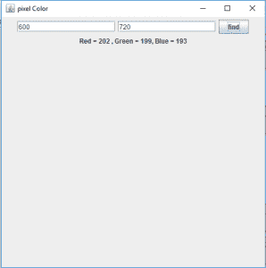

# Java 机器人类|获取给定点的像素颜色

> 原文:[https://www . geesforgeks . org/Java-robot-class-get-pixel-color-给定点/](https://www.geeksforgeeks.org/java-robot-class-get-pixel-color-given-point/)

Robot 是 java.awt 包的一部分。Robot 类基本上用于生成本机系统输入事件，用于自运行演示、测试自动化和其他使用鼠标和键盘控制的应用程序。
Robot 类生成的事件可以用来控制鼠标、键盘，也可以用来截图屏幕。
在本文中我们将讨论如何获取用户提到的屏幕上的点的像素颜色。
**所用方法:**

```
getPixelColor(int x, int y)  
This function returns an object of the color class 
of the given screen coordinates. 
```

**在下面的程序中，我们将打印一个标签，该标签将包含输入像素的 RGB 值，并且标签的文本将是像素颜色**

## Java 语言(一种计算机语言，尤用于创建网站)

```
// Java program to get the pixel color of
// given screen coordinates
import java.awt.*;
import javax.swing.*;
import java.awt.event.*;
public class color extends JFrame
    implements ActionListener {
    // textfield to get x, y coordinates
    static JTextField x, y;

    // button
    static JButton b;

    // create a frame
    static JFrame f;

    // label
    static JLabel l;

    public static void main()
    {

        // create a frame
        f = new JFrame("pixel Color");

        // label to show the RGB value
        l = new JLabel("no value");

        // create the text field
        x = new JTextField(16);
        y = new JTextField(16);

        // create a button
        b = new JButton("find");

        // create an object of the class
        color co = new color();

        // add ActionListener
        b.addActionListener(co);

        // create a panel
        JPanel p = new JPanel();

        // add textfield and button to the panel
        p.add(x);
        p.add(y);
        p.add(b);
        p.add(l);

        // add the panel
        f.add(p);

        // set the size of the frame
        f.setSize(500, 500);
        f.show();
    }

    // if the button is pressed
    public void actionPerformed(ActionEvent e)
    {
        String s = e.getActionCommand();
        if (s.equals("find")) {
            int xp, yp;

            // get user inputs of x and y position
            xp = Integer.parseInt(x.getText());
            yp = Integer.parseInt(y.getText());

            // try and catch block to handle exceptions
            try {
                // create an object of robot class
                Robot r = new Robot();

                // get the pixel color
                c = r.getPixelColor(xp, yp);
            }
            catch (Exception evt) {
                // print error message
                System.err.println(evt.getMessage());
            }

            Color c;

            // set the RGB value to the label
            // and to its foreground
            l.setForeground(c);
            l.setText("Red = " + c.getRed() + ",
Green = " + c.getGreen() + ", Blue = " + c.getBlue());
        }
    }
}
```

**输出:**



**注意:**以下程序可能无法在联机编译器中运行，请使用脱机 IDE。