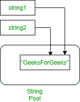
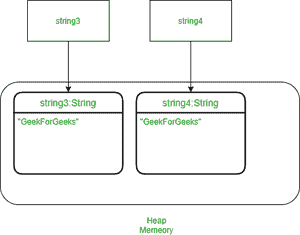

# 作为常量或单例的 Java 字符串文字

> 原文:[https://www . geesforgeks . org/Java-string-常值或单值/](https://www.geeksforgeeks.org/java-string-literals-as-constants-or-singletons/)

[字符串](https://www.geeksforgeeks.org/strings-in-java/)是一个字符序列，在 Java 编程中被广泛使用。在 Java 编程语言中，字符串是对象。在 Java 中，如果我们在其他字符串变量声明中使用相同的字符串，虚拟机可能只在内存中创建一个字符串实例。为了便于理解，让我们考虑如下插图:

插图 1:

```java
String string1 = "GeeksForGeeks";
String string2 = "GeeksForGeeks";
```

在上面的例子中，java 虚拟机将在内存中只创建一个“GeeksForGeeks”实例。有两个不同的变量，初始化为“GeeksForGeeks”的字符串将指向内存中的同一个 string 实例。下图更准确地描述了示例



字符串文字因此成为事实上的常量或单例。更准确地说，在 java 中，表示 java 字符串文字的对象是从一个常量字符串池中获得的，该池由 Java 虚拟机内部保存。这意味着，即使来自不同项目的单独编译但在同一应用程序中使用的类也可能共享常量字符串对象。共享发生在运行时，因此它不是编译时特性。

**图 2:** 如果我们希望这两个字符串变量指向单独的字符串对象，那么我们使用新的运算符如下:

```java
String string1 = new String("GeeksForGeeks");
String string2 = new String("GeeksForGeeks");
```

上面的代码将在内存中创建两个不同的内存对象来表示它们，即使两个字符串的值相同。下图描述了新运算符的使用:



> **注:**从上图可以清楚地看出，两个不同的内存块是为包含相同值字符串的两个不同字符串创建的。

**例 1:**

## Java 语言(一种计算机语言，尤用于创建网站)

```java
// Java Program to Illustrate String Literals as
// Constants or Singletons

// Main class
// StringSingleton
public class GFG {

    // Main driver method
    public static void main(String[] args)
    {

        // Strings
        String string1 = "GeeksForGeeks";
        String string2 = "GeeksForGeeks";
        String string3 = new String("GeeksForGeeks");
        String string4 = new String("GeeksForGeeks");

        // Checking if two string are same or not
        if (string1 == string2) {

            // Returns true
            System.out.println("True");
        }
        else {

            // Returns false
            System.out.println("False");
        }

        // Again checking if two string are same or not
        if (string1 == string3) {

            // Returns false
            System.out.println("True");
        }
        else {

            System.out.println("False");
        }

        // Again checking if two string are same or not
        if (string4 == string3) {

            // Returns false
            System.out.println("True");
        }
        else {
            System.out.println("False");
        }
    }
}
```

**Output**

```java
True
False
False
```

> 在上面的程序中，总共将创建 3 个对象。现在，如果我们想要比较 2 个字符串内容，我们可以使用 equals 方法，并且可以使用' == '运算符来比较两个字符串引用是否相同。

**例 2:**

## Java 语言(一种计算机语言，尤用于创建网站)

```java
// Java Program to Illustrate String Literals as
// Constants or Singletons

// Main class
// StringSingleton
public class GFG {

    // Main driver method
    public static void main(String[] args)
    {
        // Strings
        String string1 = "GeeksForGeeks";
        String string3 = new String("GeeksForGeeks");

        // Print and display statements

        // Displays true
        System.out.println(string1.equals(string3));

        // Displays false
        System.out.println(string1 == string3);
    }
}
```

**Output**

```java
true
false
```