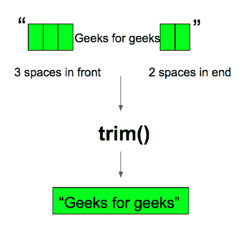

# Java 字符串修剪()方法，示例

> 原文:[https://www . geesforgeks . org/Java-string-trim-method-example/](https://www.geeksforgeeks.org/java-string-trim-method-example/)

Java String 中的 **trim()** 方法是一个内置函数，可以消除前导和尾随空格。空格字符的 Unicode 值为“\u0020”。java 中的 trim()方法检查字符串前后的 Unicode 值，如果存在，则删除空格并返回省略的字符串。trim()方法还有助于修剪 Java 中的字符。

> **注意:**trim()方法不消除中间空格。



**方法签名:**

```
public String trim()
```

**参数:**trim()方法不接受任何参数。

**返回类型:**修剪()方法的返回类型为**弦**。它返回省略的字符串，没有前导和尾随空格。

下面是用 Java 显示字符串 **trim()** 方法的工作示例。

**例 1:**

## Java 语言(一种计算机语言，尤用于创建网站)

```
// Java program to demonstrate working
// of java string trim() method

class Gfg {

    // driver code
    public static void main(String args[])
    {

        // trims the trailing and leading spaces
        String s = " geeks for geeks has all java functions to read  ";
        System.out.println(s.trim());

        // trims the leading spaces
        s = " Chetna loves reading books";
        System.out.println(s.trim());
    }
}
```

**Output**

```
geeks for geeks has all java functions to read
Chetna loves reading books
```

#### 例 2:

## Java 语言(一种计算机语言，尤用于创建网站)

```
// Java program to demonstrate working
// of java string trim() method

import java.io.*;

class GFG {
    public static void main (String[] args) {

      String s1 = "   Geeks For Geeks   ";

      // Before Trim() method
      System.out.println("Before Trim() - ");
      System.out.println("String - "+s1);
      System.out.println("Length - "+s1.length());

      // applying trim() method on string s1
      s1=s1.trim();

      // After Trim() method
      System.out.println("\nAfter Trim() - ");
      System.out.println("String - "+s1);
      System.out.println("Length - "+s1.length());

    }
}
```

**Output**

```
Before Trim() - 
String -    Geeks For Geeks   
Length - 21

After Trim() - 
String - Geeks For Geeks
Length - 15
```