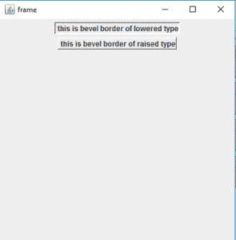
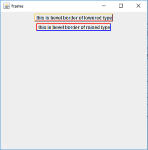
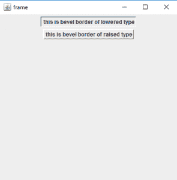
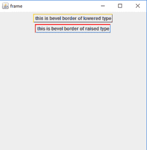

# Java Swing |斜边框和软斜边框

> 原文:[https://www . geeksforgeeks . org/Java-swing-斜角边框-和-soft 斜角边框/](https://www.geeksforgeeks.org/java-swing-bevelborder-and-softbevelborder/)

斜面边框和软斜面边框是 javax.swing.Border 包的一部分。此包包含不同的组件边框。斜面边框是一个简单的双线斜面边框的实现。斜角边框和软斜角边框几乎相同，但软斜角边框软化了边角。
**类斜边框的构造函数** :

1.  *斜边框(int Type)* :创建具有指定类型的斜边框，其颜色将从传递到画笔命令方法中的组件的背景颜色中派生。
2.  *斜边框(int Type，Color h，Color s)* :用指定的类型、高光和阴影颜色创建斜边框。
3.  *斜边框(int Type，Color highlightOuterColor，Color highlightInnerColor，Color shadowOuterColor，Color shadowInnerColor)* :创建具有指定类型、高光和阴影颜色的斜边框。

**软斜边框类**的构造函数:

1.  *软斜边框(int Type)* :创建具有指定类型的斜边框，其颜色将从传递到画笔命令方法中的组件的背景颜色中导出。
2.  *软斜边框(int Type，Color h，Color s)* :使用指定的类型、高光和阴影颜色创建斜边框。
3.  *软斜边框(int Type，Color highlightOuterColor，Color highlightInnerColor，Color shadowOuterColor，Color shadowInnerColor)* :创建具有指定类型、高光和阴影颜色的斜边框。

**常用的方法有:**

<figure class="table">

| 方法 | 说明 |
| --- | --- |
| **获取斜面型（）** | 返回斜角边框的类型 |
| **getborderrinsets(组件 c，Insets insets)** | 用此边框的当前 insets 重新初始化 Insets 参数。 |
| **get highlightenecolor()** | 返回斜面边框的内部高亮颜色。 |
| **getHighlightInnerColor(成分 c)** | 返回在指定组件上呈现时斜面边框的内部高亮颜色。 |
| **get highlightouterlor()** | 返回斜面边框的外部高亮颜色。 |
| **gethighlightoutcolor(成分 c)** | 返回在指定组件上呈现时斜面边框的外部高亮颜色。 |
| **get Hadoop winneror()** | 返回斜面边框的内部阴影颜色。 |
| **getShadowInnerColor(组件 c)** | 返回在指定组件上呈现时斜面边框的内部阴影颜色。 |
| **getShadowOuterColor()** | 返回斜面边框的外部阴影颜色。 |
| **获取阴影外部颜色(成分 c)** | 返回在指定组件上呈现时斜面边框的外部阴影颜色。 |
| **【is order OPAC()** | 返回边框是否不透明 |

</figure>

下面的程序说明了斜面边框类:

1.  **程序创建指定类型的简单斜角边框:**要创建斜角边框，我们首先创建一个 JPanel 对象 *p* ，所有边框都将应用到这个对象。JPanel 将托管在 JFrame f 中，这是这个程序中最外层的容器。为了设置斜面边框，我们创建了两个 JLabel 对象，“l”和“l1”，一个用于凸起的文字边框，另一个用于降低的文字边框。边界由函数 l.setBorder()和 l1.setBorder()应用。最后，边界由 p.add()函数添加到 JPanel 中，结果由 f.show()显示。

## Java 语言(一种计算机语言，尤用于创建网站)

```
// Java Program to create a simple bevel
// border with specified type
import java.awt.event.*;
import java.awt.*;
import javax.swing.*;
import javax.swing.border.*;
class bevel extends JFrame {

    // frame
    static JFrame f;

    // main class
    public static void main(String[] args)
    {
        // create a new frame
        f = new JFrame("frame");

        // create a object
        bevel s = new bevel();

        // create a panel
        JPanel p = new JPanel();

        // create a label
        JLabel l = new JLabel(" this is bevel border of raised type");

        // create a label
        JLabel l1 = new JLabel(" this is bevel border of lowered type");

        // set border for panel
        l.setBorder(new BevelBorder(BevelBorder.RAISED));

        // set border for label
        l1.setBorder(new BevelBorder(BevelBorder.LOWERED));

        // add button to panel
        p.add(l1);
        p.add(l);

        f.add(p);

        // set the size of frame
        f.setSize(400, 400);

        f.show();
    }
}
```

1.  **输出** :



2.  **程序应用指定颜色的斜角边框进行高亮和阴影**:要创建高亮颜色的斜角边框，我们首先创建一个 JPanel 对象 *p* ，所有的边框都会应用到这个对象上。JPanel 将托管在 JFrame f 中，这是这个程序中最外层的容器。为了设置斜面边框，我们创建了两个 JLabel 对象，“l”和“l1”，一个用于凸起的文字边框，另一个用于降低的文字边框。边界由函数 l.setBorder()和 l1.setBorder()应用。颜色作为参数传递给这些构造函数，例如:Color.red 等。)最后，边界由 p.add()函数添加到 JPanel 中，结果由 f.show()显示。

## Java 语言(一种计算机语言，尤用于创建网站)

```
// java Program to  apply bevel border with
// specified colors to highlight and shadow
import java.awt.event.*;
import java.awt.*;
import javax.swing.*;
import javax.swing.border.*;
class bevel1 extends JFrame {

    // frame
    static JFrame f;

    // main class
    public static void main(String[] args)
    {
        // create a new frame
        f = new JFrame("frame");

        // create a object
        bevel1 s = new bevel1();

        // create a panel
        JPanel p = new JPanel();

        // create a label
        JLabel l = new JLabel(" this is bevel border of raised type");

        // create a label
        JLabel l1 = new JLabel(" this is bevel border of lowered type");

        // set border for panel
        l.setBorder(new BevelBorder(BevelBorder.RAISED, Color.red,
                                                       Color.blue));

        // set border for label
        l1.setBorder(new BevelBorder(BevelBorder.LOWERED, Color.black,
                                  Color.red, Color.pink, Color.yellow));

        // add button to panel
        p.add(l1);
        p.add(l);

        f.add(p);

        // set the size of frame
        f.setSize(400, 400);

        f.show();
    }
}
```

1.  **输出** :



下面的程序说明了软斜边框类:

1.  **程序创建一个简单的指定类型的软斜角边框**:要创建一个软斜角边框，我们首先创建一个 JPanel 对象 *p* ，所有的边框都会应用到这个对象上。JPanel 将托管在 JFrame f 中。为了设置斜面边框，我们创建了两个 JLabel 对象，“l”和“l1”。边界由函数 l.setBorder()和 l1.setBorder()应用。为了使边框变软，我们在 setBorder()方法的参数中调用构造函数，该参数由行“soft 坡口边界()”表示。最后，边界由 p.add()函数添加到 JPanel 中，结果由 f.show()显示。

## Java 语言(一种计算机语言，尤用于创建网站)

```
// java Program to create a simple Soft bevel border
// with specified type
import java.awt.event.*;
import java.awt.*;
import javax.swing.*;
import javax.swing.border.*;
class bevel2 extends JFrame {

    // frame
    static JFrame f;

    // main class
    public static void main(String[] args)
    {
        // create a new frame
        f = new JFrame("frame");

        // create a object
        bevel2 s = new bevel2();

        // create a panel
        JPanel p = new JPanel();

        // create a label
        JLabel l = new JLabel(" this is bevel border of raised type");

        // create a label
        JLabel l1 = new JLabel(" this is bevel border of lowered type");

        // set border for panel
        l.setBorder(new SoftBevelBorder(BevelBorder.RAISED));

        // set border for label
        l1.setBorder(new SoftBevelBorder(BevelBorder.LOWERED));

        // add button to panel
        p.add(l1);
        p.add(l);

        f.add(p);

        // set the size of frame
        f.setSize(400, 400);

        f.show();
    }
}
```

1.  **输出** :



2.  **程序应用指定颜色的软斜角边框进行高亮和阴影**:要创建一个软斜角边框，我们首先创建一个 JPanel 对象 *p* ，所有的边框都会应用到这个对象上。JPanel 将托管在 JFrame f 中。为了设置斜面边框，我们创建了两个 JLabel 对象，“l”和“l1”。边界由函数 l.setBorder()和 l1.setBorder()应用。为了使边框变软，我们在 setBorder()方法的参数中调用构造函数，该参数由行“soft 坡口边界()”表示。颜色作为参数传递给这些构造函数，例如:Color.red 等。).最后，边界由 p.add()函数添加到 JPanel 中，结果由 f.show()显示。

## Java 语言(一种计算机语言，尤用于创建网站)

```
// Java Program to  apply soft bevel border with
// specified colors to highlight and shadow
import java.awt.event.*;
import java.awt.*;
import javax.swing.*;
import javax.swing.border.*;
class bevel3 extends JFrame {

    // frame
    static JFrame f;

    // main class
    public static void main(String[] args)
    {
        // create a new frame
        f = new JFrame("frame");

        // create a object
        bevel3 s = new bevel3();

        // create a panel
        JPanel p = new JPanel();

        // create a label
        JLabel l = new JLabel(" this is bevel border of raised type");

        // create a label
        JLabel l1 = new JLabel(" this is bevel border of lowered type");

        // set border for panel
        l.setBorder(new SoftBevelBorder(BevelBorder.RAISED, Color.red,
                                                         Color.blue));

        // set border for label
        l1.setBorder(new SoftBevelBorder(BevelBorder.LOWERED, Color.black,
                                    Color.red, Color.pink, Color.yellow));

        // add button to panel
        p.add(l1);
        p.add(l);

        f.add(p);

        // set the size of frame
        f.setSize(400, 400);

        f.show();
    }
}
```

1.  **输出:**



**注意:**上述程序可能无法在联机 IDE 中运行，请使用脱机编译。
**参考** :

*   [https://docs . Oracle . com/javase/7/docs/API/javax/swing/border/坡边. html](https://docs.oracle.com/javase/7/docs/api/javax/swing/border/BevelBorder.html)
*   [https://docs . Oracle . com/javase/7/docs/API/javax/swing/border/soft 坡边. html](https://docs.oracle.com/javase/7/docs/api/javax/swing/border/SoftBevelBorder.html)