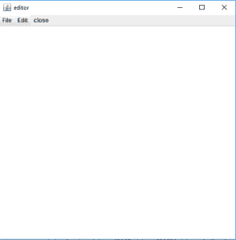
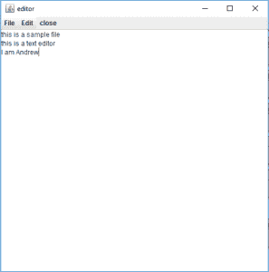
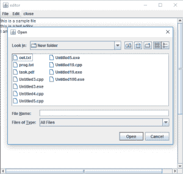
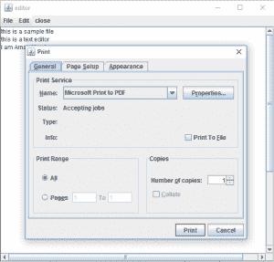

# Java Swing |创建一个简单的文本编辑器

> 原文:[https://www . geesforgeks . org/Java-swing-create-a-simple-text-editor/](https://www.geeksforgeeks.org/java-swing-create-a-simple-text-editor/)

为了在 Java Swing 中创建一个简单的文本编辑器，我们将使用一个 JTextArea，一个 JMenuBar，并向其中添加 JMenu，我们将添加 JMenuItems。所有菜单项都将有 actionListener 来检测任何操作。
**会有一个菜单栏，包含两个菜单和一个按钮:**

1.  **文件菜单**
    *   **打开**:该菜单用于打开文件
    *   **保存**:该菜单用于保存文件
    *   **打印**:该菜单用于打印文本区域的组件
    *   **新建**:该菜单用于新建一个空白文件
2.  编辑菜单
    *   **剪切**:该菜单用于剪切所选区域并复制到剪贴板
    *   **复制**:该菜单用于将所选区域复制到剪贴板
    *   **粘贴**:该菜单用于将剪贴板中的文本粘贴到文本区域
3.  **关闭**:此按钮关闭框架

我们已经使用了文件读取器和文件写入器来获取更多关于 Java 文件读取和写入的信息。请遵循以下链接:

*   [用 Java 读取文本文件的不同方式](https://www.geeksforgeeks.org/different-ways-reading-text-file-java/)
*   [使用文件写入器和文件读取器进行 Java 文件处理](https://www.geeksforgeeks.org/file-handling-java-using-filewriter-filereader/)

**使用的方法:**

<figure class="table">

| 方法 | 说明 |
| --- | --- |
| **切()** | 从文本区域中移除选定区域，并将其存储在剪贴板中 |
| **副本()** | 从文本区域复制选定区域，并将其存储在剪贴板中 |
| **粘贴()** | 从文本区域中移除选定区域，并将其存储在剪贴板中 |
| **打印()** | 打印文本区域的组成部分 |

</figure>

**关于 JSwing 组件的更多方法，请参考:**

1.  [Java 摇摆| JPanel](https://www.geeksforgeeks.org/java-swing-jpanel-examples/)
2.  [Java swing \名称栏](https://www.geeksforgeeks.org/java-swing-jmenubar/)
3.  [在 Java 中使用摆动创建帧](https://www.geeksforgeeks.org/creating-frames-using-swings-java/)
4.  [Java 摇摆| JTextArea](https://www.geeksforgeeks.org/java-swing-jtextarea/)

**程序创建简单文本编辑器:**
创建简单文本编辑器:

*   首先，我们将创建一个名为“编辑器”的框架 f，并应用金属外观和感觉，并在其中设置一个海洋主题。
*   我们将添加一个文本区域和一个带有三个菜单文件、编辑和关闭的菜单栏。
    *   “文件”选项有 4 个菜单项:新建、打开、保存和打印。
    *   “编辑”有 3 个菜单项剪切，复制和粘贴。我们将向所有菜单项添加一个动作监听器(使用 addActionListener()函数)来检测任何动作。
*   我们将使用 add()函数将菜单项添加到菜单中，将菜单添加到菜单栏中，并使用 addJMenuBar()函数将菜单栏添加到框架中。
*   我们将使用添加功能将文本区域添加到框架中，使用设置大小(500，500)功能将框架的大小设置为 500，500，然后使用显示功能显示框架。

以下是菜单功能的调用方式:

*   选择剪切、复制、粘贴和打印菜单项时，将调用文本区域剪切()、复制()、粘贴()和打印()的内置功能。
*   选择“保存”菜单项时，将打开一个文件选择器，在选择文件后将显示保存对话框。文件写入器(缓冲写入器)会将文本区域的内容写入文件，并关闭文件写入器和缓冲写入器。
*   在选择“打开”菜单项时，将打开一个文件选择器，它将在选择文件后显示打开对话框。文件阅读器和缓冲阅读器将读取文件，并将文本区域的文本设置为文件的内容。
*   如果选择了“新建”菜单项，文本区域的文本将被设置为空白。如果选择了“关闭”菜单项，则使用函数 isVisible(false)关闭框架。

**节目:**

## Java 语言(一种计算机语言，尤用于创建网站)

```
// Java Program to create a text editor using java
import java.awt.*;
import javax.swing.*;
import java.io.*;
import java.awt.event.*;
import javax.swing.plaf.metal.*;
import javax.swing.text.*;
class editor extends JFrame implements ActionListener {
    // Text component
    JTextArea t;

    // Frame
    JFrame f;

    // Constructor
    editor()
    {
        // Create a frame
        f = new JFrame("editor");

        try {
            // Set metal look and feel
            UIManager.setLookAndFeel("javax.swing.plaf.metal.MetalLookAndFeel");

            // Set theme to ocean
            MetalLookAndFeel.setCurrentTheme(new OceanTheme());
        }
        catch (Exception e) {
        }

        // Text component
        t = new JTextArea();

        // Create a menubar
        JMenuBar mb = new JMenuBar();

        // Create amenu for menu
        JMenu m1 = new JMenu("File");

        // Create menu items
        JMenuItem mi1 = new JMenuItem("New");
        JMenuItem mi2 = new JMenuItem("Open");
        JMenuItem mi3 = new JMenuItem("Save");
        JMenuItem mi9 = new JMenuItem("Print");

        // Add action listener
        mi1.addActionListener(this);
        mi2.addActionListener(this);
        mi3.addActionListener(this);
        mi9.addActionListener(this);

        m1.add(mi1);
        m1.add(mi2);
        m1.add(mi3);
        m1.add(mi9);

        // Create amenu for menu
        JMenu m2 = new JMenu("Edit");

        // Create menu items
        JMenuItem mi4 = new JMenuItem("cut");
        JMenuItem mi5 = new JMenuItem("copy");
        JMenuItem mi6 = new JMenuItem("paste");

        // Add action listener
        mi4.addActionListener(this);
        mi5.addActionListener(this);
        mi6.addActionListener(this);

        m2.add(mi4);
        m2.add(mi5);
        m2.add(mi6);

        JMenuItem mc = new JMenuItem("close");

        mc.addActionListener(this);

        mb.add(m1);
        mb.add(m2);
        mb.add(mc);

        f.setJMenuBar(mb);
        f.add(t);
        f.setSize(500, 500);
        f.show();
    }

    // If a button is pressed
    public void actionPerformed(ActionEvent e)
    {
        String s = e.getActionCommand();

        if (s.equals("cut")) {
            t.cut();
        }
        else if (s.equals("copy")) {
            t.copy();
        }
        else if (s.equals("paste")) {
            t.paste();
        }
        else if (s.equals("Save")) {
            // Create an object of JFileChooser class
            JFileChooser j = new JFileChooser("f:");

            // Invoke the showsSaveDialog function to show the save dialog
            int r = j.showSaveDialog(null);

            if (r == JFileChooser.APPROVE_OPTION) {

                // Set the label to the path of the selected directory
                File fi = new File(j.getSelectedFile().getAbsolutePath());

                try {
                    // Create a file writer
                    FileWriter wr = new FileWriter(fi, false);

                    // Create buffered writer to write
                    BufferedWriter w = new BufferedWriter(wr);

                    // Write
                    w.write(t.getText());

                    w.flush();
                    w.close();
                }
                catch (Exception evt) {
                    JOptionPane.showMessageDialog(f, evt.getMessage());
                }
            }
            // If the user cancelled the operation
            else
                JOptionPane.showMessageDialog(f, "the user cancelled the operation");
        }
        else if (s.equals("Print")) {
            try {
                // print the file
                t.print();
            }
            catch (Exception evt) {
                JOptionPane.showMessageDialog(f, evt.getMessage());
            }
        }
        else if (s.equals("Open")) {
            // Create an object of JFileChooser class
            JFileChooser j = new JFileChooser("f:");

            // Invoke the showsOpenDialog function to show the save dialog
            int r = j.showOpenDialog(null);

            // If the user selects a file
            if (r == JFileChooser.APPROVE_OPTION) {
                // Set the label to the path of the selected directory
                File fi = new File(j.getSelectedFile().getAbsolutePath());

                try {
                    // String
                    String s1 = "", sl = "";

                    // File reader
                    FileReader fr = new FileReader(fi);

                    // Buffered reader
                    BufferedReader br = new BufferedReader(fr);

                    // Initialize sl
                    sl = br.readLine();

                    // Take the input from the file
                    while ((s1 = br.readLine()) != null) {
                        sl = sl + "\n" + s1;
                    }

                    // Set the text
                    t.setText(sl);
                }
                catch (Exception evt) {
                    JOptionPane.showMessageDialog(f, evt.getMessage());
                }
            }
            // If the user cancelled the operation
            else
                JOptionPane.showMessageDialog(f, "the user cancelled the operation");
        }
        else if (s.equals("New")) {
            t.setText("");
        }
        else if (s.equals("close")) {
            f.setVisible(false);
        }
    }

    // Main class
    public static void main(String args[])
    {
        editor e = new editor();
    }
}
```

**输出:**









**注意:**上述程序可能无法在联机 IDE 中运行，请使用脱机编译器。