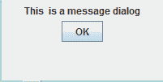
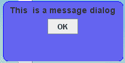
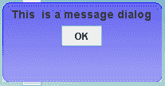

# Java Swing |创建自定义消息对话框

> 原文:[https://www . geesforgeks . org/Java-swing-creating-custom-message-dialogs/](https://www.geeksforgeeks.org/java-swing-creating-custom-message-dialogs/)

虽然 Java Swing 提供了内置的消息对话框来显示消息，但是我们可以通过使用 JWindow 和其他 Java Swing 元素来创建自定义的消息对话框。创建它们的优势在于它们是高度可定制的，我们可以为它们添加所需的外观和功能。
在本文中，我们将看到如何在 Java Swing 中创建自定义消息。
**例:**

```java
First we create a simple JWindow and add label and button to it.
Output:
```



```java
Then we will shape the window and background color to it.
Output:
```



```java
Then will set the look and feel of the label and
button to System look and feel and then add glossy 
appearance to the window by applying per pixel
translucency.
Output:
```



**在下面的程序中我们将看到如何创建消息对话框。**
1。程序创建一个简单的 JWindow，并添加标签和按钮。

## Java 语言(一种计算机语言，尤用于创建网站)

```java
// Java Program to create a simple JWindow
// and add label and button to it.
import java.awt.*;
import javax.swing.*;
import java.awt.event.*;
class message implements ActionListener {

    // window
    JWindow w;

    // constructor
    message()
    {
        // create a window
        w = new JWindow();

        // create a label
        JLabel l = new JLabel("This  is a message dialog");

        // create a new button
        JButton b = new JButton("OK");

        // add action listener
        b.addActionListener(this);

        // create a panel
        JPanel p = new JPanel();

        // add contents to panel
        p.add(l);
        p.add(b);

        w.add(p);

        w.setSize(200, 100);
        w.setLocation(300, 300);

        w.show();
    }

    // if button is pressed
    public void actionPerformed(ActionEvent evt)
    {
        w.setVisible(false);
    }

    // main class
    public static void main(String args[])
    {
        // create aobject
        message m = new message();
    }
}
```

**输出:**


**2。**程序创建一个消息窗口，给它塑造窗口和背景色。

## Java 语言(一种计算机语言，尤用于创建网站)

```java
// Java Program to create a message window,
// and shape the window and add background color to it
import java.awt.*;
import javax.swing.*;
import java.awt.event.*;
class message1 implements ActionListener {
    // window
    JWindow w;

    // constructor
    message1()
    {
        // create a window
        w = new JWindow();

        // set background of window transparent
        w.setBackground(new Color(0, 0, 0, 0));

        // create a label
        JLabel l = new JLabel("This  is a message dialog");

        // create a new button
        JButton b = new JButton("OK");

        // add action listener
        b.addActionListener(this);

        try {
            // set windows look and feel
            UIManager.setLookAndFeel(UIManager.
                             getSystemLookAndFeelClassName());
        }
        catch (Exception e) {
        }

        // create a panel
        JPanel p = new JPanel() {
            public void paintComponent(Graphics g)
            {

                g.setColor(new Color(100, 100, 240));
                g.fillRoundRect(0, 0, 200, 100, 20, 20);

                g.setColor(new Color(10, 10, 255));
                g.drawRoundRect(0, 0, 200, 100, 20, 20);
            }
        };

        // create a font
        Font f = new Font("BOLD", 1, 14);

        l.setFont(f);

        // add contents to panel
        p.add(l);
        p.add(b);

        w.add(p);

        w.setSize(200, 100);
        w.setLocation(300, 300);

        w.show();
    }

    // if button is pressed
    public void actionPerformed(ActionEvent evt)
    {
        w.setVisible(false);
    }

    // main class
    public static void main(String args[])
    {
        // create aobject
        message1 m = new message1();
    }
}
```

**输出:**


**3。**程序创建一个消息窗口，塑造窗口，添加背景色，并通过应用每像素半透明
为窗口添加光泽外观

## Java 语言(一种计算机语言，尤用于创建网站)

```java
// Java Program to create a message window, shape the window
// add background color to it and also add
// glossy appearance to the window by applying per pixel translucency
import java.awt.*;
import javax.swing.*;
import java.awt.event.*;
class message2 implements ActionListener {
    // window
    JWindow w;

    // constructor
    message2()
    {
        // create a window
        w = new JWindow();

        // set background of window transparent
        w.setBackground(new Color(0, 0, 0, 0));

        // create a label
        JLabel l = new JLabel("This  is a message dialog");

        // create a new button
        JButton b = new JButton("OK");

        // add action listener
        b.addActionListener(this);

        try {
            // set windows look and feel
            UIManager.setLookAndFeel(UIManager
                         .getSystemLookAndFeelClassName());
        }
        catch (Exception e) {
        }

        // create a panel
        JPanel p = new JPanel() {
            public void paintComponent(Graphics g)
            {

                g.setColor(new Color(100, 100, 240));
                g.fillRoundRect(0, 0, 200, 100, 20, 20);

                g.setColor(new Color(10, 10, 255));
                g.drawRoundRect(0, 0, 200, 100, 20, 20);

                // create a glossy appearance
                for (int i = 0; i < 100; i++) {
                    g.setColor(new Color(255, 255, 255, i));
                    g.drawLine(0, i, 200, i);
                }
            }
        };

        // create a font
        Font f = new Font("BOLD", 1, 14);

        l.setFont(f);

        // add contents to panel
        p.add(l);
        p.add(b);

        w.add(p);

        w.setSize(200, 100);
        w.setLocation(300, 300);

        w.show();
    }

    // if button is pressed
    public void actionPerformed(ActionEvent evt)
    {
        w.setVisible(false);
    }

    // main class
    public static void main(String args[])
    {
        // create aobject
        message2 m = new message2();
    }
}
```

**输出:**


**注意:以下程序可能无法在联机编译器中运行，请使用脱机 IDE。**