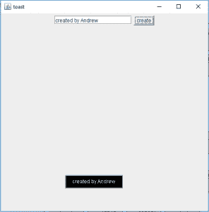

# Java Swing |创建祝酒词

> 原文:[https://www . geesforgeks . org/Java-swing-creating-toast-message/](https://www.geeksforgeeks.org/java-swing-creating-toast-message/)

**什么是敬酒信息？以及如何使用 Java Swing 创建它们？**
吐司消息是一种通过短时间持续然后消失的弹出消息通知用户的快速方式。

Java Swing 没有内置的吐司消息类，但是吐司消息是一种流行且有效的显示自动过期消息的方法，该消息只显示很短的时间。因此，为了实现一个吐司消息，我们必须手动构建一个能够创建吐司消息的类。

在本文中，我们将讨论如何使用 Java Swing 组件在 Java 中手动创建一个 toast 消息。以下程序将创建一个短时间的吐司短信，然后它们将消失。

请浏览下面的文章，了解更多关于半透明窗口和框架的细节，这会让你知道如何实现半透明和成型的窗口。
[Java Swing | Java 中的半透明异形窗](https://www.geeksforgeeks.org/java-swing-translucent-shaped-window-java/)
[JSwing |半透明异形窗](https://www.geeksforgeeks.org/jswing-create-translucent-shaped-windows-java/)

**下面的程序创建吐司消息(这是一个选择性半透明的 JWindow)**

```java
// Java program that creates the toast message
//(which is a selectively translucent JWindow)
import java.awt.*;
import javax.swing.*;
import java.awt.event.*;
class toast extends JFrame {

    //String of toast
    String s;

    // JWindow
    JWindow w;

    toast(String s, int x, int y)
    {
        w = new JWindow();

        // make the background transparent
        w.setBackground(new Color(0, 0, 0, 0));

        // create a panel
        JPanel p = new JPanel() {
            public void paintComponent(Graphics g)
            {
                int wid = g.getFontMetrics().stringWidth(s);
                int hei = g.getFontMetrics().getHeight();

                // draw the boundary of the toast and fill it
                g.setColor(Color.black);
                g.fillRect(10, 10, wid + 30, hei + 10);
                g.setColor(Color.black);
                g.drawRect(10, 10, wid + 30, hei + 10);

                // set the color of text
                g.setColor(new Color(255, 255, 255, 240));
                g.drawString(s, 25, 27);
                int t = 250;

                // draw the shadow of the toast
                for (int i = 0; i < 4; i++) {
                    t -= 60;
                    g.setColor(new Color(0, 0, 0, t));
                    g.drawRect(10 - i, 10 - i, wid + 30 + i * 2,
                               hei + 10 + i * 2);
                }
            }
        };

        w.add(p);
        w.setLocation(x, y);
        w.setSize(300, 100);
    }

    // function to pop up the toast
    void showtoast()
    {
        try {
            w.setOpacity(1);
            w.setVisible(true);

            // wait for some time
            Thread.sleep(2000);

            // make the message disappear  slowly
            for (double d = 1.0; d > 0.2; d -= 0.1) {
                Thread.sleep(100);
                w.setOpacity((float)d);
            }

            // set the visibility to false
            w.setVisible(false);
        }
        catch (Exception e) {
            System.out.println(e.getMessage());
        }
    }
}
```

**运行上述程序的驱动程序。**

```java
// Java Program to create a driver class to run 
// the toast class
import javax.swing.*;
import java.awt.*;
import java.awt.event.*;
class driver extends JFrame implements ActionListener {

    // create a frame
    static JFrame f;

    // textfield
    static JTextField tf;

    public static void main(String args[])
    {
        // create the frame
        f = new JFrame("toast");

        driver d = new driver();

        // textfield
        tf = new JTextField(16);

        // button
        Button b = new Button("create");

        // add action listener
        b.addActionListener(d);

        // create a panel
        JPanel p = new JPanel();

        p.add(tf);
        p.add(b);

        // add panel
        f.add(p);

        // setSize
        f.setSize(500, 500);

        f.show();
    }

    // if button is pressed
    public void actionPerformed(ActionEvent e)
    {

        // create a toast message
        toast t = new toast(tf.getText(), 150, 400);

        // call the method
        t.showtoast();
    }
}
```

**输出:** 

<video class="wp-video-shortcode" id="video-203724-1" width="486" height="492" preload="metadata" controls=""><source type="video/mp4" src="https://media.geeksforgeeks.org/wp-content/uploads/toast.mp4?_=1">[https://media.geeksforgeeks.org/wp-content/uploads/toast.mp4](https://media.geeksforgeeks.org/wp-content/uploads/toast.mp4)</video>

**注意:本程序不会在联机 IDE 中运行，请使用带有最新版本 java 的脱机 IDE。**