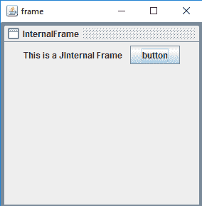
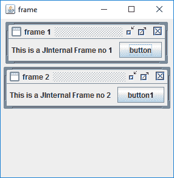
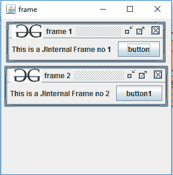

# Java Swing |带示例的内部框架

> 原文:[https://www . geeksforgeeks . org/Java-swing-内部框架-示例/](https://www.geeksforgeeks.org/java-swing-internal-frame-with-examples/)

JInternalFrame 是 Java Swing 的一部分。JInternalFrame 是一个容器，它提供了框架的许多功能，包括显示标题、打开、关闭、调整大小、支持菜单栏等。
**金泰尔纳框架的构造函数**

1.  **JInternalFrame()** :创建一个新的不可关闭、不可调整大小、不可图标化、不可最大化的没有标题的 JInternalFrame
2.  **JInternalFrame(String t)** :用指定的标题创建一个新的不可关闭、不可调整大小、不可图标化、不可最大化的 JInternalFrame
3.  **JInternalFrame(String t，布尔可调整大小)**:用指定的标题和可调整大小创建一个新的不可关闭、不可图标化、不可最大化的 JInternalFrame
4.  **JInternalFrame(String t，布尔可调整大小，布尔可关闭)**:创建一个新的不可图标化、不可最大化的 JInternalFrame，并指定标题、可关闭性和可调整大小
5.  **JInternalFrame(String t，布尔可调整大小，布尔可关闭，布尔可最大化)**:创建一个新的不可图标化的 JInternalFrame，并指定标题、可关闭性、最大化性和可大小化性

6.  **JInternalFrame(String t，布尔可调整大小，布尔可关闭，布尔可最大化，布尔可图标化)**:创建一个新的 JInternalFrame，并指定标题、可关闭性、最大化性、可图标化性和可大小化性

**常用方法**

1.  **设置框架图标(图标图标)**:将框架的图标设置为指定的图像
2.  **设置布局(LayoutManager 管理器)**:将框架的布局设置为指定的布局管理器
3.  **设置(字符串 t)** :将框架的标题设置为指定的标题
4.  **getTitle()** :获取帧的标题
5.  **整形(int x，int y，int width，int height)** :将框架调整到指定的宽度和高度以及指定的位置
6.  **添加(组件 c)** :将指定的组件添加到容器中。
7.  **add mpl(Component c，Object co，int i)** :添加指定的组件。
8.  **addinternal framelistener(internalframeslient l)**:将指定的 internalframeslient 添加到列表中。
9.  **createRootPane()** :由构造函数调用，设置 JRootPane。
10.  **dispose()** :使这个内部框架不可见，不被选中，关闭。
11.  **Fireinternalframevent(int id)**:触发内部框架事件。
12.  **getAccessibleContext()** :获取与此 JInternalFrame 关联的 AccessibleContext。
13.  **getContentPane()** :返回该内部框架的内容窗格。
14.  **getDefaultCloseOperation()**:返回用户在此内部框架上发起“关闭”时发生的默认操作。
15.  **getDesktopIcon()** :返回这个 JInternalFrame 被图标化时使用的 JDesktopIcon。
16.  **getDesktopPane()** :在祖先层次结构中搜索 JDesktop 实例的便捷方法。
17.  **getFocusOwner()** :如果这个 JInternalFrame 是活动的，返回有焦点的子代。
18.  **getFrameIcon()** :返回该内部框架标题栏显示的图像
19.  **getGlassPane()** :返回该内部框架的玻璃窗格。
20.  **getInternalFrameListener()**:返回一个数组，该数组包含用 addInternalFrameListener 添加到此 JInternalFrame 的所有 internal framelistener
21.  **getJMenuBar()** :返回这个 JInternalFrame 的当前 JMenuBar
22.  **getLastCursor()** :返回由设置光标方法设置的最后一个光标
23.  **getLayer()** :获取该组件图层属性的便捷方法。
24.  **getLayeredPane()** :返回该内部框架的分层窗格。
25.  **getmostreentfocusowner()**:返回此 JInternalFrame 的子组件，当选择此 JInternalFrame 时，该子组件将接收焦点。
26.  **getNormalBounds()** :如果 JInternalFrame 没有处于最大化状态，则返回 getBounds()；否则，返回 JInternalFrame 将恢复到的边界。
27.  **getRootPane()** :返回这个内部框架的 RootPane 对象。
28.  **getUI()** :返回渲染此组件的观感对象。
29.  **getWarningString()** :获取与此内部框架一起显示的警告字符串。
30.  **isclosalable()**:返回这个 JInternalFrame 是否可以被某个用户动作关闭。
31.  **isClosed()** :返回此 JInternalFrame 当前是否关闭。
32.  **isIcon()** :返回 JInternalFrame 当前是否图标化。
33.  **isMaximizable()** :获取 Maximizable 属性的值。
34.  **isMaximum()** :返回 JInternalFrame 当前是否最大化。
35.  **IsresTagging()**:返回是否可以调整 JInternalFrame 的大小。
36.  **isSelected()** :返回 JInternalFrame 是否为当前活动帧。
37.  **pack()** :使此金特尔框架的组件按其首选尺寸布局。
38.  **绘画组件(图形 g)** :被覆盖，允许在拖动内部框架时进行优化绘画。
39.  **paramString()** :返回此 JInternalFrame 的字符串表示形式。
40.  **移除(组件 c)** :从容器中移除指定的组件。
41.  **移除内部框架侦听器(InternalFrameListener l)** :移除指定的内部框架侦听器。
42.  **set closed(布尔 b)** :设置这个 JInternalFrame 是否可以通过一些用户动作关闭。
43.  **设置 ContentPane(容器 c)** :设置这个 JInternalFrame 的 contentPane 属性。
44.  **设置光标(光标 c)** :将光标图像设置为指定光标。
45.  **setDefaultCloseOperation(int o)**:设置当用户在此内部框架上启动“关闭”时默认发生的操作。
46.  **setDesktopIcon(JInternalFrame。JDesktopIcon d)** :设置与此 JInternalFrame 关联的 JDesktopIcon。
47.  **设置 GlassPane(组件 g)** :设置这个 JInternalFrame 的 glassPane 属性。
48.  **setIcon(布尔 b)** :对这个内部框架进行图标化或者去图标化。
49.  **setJMenuBar(JMenuBar m)** :为此 JInternalFrame 设置菜单栏属性。
50.  **seticonicable(boolean b)**:设置 iconable 属性，该属性必须为 true，用户才能使 JInternalFrame 成为图标。
51.  **setJMenuBar(JMenuBar m)** :为此 JInternalFrame 设置菜单栏属性。
52.  **setLayer(int l)** :设置该组件图层属性的便捷方法。
53.  **setLayer(Integer l)** :设置该组件图层属性的便捷方法。
54.  **setLayeredPane（JLayeredPane l）** ： 设置此 JInternalFrame 的分层 Pane 属性。
55.  **设置最大化(boolean b)** :设置最大化属性，该属性决定了是否可以通过一些用户动作来最大化 JInternalFrame。
56.  **设置最大值(布尔 b)** :最大化并恢复该内部帧。
57.  **设置法线边界(矩形 r)** :设置此内部帧的法线边界。
58.  **setResizable(boolean b)** :设置是否可以通过一些用户动作来调整 JInternalFrame 的大小。
59.  **设置根窗格(JRootPane r)** :为这个 JInternalFrame 设置根窗格属性。
60.  **setRootPaneCheckingEnabled(boolean e)**:设置是否将添加和设置布局的调用转发到 contentPane。
61.  **设置选定(布尔型)**:选择或取消选择正在显示的内部框架。
62.  **设置 UI(internal frame UI)**:为此 JInternalFrame 设置 UI 委托。
63.  **show()** :使内部框架可见。
64.  **toBack()** :将这个内部帧发送到后面。
65.  **toFront()** :将这个内框带到前面。
66.  **updateUI()**:ui manager 通知外观和感觉发生了变化。

**1。程序创建一个简单的金特尔框架:**

## Java 语言(一种计算机语言，尤用于创建网站)

```java
// java Program to create a simple JInternalFrame
import java.awt.event.*;
import java.awt.*;
import javax.swing.*;
class solution extends JFrame {

    // frame
    static JFrame f;

    // label to display text
    static JLabel l;

    // main class
    public static void main(String[] args)
    {
        // create a new frame to
        f = new JFrame("frame");

        // create a internal frame
        JInternalFrame in = new JInternalFrame();

        // set the title of the frame
        in.setTitle("InternalFrame");

        // create a Button
        JButton b = new JButton("button");

        // create a label to display text
        l = new JLabel("This is a JInternal Frame  ");

        // create a panel
        JPanel p = new JPanel();

        // add label and button to panel
        p.add(l);
        p.add(b);

        // set visibility internal frame
        in.setVisible(true);

        // add panel to internal frame
        in.add(p);

        // add internal frame to frame
        f.add(in);

        // set the size of frame
        f.setSize(300, 300);

        f.show();
    }
}
```

**输出:**



**2。程序创建多个内部框架**

## Java 语言(一种计算机语言，尤用于创建网站)

```java
// java Program to create multiple internal frames
import java.awt.event.*;
import java.awt.*;
import javax.swing.*;
class solution extends JFrame {

    // frame
    static JFrame f;

    // label to display text
    static JLabel l, l1;

    // main class
    public static void main(String[] args)
    {
        // create a new frame
        f = new JFrame("frame");

        // set layout of frame
        f.setLayout(new FlowLayout());

        // create a internal frame
        JInternalFrame in = new JInternalFrame("frame 1", true, true, true, true);

        // create a internal frame
        JInternalFrame in1 = new JInternalFrame("frame 2", true, true, true, true);

        // create a Button
        JButton b = new JButton("button");
        JButton b1 = new JButton("button1");

        // create a label to display text
        l = new JLabel("This is a JInternal Frame no 1  ");
        l1 = new JLabel("This is a JInternal Frame no 2  ");

        // create a panel
        JPanel p = new JPanel();
        JPanel p1 = new JPanel();

        // add label and button to panel
        p.add(l);
        p.add(b);
        p1.add(l1);
        p1.add(b1);

        // set visibility internal frame
        in.setVisible(true);
        in1.setVisible(true);

        // add panel to internal frame
        in.add(p);
        in1.add(p1);

        // add internal frame to frame
        f.add(in);
        f.add(in1);

        // set the size of frame
        f.setSize(300, 300);

        f.show();
    }
}
```

**输出:**



**3。程序创建多个框架并将图标设置到框架**

## Java 语言(一种计算机语言，尤用于创建网站)

```java
// java Program to create multiple frame and set icon to the frame
import java.awt.event.*;
import java.awt.*;
import javax.swing.*;
class solution extends JFrame {

    // frame
    static JFrame f;

    // label to display text
    static JLabel l, l1;

    // main class
    public static void main(String[] args)
    {
        // create a new frame
        f = new JFrame("frame");

        // set layout of frame
        f.setLayout(new FlowLayout());

        // create a internal frame
        JInternalFrame in = new JInternalFrame("frame 1",
                                 true, true, true, true);

        // create a internal frame
        JInternalFrame in1 = new JInternalFrame("frame 2",
                                   true, true, true, true);

        // set icon for internal frames
        in.setFrameIcon(new ImageIcon("f:/gfg.jpg"));
        in1.setFrameIcon(new ImageIcon("f:/gfg.jpg"));

        // create a Button
        JButton b = new JButton("button");
        JButton b1 = new JButton("button1");

        // create a label to display text
        l = new JLabel("This is a JInternal Frame no 1  ");
        l1 = new JLabel("This is a JInternal Frame no 2  ");

        // create a panel
        JPanel p = new JPanel();
        JPanel p1 = new JPanel();

        // add label and button to panel
        p.add(l);
        p.add(b);
        p1.add(l1);
        p1.add(b1);

        // set visibility internal frame
        in.setVisible(true);
        in1.setVisible(true);

        // add panel to internal frame
        in.add(p);
        in1.add(p1);

        // add internal frame to frame
        f.add(in);
        f.add(in1);

        // set the size of frame
        f.setSize(300, 300);

        f.show();
    }
}
```

**输出:**



**注意:以上程序可能无法在在线编译器中运行，请使用离线 IDE**