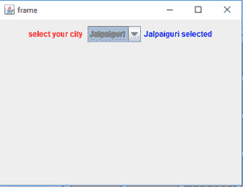
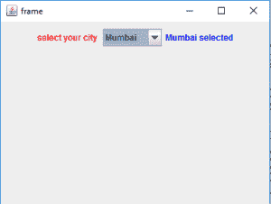
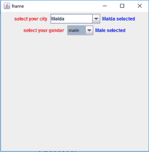
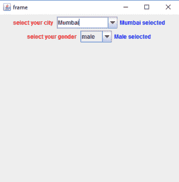
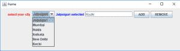
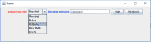

# Java Swing | JComboBox 带示例

> 原文:[https://www . geesforgeks . org/Java-swing-jcombobox-examples/](https://www.geeksforgeeks.org/java-swing-jcombobox-examples/)

JComboBox 是 Java Swing 包的一部分。JComboBox 继承了 JComponent 类。JComboBox 显示了一个弹出菜单，其中显示了一个列表，用户可以从该指定列表中选择一个选项。JComboBox 可以是可编辑的，也可以是只读的，这取决于程序员的选择。
**JComboBox 的构造函数为:**

1.  **JComboBox()** :新建一个空的 JComboBox。
2.  **JComboBox(ComboBoxModel M)**:用指定 combobox model 中的项目创建一个新的 JComboBox
3.  **JComboBox(E [ ] i)** :用指定数组中的项目创建一个新的 JComboBox。
4.  **JComboBox(矢量项目)**:用指定矢量中的项目创建一个新的 JComboBox

**常用方法有:**

1.  **添加项目(E 项)**:将项目添加到 JComboBox
2.  **addItemListener（ ItemListener l）** ： 向 JComboBox 添加一个 ItemListener
3.  **getItemAt(int i)** :返回索引 I 处的项目
4.  **getItemCount()** :返回列表中的项目数
5.  **getSelectedItem()** :返回选中的项目
6.  **移除项目(int i)** :移除索引 I 处的元素
7.  **设置可编辑(布尔 b)** :布尔 b 决定组合框是否可编辑。如果传递 true，则组合框是可编辑的，反之亦然。
8.  **setSelectedIndex(int i)** :选择索引 I 处的 JComboBox 的元素。
9.  **显示弹出窗口()**:使组合框显示其弹出窗口。
10.  **设置 UI(组合框 ui)** :设置渲染这个组件的 L & F 对象。
11.  **setSelectedItem(Object a)** :将组合框显示区的选中项设置为参数中的对象。
12.  **设置选择索引(int a)** :选择索引处的项目。
13.  **设定弹出窗口的可见性(布尔型 v)** :设定弹出窗口的可见性。
14.  **设置模型(ComboBoxModel a)** :设置 JComboBox 获取项目列表时使用的数据模型。
15.  **setMaximumRowCount(int count)**:设置 JComboBox 显示的最大行数。
16.  **设置启用(布尔 b)** :启用组合框，以便可以选择项目。
17.  **移除项目(对象或对象)**:从项目列表中移除项目。
18.  **removeAllItems()** :从项目列表中移除所有项目。
19.  **remove ActionListener(action listener l)**:删除 action listener。
20.  **isopupvisible()**:确定弹出窗口的可见性。
21.  **添加弹出项目侦听器(PopupMenuListener l)** :添加一个弹出项目侦听器，它将从组合框的弹出部分侦听通知消息。
22.  **getActionCommand()** :返回发送给动作侦听器的事件中包含的动作命令。
23.  **getEditor()** :返回用于绘制和编辑 JComboBox 字段中所选项目的编辑器。
24.  **getItemCount()** :返回列表中的项数。
25.  **getItemListeners()** :返回一个数组，该数组包含使用 addItemListener()添加到此 JComboBox 的所有项目侦听器。
26.  **createDefaultKeyselectionManager()**:返回默认键选择管理器的实例。
27.  **FireItemStateChanged(ItemEvent e)**:通知所有已注册对此事件类型感兴趣的侦听器进行通知。
28.  **firePopupMenuCanceled()** :通知 PopupMenuListeners 组合框的弹出部分已被取消。
29.  **FirePopumpemNuwilleEnvisible()**:通知 PopupMenuListeners 组合框的弹出部分已经变得不可见。
30.  **FirePopumpemNuwilLevable()**:通知 PopupMenuListeners 组合框的弹出部分将变得可见。
31.  **设置编辑器(ComboBoxEditor a)** :设置用于在 JComboBox 字段中绘制和编辑所选项目的编辑器。
32.  **setActionCommand(字符串 a)** :设置发送给 actionListeners 的事件中应该包含的动作命令。
33.  **getUI()** :返回渲染此组件的观感对象。
34.  **paramString()** :返回此 JComboBox 的字符串表示形式。
35.  **getUIClassID()** :返回渲染此组件的外观类的名称。
36.  **getAccessibleContext()** :获取与此 JComboBox 关联的 AccessibleContext

**以下程序将说明 JComboBox**
**1 的使用。程序创建一个简单的 JComboBox 并向其中添加元素。**

## Java 语言(一种计算机语言，尤用于创建网站)

```java
// Java Program to create a simple JComboBox
// and add elements to it
import java.awt.event.*;
import java.awt.*;
import javax.swing.*;
class solve extends JFrame implements ItemListener {

    // frame
    static JFrame f;

    // label
    static JLabel l, l1;

    // combobox
    static JComboBox c1;

    // main class
    public static void main(String[] args)
    {
        // create a new frame
        f = new JFrame("frame");

        // create a object
        solve s = new solve();

        // set layout of frame
        f.setLayout(new FlowLayout());

        // array of string containing cities
        String s1[] = { "Jalpaiguri", "Mumbai", "Noida", "Kolkata", "New Delhi" };

        // create checkbox
        c1 = new JComboBox(s1);

        // add ItemListener
        c1.addItemListener(s);

        // create labels
        l = new JLabel("select your city ");
        l1 = new JLabel("Jalpaiguri selected");

        // set color of text
        l.setForeground(Color.red);
        l1.setForeground(Color.blue);

        // create a new panel
        JPanel p = new JPanel();

        p.add(l);

        // add combobox to panel
        p.add(c1);

        p.add(l1);

        // add panel to frame
        f.add(p);

        // set the size of frame
        f.setSize(400, 300);

        f.show();
    }
    public void itemStateChanged(ItemEvent e)
    {
        // if the state combobox is changed
        if (e.getSource() == c1) {

            l1.setText(c1.getSelectedItem() + " selected");
        }
    }
}
```

**输出:**





**2。程序创建两个复选框一个可编辑，另一个只读**

## Java 语言(一种计算机语言，尤用于创建网站)

```java
// Java Program to create two  checkbox
// one editable and other read only
import java.awt.event.*;
import java.awt.*;
import javax.swing.*;
class solve extends JFrame implements ItemListener {

    // frame
    static JFrame f;

    // label
    static JLabel l, l1, l3, l4;

    // combobox
    static JComboBox c1, c2;

    // main class
    public static void main(String[] args)
    {
        // create a new frame
        f = new JFrame("frame");

        // create a object
        solve s = new solve();

        // array of string containing cities
        String s1[] = { "Jalpaiguri", "Mumbai", "Noida", "Kolkata", "New Delhi" };
        String s2[] = { "male", "female", "others" };

        // create checkbox
        c1 = new JComboBox(s1);
        c2 = new JComboBox(s2);

        // set Kolakata and male as selected items
        // using setSelectedIndex
        c1.setSelectedIndex(3);
        c2.setSelectedIndex(0);

        // add ItemListener
        c1.addItemListener(s);
        c2.addItemListener(s);

        // set the checkbox as editable
        c1.setEditable(true);

        // create labels
        l = new JLabel("select your city ");
        l1 = new JLabel("Jalpaiguri selected");
        l3 = new JLabel("select your gender ");
        l4 = new JLabel("Male selected");

        // set color of text
        l.setForeground(Color.red);
        l1.setForeground(Color.blue);
        l3.setForeground(Color.red);
        l4.setForeground(Color.blue);

        // create a new panel
        JPanel p = new JPanel();

        p.add(l);

        // add combobox to panel
        p.add(c1);

        p.add(l1);

        p.add(l3);

        // add combobox to panel
        p.add(c2);

        p.add(l4);

        // set a layout for panel
        p.setLayout(new FlowLayout());

        // add panel to frame
        f.add(p);

        // set the size of frame
        f.setSize(400, 400);

        f.show();
    }
    public void itemStateChanged(ItemEvent e)
    {
        // if the state combobox 1is changed
        if (e.getSource() == c1) {

            l1.setText(c1.getSelectedItem() + " selected");
        }

        // if state of combobox 2 is changed
        else
            l4.setText(c2.getSelectedItem() + " selected");
    }
}
```

**输出:**





**3。程序创建一个复选框，并添加或删除项目。**

## Java 语言(一种计算机语言，尤用于创建网站)

```java
// Java  Program to create a checkbox
// and add or remove items from it
import java.awt.event.*;
import java.awt.*;
import javax.swing.*;
class solve11 extends JFrame implements ItemListener, ActionListener {

    // frame
    static JFrame f;

    // label
    static JLabel l, l1;

    // combobox
    static JComboBox c1;

    // textfield to add and delete items
    static JTextField tf;

    // main class
    public static void main(String[] args)
    {
        // create a new frame
        f = new JFrame("frame");

        // create a object
        solve11 s = new solve11();

        // set layout of frame
        f.setLayout(new FlowLayout());

        // array of string containing cities
        String s1[] = { "Jalpaiguri", "Mumbai", "Noida", "Kolkata", "New Delhi" };

        // create checkbox
        c1 = new JComboBox(s1);

        // create textfield
        tf = new JTextField(16);

        // create add and remove buttons
        JButton b = new JButton("ADD");
        JButton b1 = new JButton("REMOVE");

        // add action listener
        b.addActionListener(s);
        b1.addActionListener(s);

        // add ItemListener
        c1.addItemListener(s);

        // create labels
        l = new JLabel("select your city ");
        l1 = new JLabel("Jalpaiguri selected");

        // set color of text
        l.setForeground(Color.red);
        l1.setForeground(Color.blue);

        // create a new panel
        JPanel p = new JPanel();

        p.add(l);

        // add combobox to panel
        p.add(c1);

        p.add(l1);
        p.add(tf);
        p.add(b);
        p.add(b1);

        f.setLayout(new FlowLayout());

        // add panel to frame
        f.add(p);

        // set the size of frame
        f.setSize(700, 200);

        f.show();
    }
    // if button is pressed
    public void actionPerformed(ActionEvent e)
    {
        String s = e.getActionCommand();
        if (s.equals("ADD")) {
            c1.addItem(tf.getText());
        }
        else {
            c1.removeItem(tf.getText());
        }
    }

    public void itemStateChanged(ItemEvent e)
    {
        // if the state combobox is changed
        if (e.getSource() == c1) {

            l1.setText(c1.getSelectedItem() + " selected");
        }
    }
}
```

**输出:**





**注意:以上程序可能无法在在线编译器中运行，请使用离线 IDE**