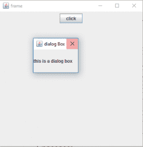
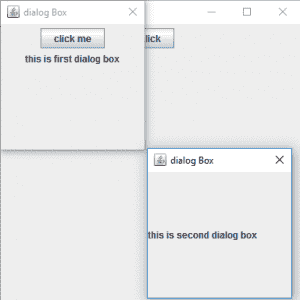

# Java Swing | JDialog 带示例

> 原文:[https://www.geeksforgeeks.org/java-swing-jdialog-examples/](https://www.geeksforgeeks.org/java-swing-jdialog-examples/)

JDialog 是 Java swing 包的一部分。该对话框的主要目的是向其中添加组件。JDialog 可以根据用户需求进行定制。
**类的构造函数有:**

1.  **JDialog()** :创建一个没有任何标题或任何指定所有者的空对话框
2.  **JDialog(框架 o)** :创建一个空对话框，指定一个框架作为其所有者
3.  **JDialog(框架 o，字符串 s)** :创建一个空对话框，指定框架为其所有者
    和指定标题
4.  **JDialog(窗口 o)** :创建一个空对话框，指定一个窗口作为其所有者
5.  **JDialog(Window o，String t)** :创建一个空对话框，指定窗口作为其所有者和指定标题。
6.  **JDialog(Dialog o)** :创建一个空对话框，指定对话框作为其所有者
7.  **JDialog(Dialog o，String s)** :创建一个空对话框，指定对话框作为其所有者和指定标题。

**常用方法**

1.  **设置布局(LayoutManager m)** :将对话框的布局设置为指定的布局管理器
2.  **设置菜单栏(JMenuBar m)** :将对话框的菜单栏设置为指定的菜单栏
3.  **添加(组件 c)** :向对话框添加组件
4.  **是可见的(布尔值 b)** :设置对话框的可见性，如果布尔值为真，则可见，否则不可见
5.  **更新(Graphics g)** :调用 paint(g)函数
6.  **移除(组件 c)** :移除组件 c
7.  **getGraphics()** :返回组件的图形上下文。
8.  **getLayeredPane()** :返回对话框的分层窗格
9.  **设置内容窗格(容器 c)** :设置对话框的内容窗格
10.  **设置分层窗格(JLayeredPane l)** :设置对话框的分层窗格
11.  **设置根面板**:设置对话框的根面板
12.  **getJMenuBar()** :返回组件的菜单栏
13.  **setTransferHandler(TransferHandler n)**:设置 transfer handler 属性，这是一种支持将数据传输到该组件的机制。
14.  **setRootPaneCheckingEnabled(布尔使能)**:设置是否将添加和设置布局的调用转发到 contentPane。
15.  **设置根面板(JRootPane 根目录)**:设置对话框的根面板属性。
16.  **设置玻璃面板(组件玻璃)**:设置对话框的玻璃面板属性。
17.  **重画(长时间，int x，int y，int width，int height)** :在时间毫秒内重画这个组件的指定矩形。
18.  **移除(组件 c)** :从对话框中移除指定的组件。
19.  **isRootPaneCheckingEnabled()**:返回是否将添加和设置布局的调用转发到内容窗格。
20.  **getTransferHandler()** :返回 TransferHandler 属性。
21.  **getRootPane()** :返回该对话框的 RootPane 对象。
22.  **getGlassPane()** :返回该对话框的 GlassPane 对象。
23.  **createRootPane()** :由构造函数方法调用，创建默认的 RootPane。
24.  **添加组件(组件 co，对象 c，int i)** :将指定的子组件添加到对话框中。

**以下程序将说明 JDialog**
**1 的使用。程序创建一个简单的 JDialog**

## Java 语言(一种计算机语言，尤用于创建网站)

```java
// java Program to create a simple JDialog
import java.awt.event.*;
import java.awt.*;
import javax.swing.*;
class solve extends JFrame implements ActionListener {

    // frame
    static JFrame f;

    // main class
    public static void main(String[] args)
    {
        // create a new frame
        f = new JFrame("frame");

        // create a object
        solve s = new solve();

        // create a panel
        JPanel p = new JPanel();

        JButton b = new JButton("click");

        // add actionlistener to button
        b.addActionListener(s);

        // add button to panel
        p.add(b);

        f.add(p);

        // set the size of frame
        f.setSize(400, 400);

        f.show();
    }
    public void actionPerformed(ActionEvent e)
    {
        String s = e.getActionCommand();
        if (s.equals("click")) {
            // create a dialog Box
            JDialog d = new JDialog(f, "dialog Box");

            // create a label
            JLabel l = new JLabel("this is a dialog box");

            d.add(l);

            // setsize of dialog
            d.setSize(100, 100);

            // set visibility of dialog
            d.setVisible(true);
        }
    }
}
```

**输出:**



**2。程序在对话框**内创建一个对话框

## Java 语言(一种计算机语言，尤用于创建网站)

```java
// java Program to create a dialog within a dialog
import java.awt.event.*;
import java.awt.*;
import javax.swing.*;
class solve extends JFrame implements ActionListener {

    // frame
    static JFrame f;

    // dialog
    static JDialog d, d1;

    // main class
    public static void main(String[] args)
    {
        // create a new frame
        f = new JFrame("frame");

        // create a object
        solve s = new solve();

        // create a panel
        JPanel p = new JPanel();

        JButton b = new JButton("click");

        // add actionlistener to button
        b.addActionListener(s);

        // add button to panel
        p.add(b);

        f.add(p);

        // set the size of frame
        f.setSize(400, 400);

        f.show();
    }
    public void actionPerformed(ActionEvent e)
    {
        String s = e.getActionCommand();
        if (s.equals("click")) {
            // create a dialog Box
            d = new JDialog(f, "dialog Box");

            // create a label
            JLabel l = new JLabel("this is first dialog box");

            // create a button
            JButton b = new JButton("click me");

            // add Action Listener
            b.addActionListener(this);

            // create a panel
            JPanel p = new JPanel();

            p.add(b);
            p.add(l);

            // add panel to dialog
            d.add(p);

            // setsize of dialog
            d.setSize(200, 200);

            // set visibility of dialog
            d.setVisible(true);
        }
        else { // create a dialog Box
            d1 = new JDialog(d, "dialog Box");

            // create a label
            JLabel l = new JLabel("this is second dialog box");

            d1.add(l);

            // setsize of dialog
            d1.setSize(200, 200);

            // set location of dialog
            d1.setLocation(200, 200);

            // set visibility of dialog
            d1.setVisible(true);
        }
    }
}
```

**输出:**



**注意:以上程序可能无法在在线编译器中运行，请使用离线 IDE**